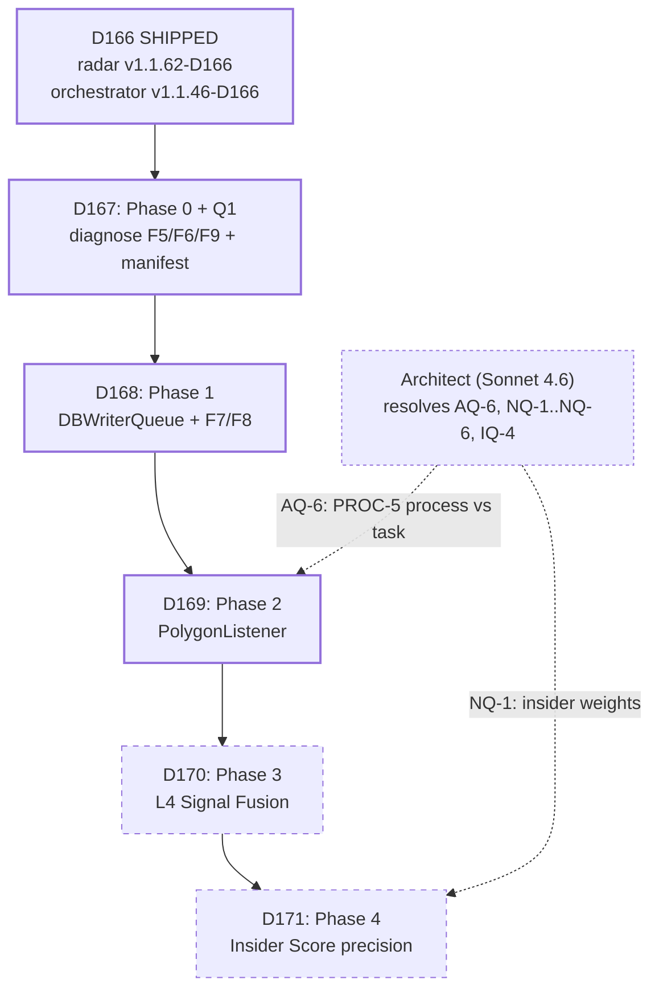

# D167 → D171 Master Implementation Plan

> **Architectural authority**: Sonnet 4.6 (architect) | **Code review**: Opus 4.7
> **Status**: D166 shipped (`run_radar v1.1.62-D166`, `orchestrator v1.1.46-D166`).
> **Generated**: 2026-05-05 | **Authored as plan-mode handoff for coding agents**

---

## 0. Critical scope corrections (read before any sprint)

These corrections override portions of `2026-05-05_D166_completion.md` (the D167 design doc):

### SC-1: F6 (`kyle_lambda_samples.window_ts=0`) is **NOT confirmed as a bug**

`panopticon_py/hunting/run_radar.py` lines **2554–2581** and **2776–2800** contain explicit comments:
```
# D97: Guard window_ts=0 only for T1 markets.
# T2/T3/T5 slugs may not end in digits — compute slug/window_ts locally.
```
For non-T1 markets, `window_ts=0` is the **intended fallback** because their slugs do not embed a 5-min window timestamp. The metric `_sync_metrics_baseline` filters `WHERE window_ts > 0` **by design** to count T1-only samples.

**Implication for D167**: Task **P0-T1** is a *diagnostic* task ("confirm or refute"), **not** a fix task. Coding agent must NOT write a "fix" until diagnosis confirms an actual bug. If diagnosis confirms by-design behavior, the deliverable is observability work (split T1 vs non-T1 counters), not a code change to `window_ts` writes.

### SC-2: Radar is an asyncio task **inside** the orchestrator process, not a separate OS process

Evidence: `run/process_manifest.json` reports `orchestrator.pid = 51452` and `radar.pid = 51452` (same PID). `run_hft_orchestrator.py:472` confirms:
```python
radar_task = asyncio.create_task(run_polymarket_radar(signal_queue, db), name="radar")
```

**Implication for D167 Q1**: The "stale radar version" fix is not a cross-process telemetry problem. It is a manifest-write path that does not read `run_radar.PROCESS_VERSION`. Fix is local to orchestrator startup.

**Implication for D169 (Phase 2)**: The original D167 doc's `multiprocessing.Process` design for `PolygonListener` (PROC-5) needs an Architect decision. Two valid options:
- **Option A**: Real new process spawned by `run_hft_orchestrator.py` via `multiprocessing.Process`. Cross-process queue with Windows `spawn` semantics (pickle-only payloads, no shared file handles).
- **Option B**: Another asyncio task in orchestrator process (like `radar_task`, `ofi_task`, `graph_task`). Uses `asyncio.Queue`, no pickle constraints, simpler. Trade-off: if WSS handler stalls, it can starve the radar event loop.

**D169 is BLOCKED on this decision (AQ-6 below).** Plan documents Option B as the default given it matches existing pattern, but flags both.

### SC-3: D167 doc tone — many "PROC-N" labels are conceptual, not OS-process

The doc uses "PROC-1 (WS Hub)", "PROC-3 (Wallet Engine)", "PROC-4 (Signal Engine)" as a logical decomposition. Today, all of these run as asyncio tasks inside the **single** `orchestrator` Python process. Only `backend`, `analysis_worker`, `arb_scanner`, and `watchdog` are real separate processes.

**Implication**: any plan step that says "spawn a new process" should be cross-checked: does it really need to be a process, or can it be an asyncio task?

---

## 1. Sprint map

| Sprint | Phase | Scope | Duration | Status |
|---|---|---|---|---|
| **D167** | Phase 0 + Q1 | F5 dry-run + F6 diagnostic + F9 entropy gate tuning + manifest version drift | 3 days | EXECUTABLE NOW |
| **D168** | Phase 1 | `DBWriterQueue` in `db.py` + analysis_worker retry + `ORDER_RECON` consolidation | 3–4 days | SHIPPED |
| **D169** | Phase 2 | `PolygonListener` (Alchemy WSS + HTTP fallback) + Wallet Engine basics | 5 days | EXECUTABLE |
| **D170** | Phase 3 | L4 signal fusion (PATH-A + PATH-B merge) | 3 days | BLOCKED ON D169 |
| **D171** | Phase 4 | Insider score precision (fingerprint + transfer graph + entity linker) | 5–7 days | BLOCKED ON D170 + Architect (NQ-1) |

### Dependency graph



---

## 2. Folder convention

```
.cursor/plans/
├── D167_D171_master_index.md           # this file
├── d167_phase0_diagnosis/
│   ├── README.md                       # D167 sprint overview, exit criteria
│   ├── P0 - T1 - Composer2.md          # F6 kyle window_ts diagnosis
│   ├── P0 - T2 - GLM5.1.md             # F9 entropy gate env tuning
│   ├── P0 - T3 - Composer2.md          # F5 dry-run signal gate
│   └── P0 - T4 - GLM5.1.md             # Q1 manifest version drift
├── d168_phase1_db_writer/
│   ├── README.md
│   ├── P1 - T1 - Composer2.md          # DBWriterQueue design in db.py
│   ├── P1 - T2 - Composer2.md          # analysis_worker.py F7 retry
│   ├── P1 - T3 - GLM5.1.md             # run_radar.py batch replace direct DB writes
│   └── P1 - T4 - Minimax2.7.md         # supervisor writer_loop integration
├── d169_phase2_polygon_listener/
│   ├── README.md                       # ARCHITECT BLOCK FLAG (AQ-6)
│   ├── P2 - T1 - Composer2.md          # PolygonListener (WSS + HTTP fallback)
│   ├── P2 - T2 - GLM5.1.md             # whale_scanner + discovery_loop integration
│   └── P2 - T3 - Minimax2.7.md         # Historical trades (Data API /trades)
├── d170_phase3_signal_fusion/
│   ├── README.md
│   └── P3 - T1 - Minimax2.7.md         # L4 signal fusion in signal_engine.py
└── d171_phase4_insider_score/
    ├── README.md                       # ARCHITECT BLOCK FLAG (NQ-1)
    ├── P4 - T1 - Composer2.md          # fingerprint_scrubber + entropy_window
    └── P4 - T2 - Codex5.3.md           # Transfer graph + entity_linker
```

### Filename normalization

| Token in filename | Real LLM |
|---|---|
| `Composer2` | Cursor Composer 2 |
| `GLM5.1` | GLM 5.1 |
| `Minimax2.7` | Minimax M2.7 |
| `Codex5.3` | Codex 5.3 |
| `GPT5.5` | GPT 5.5 (used only as fallback) |
| `Opus4.7` | Opus 4.7 (review-only, no implementation tasks) |
| `Sonnet4.6` | Sonnet 4.6 (architect, no implementation tasks) |

The user's draft used `composor2` (typo); plan normalizes to `Composer2`.

---

## 3. Per-task markdown structure (all 20 task files follow this template)

Each `P{phase} - T{task} - {LLM}.md` contains:

1. **Header**: sprint, phase, LLM, priority, estimated hours, blocking, blocks
2. **Goal**: 1–2 sentences
3. **Context**: why the task exists, what assumption it tests
4. **Step-by-step guide**: numbered, atomic actions
5. **Flow + logic chart**: mermaid diagram of control/data flow
6. **API curl example**: real HTTP/SQLite/etc command (`N/A` if pure refactor)
7. **API standard reply**: expected response shape
8. **Code skeleton**: function signatures + key snippets (10–30 lines per function)
9. **Error brainstorm + restrictions**: table of `(error, trigger, restriction)` rows
10. **Verification checklist**: explicit `[ ]` items
11. **Exit criteria**: definition of done
12. **Rollback plan**: how to revert if soak fails

---

## 4. Open architect questions (escalation queue)

These must be resolved by Sonnet 4.6 (with Opus 4.7 review) before the gated sprints can ship.

### Architecture questions

- **AQ-1** [D168]: `multiprocessing.Queue` backpressure — block `put` or drop? Suggested: drop with WARNING log.
- **AQ-2** [D168]: SQLite vs PostgreSQL at projected 1k writes/s. Suggested: SQLite WAL is fine; revisit if `[DB_WRITER] queue full` count exceeds 100/min.
- **AQ-3** [D168]: `run_radar.py` is 160 KB — wrap (no internal refactor) or split. Suggested: wrap with `DBWriterQueue.put()` adapter, defer split.
- **AQ-4** [D169]: Windows `spawn` mode pickle constraints for cross-process Queue payloads.
- **AQ-5** [D168]: `analysis_worker.py:upsert_wallet_market_position_lifo` — does it run in a transaction? If yes, retry must rollback first.
- **AQ-6** [D169]: `PolygonListener` process model. **RULING (2026-05-05)**: Option B (`asyncio.create_task` in orchestrator), with timeout guards + HTTP fallback.

### Numerical questions

- **NQ-1** [D171 BLOCKER]: Insider score weights `w1..w5`. Doc proposes `0.30/0.25/0.20/0.15/0.10`. Need literature anchor or backtest baseline.
- **NQ-2** [D169]: Amihud ILLIQ — USDC notional or shares? Doc resolves to USDC; confirm consistency with Kyle Lambda.
- **NQ-3** [D171]: `FOLLOW_THRESHOLD=0.65` cold-start value.
- **NQ-4** [D167 P0-T3]: `z_eval_ok > 0` but `fired = 0` — is `z` never ≤ `-4.0`, or is there a downstream guard? **P0-T3 must add z-distribution logging to answer this.**
- **NQ-5** [D167 P0-T1]: `kyle_lambda_samples.window_ts=0` semantics — fallback or NULL? **Resolved by SC-1 above (default = by-design fallback). Diagnostic only.**
- **NQ-6** [D168]: `[ORDER_RECON][SKIP]` 768/15min — acceptable or needs throttle? Suggested: acceptable post-D168 if `DBWriterQueue` reduces lock pressure.

### Implementation questions

- **IQ-1** [D169]: Alchemy Free tier 300M CU/month — does `eth_getLogs` 24/7 fit? Likely no for full-time HTTP polling. WSS-primary mode mostly free; HTTP fallback only on reconnect should fit.
- **IQ-2** [D167]: `safe_ts_to_seconds()` cold-start verification — assert after first day's data?
- **IQ-3** [D171]: `moralis_client.py` already exists — dual-track with Alchemy or replace?
- **IQ-4** [D169]: Confirm Alchemy `eth_subscribe` CU charge (commonly 0 once subscribed).

---

## 5. Coding agent operating rules (apply to all tasks in all sprints)

These augment `AGENTS.md`:

### R-1: Read-before-write (mandatory)
For every task, the coding agent MUST `Read` (or `Grep`) the target file's relevant section before any `StrReplace`. The plan cites specific line numbers; verify they still match before editing.

### R-2: Hard stop at 2 failed attempts
Per `AGENTS.md`. If the second attempt at the same edit fails (same lint/test error, same logical bug), stop and write an escalation handoff. Do **not** keep trying.

### R-3: Process restart after every Python edit
After ANY change to `panopticon_py/**/*.py`, `run_hft_orchestrator.py`, or `run_radar.py`, run `scripts/restart_all.ps1`. Validate with `curl http://localhost:8001/api/versions` per `AGENTS.md` zero-trust checklist.

### R-4: PROCESS_VERSION bump rules
- Bug fix → PATCH bump
- New feature → MINOR bump
- Append `-D{N}` for the sprint
- Same commit must update `run/versions_ref.json`

D167 expected versions after sprint:
- `run_radar.py`: `v1.1.63-D167` (PATCH bump from D166)
- `run_hft_orchestrator.py`: `v1.1.47-D167` (PATCH bump from D166)
- `panopticon_py/signal_engine.py`: bump if dry-run gate added (suggested `v1.0.X-D167`)
- `panopticon_py/ingestion/analysis_worker.py`: bump only when D168 ships, not D167
- `panopticon_py/api/app.py`: bump only if `/api/versions` payload changes

### R-5: No new SDK dependencies for LLM calls
Per `AGENTS.md`: stay on `urllib.request` for `integrate.api.nvidia.com`. Do not add `requests` or `openai`. (D171 may add `httpx` for new external APIs — that requires explicit Architect approval.)

### R-6: Time format invariants
- Internal `_ts_utc` columns: RFC3339 UTC ms strings.
- External API timestamps: per provider docs, normalize at ingestion.
- Runtime durations: `time.monotonic()`. Never persist `monotonic` as a wall-clock.

### R-7: No graphify-derived data into decision paths
Per `AGENTS.md`. Applies to all D169–D171 work involving on-chain graph analysis.

### R-8: MiniMax concurrency cap
If any task uses MiniMax models for inference, wrap in `asyncio.Semaphore(2)`. Do not parallelize MiniMax calls beyond that.

---

## 6. Verification matrix (cross-sprint)

| Metric | D167 target | D168 target | D169 target | D170 target | D171 target |
|---|---|---|---|---|---|
| `[ORDER_RECON][SKIP]` per 15min | < 768 (baseline) | < 100 | < 50 | < 50 | < 20 |
| `entropy_fires_60s` over 30min soak | ≥ 1 (forced via dry-run) | ≥ 1 organic | ≥ 5 organic | ≥ 10 organic | ≥ 10 organic |
| `paper_trades` since restart | ≥ 1 (dry-run only) | ≥ 1 organic | ≥ 5 | ≥ 20 | ≥ 50 |
| `version_match` all-true | yes | yes | yes | yes | yes |
| `process_manifest.radar.version` matches code | yes (Q1 fix) | yes | yes | yes | yes |
| New transfer events (D169+) | N/A | N/A | ≥ 100/hr | ≥ 100/hr | ≥ 100/hr |

---

## 7. Handoff & repo discipline

After each sprint:
1. `git add -A && git commit -m "D{N}: {summary}" && git push` (per `AGENTS.md` GitHub sync rule).
2. Write `temp_architect_handoffs/{date}_D{N}_completion.md` (do **not** commit; in `.gitignore`).
3. Move prior handoff to `temp_architect_handoffs/old/`.
4. Update `TECH_DEBT.md` (remove resolved debts, add discoveries).
5. Update `FUNCTION_STATUS.md` if any function changes runtime state (active/blocked/logged_only).

---

## 8. Cross-references

- D166 plan: [.cursor/plans/d166_pipeline_restoration_79014152.plan.md](.cursor/plans/d166_pipeline_restoration_79014152.plan.md)
- D166 completion handoff: [temp_architect_handoffs/2026-05-05_D166_completion.md](temp_architect_handoffs/2026-05-05_D166_completion.md)
- Agent directives: [AGENTS.md](AGENTS.md)
- Process manifest: [run/process_manifest.json](run/process_manifest.json)
- Versions reference: [run/versions_ref.json](run/versions_ref.json)
