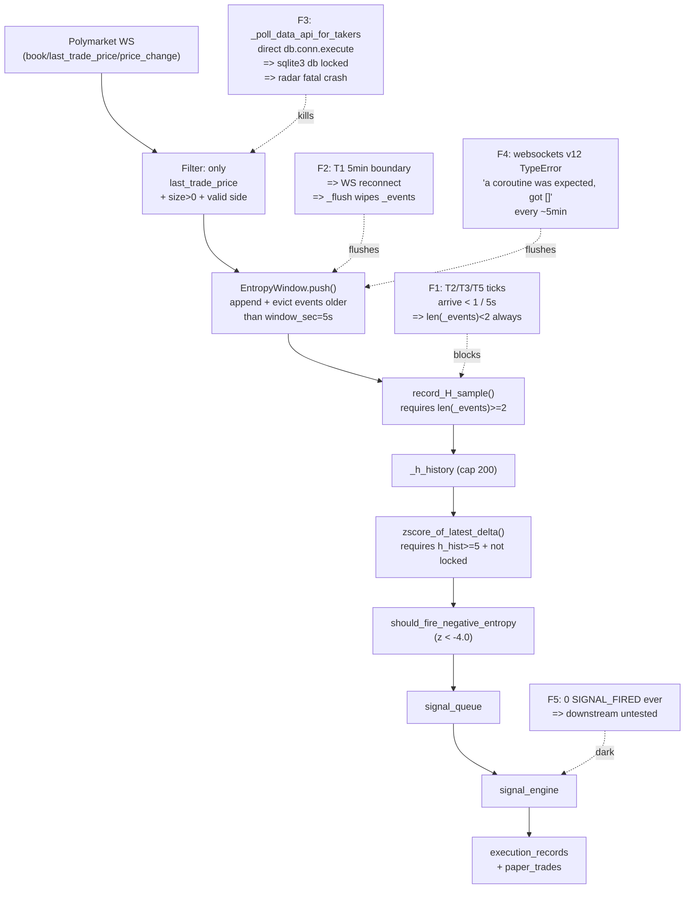

# D166 Pipeline Restoration — Architect Plan

## 1. State Diagnosis (the "why nothing fires" picture)

The pipeline has **five concurrent failure modes**. Fixing any one in isolation will not restore signal flow.



### Hard facts (from [run/orchestrator.err.log](run/orchestrator.err.log) + [data/entropy_status.json](data/entropy_status.json))
- **124 tokens monitored**, only **3 are `z_ready=true`** (h_hist >= 5 and unlocked). All 3 have `events=1` only — they will not eval on their next tick because `len(_events)<2` after eviction.
- **~70 tokens** show `h_hist=0, events=1, healthy_span>0, trigger_locked=false`. They are unlocked (D165 worked) but never accumulate H because of F1.
- **`event_type_60s={last_trade_price:1359, book:2763, price_change:29598}`** — WS is healthy, ~22 last_trade_price/sec across 200 tokens. But D75 gate shows `eval=1..9, hist_not_ready==eval, z_eval_ok=0` every 60s. The few ticks that get evaluated all fail at h_hist>=5.
- **Fatal crash at 02:44:55**: `_poll_data_api_for_takers` → `try_match_or_open` → `sqlite3.OperationalError: database is locked`. Radar `_live_ticks` died; orchestrator restarted it ~80min later. WS task and Whale scanner kept running orphaned in between.
- **TypeError "got []"** logged at 02:36:45, 02:41:43, 02:46:48, 02:46:53, 02:51:54, 02:56:52 — periodic, ~5min cadence (correlates with T1 window boundary).
- **`[SIGNAL_FIRED]` logged 0 times in 2h** → downstream signal_engine path is dark (cannot conclude bug vs. starvation; only L1 starvation is currently provable).

### Why D165's `HUNT_EW_UNLOCK_*` env vars do not fix this
D165 unlocked tokens earlier (`trigger_locked=false`), but the deeper failure is that `current_entropy()` returns None whenever `len(_events)<2`. With 5s eviction and >5s tick spacing, this is permanent regardless of unlock thresholds.

---

## 2. Phase A — Stabilization (must precede Phase B)

### A1. Halt `_poll_data_api_for_takers` fatal crash
**File**: [panopticon_py/hunting/run_radar.py](panopticon_py/hunting/run_radar.py) lines 2006–2069 + 2049
- The loop calls `try_match_or_open(trade, db)` (line 2049) which executes raw `db.conn.execute(...)` against the single shared connection — competes with WAL writer.
- **Action**: route `try_match_or_open` writes through `conn_execute_with_retry` (already exists in [panopticon_py/ingestion/order_reconstruction_engine.py](panopticon_py/ingestion/order_reconstruction_engine.py) at line 37). Wrap the function entry: catch `sqlite3.OperationalError("database is locked")`, retry 3× with exponential 50ms/200ms/500ms backoff, then **log + skip** instead of bubbling up to `_live_ticks`.
- Also wrap `_poll_data_api_for_takers`'s outer call in try/except so that a single failed market never kills the radar.
- AGENTS.md "Debt-1" / RULE-SQLITE-1 explicitly warn against this pattern.

### A2. Decouple T1 window rollover from full WS reconnect
**File**: [panopticon_py/hunting/run_radar.py](panopticon_py/hunting/run_radar.py) lines 3208–3267 (heartbeat block)
- Current: when T1 boundary hits or new tokens are discovered, `reconnect_now=True` triggers full `_close_event.set()` → reconnect → `_reconnect_all_entropy_windows()` → `_flush()` for **every** token's `_events`.
- **Action**: only set `reconnect_now=True` when the token list **shrinks** (token removed). For pure additions, send an incremental "subscribe" frame on the existing WS (Polymarket CLOB WS supports concatenating asset_ids in the existing connection — see existing `_refresh_subscription_all` at line 750 which uses the no-flush `refresh_subscription()` path).
- Net effect: T1 5-min boundary no longer wipes T2/T3/T5 entropy buffers.

### A3. Fix websockets v12 TypeError "a coroutine was expected, got []"
**File**: [panopticon_py/hunting/clob_ws_client.py](panopticon_py/hunting/clob_ws_client.py) lines 56, 22–31, 153–160
- Root cause: with `websockets>=12.0` (per [requirements.txt](requirements.txt) line 2), some internal handshake/extension callback path is being passed an empty list. Most likely culprit is the `subprotocols` default or a callback that returns `[]` when a coroutine factory is expected.
- **Action**: 
  1. Add `subprotocols=None` and `extensions=None` explicitly to `websockets.connect(u, ping_interval=20, ping_timeout=20, subprotocols=None, extensions=None)` to prevent library defaults from passing `[]`.
  2. Wrap the `async with websockets.connect(...) as ws` in a narrower `try/except TypeError` that logs once with full traceback (currently the warning at line 190 only logs `type(exc).__name__: exc`, not traceback).
  3. If that still recurs, pin `websockets==12.0` (downgrade from any 13/14 release the venv may have grabbed) — verify with `pip show websockets` before changing.

### A4. Make radar self-healing within orchestrator
**File**: [run_hft_orchestrator.py](run_hft_orchestrator.py) around line 251 (`run_polymarket_radar` task)
- **Action**: ensure the outer try/except restarts `_live_ticks` after a non-cancellation exception with a 5s backoff (verify the existing wrapper does this; if not, add it). Goal: even if A1/A2/A3 miss a case, the radar comes back within seconds rather than 80 minutes.

---

## 3. Phase B — Per-Tier EntropyWindow (resolves F1, the primary blocker)

User confirmed: **tier info IS available at all three construction sites** (verified):
- [run_radar.py L737](panopticon_py/hunting/run_radar.py): inside `_get_or_create_ew(token_id)` — can look up `_token_tier_map.get(token_id, "t3")` (already a module-level dict populated by `_refresh_all_subscriptions` at lines 1913–1921).
- [run_radar.py L2665](panopticon_py/hunting/run_radar.py): T1-explicit branch — pass `tier="t1"` literally.
- [run_radar.py L2822](panopticon_py/hunting/run_radar.py): non-T1 branch — `tier` already in scope from line 2645 (`tier = _token_tier_map.get(asset_id, "t3")`).

### B1. Make `EntropyWindow` tier-aware
**File**: [panopticon_py/hunting/entropy_window.py](panopticon_py/hunting/entropy_window.py) lines 43–91
- Add `tier: str = "t3"` to the dataclass.
- In `__post_init__`, replace the unconditional `HUNT_ENTROPY_WINDOW_SEC` read with a tier-stratified resolution:

```python
_TIER_DEFAULTS = {
    "t1": {"window_sec": 5.0,  "min_history": 5},
    "t2": {"window_sec": 60.0, "min_history": 5},
    "t3": {"window_sec": 60.0, "min_history": 5},
    "t5": {"window_sec": 60.0, "min_history": 5},
}
defaults = _TIER_DEFAULTS.get(self.tier, _TIER_DEFAULTS["t3"])
self.window_sec = float(
    os.getenv(f"HUNT_ENTROPY_WINDOW_SEC_{self.tier.upper()}",
              os.getenv("HUNT_ENTROPY_WINDOW_SEC", str(defaults["window_sec"])))
)
```

- Keep `HUNT_ENTROPY_WINDOW_SEC` as global override (back-compat).
- Add `HUNT_ENTROPY_WINDOW_SEC_T1`, `_T2`, `_T3`, `_T5` per-tier overrides.
- Same pattern for `min_history_for_z` if needed (probably keep at 5 globally for now — `config.get_min_history_for_z()` already exists).
- **Validation**: assert `window_sec >= 1.0` and `window_sec <= 600` to prevent foot-guns.

### B2. Plumb tier into the three call sites
**File**: [panopticon_py/hunting/run_radar.py](panopticon_py/hunting/run_radar.py)

- **L731–738** `_get_or_create_ew(token_id, tier=None)`:

```python
def _get_or_create_ew(token_id: str, tier: str | None = None) -> EntropyWindow:
    if token_id not in _entropy_windows:
        resolved_tier = tier or _token_tier_map.get(token_id, "t3")
        _entropy_windows[token_id] = EntropyWindow(tier=resolved_tier)
    return _entropy_windows[token_id]
```

- **L2665** (T1 path):

```python
t1_ew = _entropy_windows.get(asset_id)
if t1_ew is None:
    t1_ew = EntropyWindow(tier="t1")
    _entropy_windows[asset_id] = t1_ew
```

- **L2822** (non-T1 path):

```python
token_ew = _get_or_create_ew(asset_id, tier=tier)  # tier already in scope from L2645
```

### B3. Migration safety — flush stale tier=t3 windows on first restart
- Existing `_entropy_windows` instances were constructed with the old single `window_sec=5.0`. After the tier-aware constructor lands, on first push for a known T2/T3/T5 token, if the existing window's `window_sec` does not match the tier default, call `mark_reconnect("tier_migration")` so it rebuilds with correct semantics.
- **Action**: in `_get_or_create_ew`, if the existing window's `window_sec != tier default`, reconstruct in place. Run this once per token on D166 startup.

### B4. Update [tests/test_d165_entropy_unlock.py](tests/test_d165_entropy_unlock.py) and add D166 tests
- Add `tests/test_d166_entropy_window_per_tier.py`:
  1. T1 default window is 5.0; T2/T3/T5 default is 60.0.
  2. With T2 window=60s and ticks every 30s, after 4 ticks `len(_events)==4` (no premature eviction) and `len(_h_history) >= 1` (entropy can be computed).
  3. `HUNT_ENTROPY_WINDOW_SEC_T2=10` overrides per-tier default.
  4. `HUNT_ENTROPY_WINDOW_SEC=20` (legacy global) still works as fallback.
  5. tier-migration: an instance constructed at window_sec=5.0 then re-asked for `tier="t2"` is rebuilt to window_sec=60.0.

---

## 4. Phase C — Verification (sequential after A & B land)

### C1. Process restart per [AGENTS.md](AGENTS.md) "PROCESS RESTART"
```powershell
# All env now per-tier; legacy HUNT_EW_UNLOCK_* still set from D165
$env:DEBUG_STATS_ENABLED='true'
$env:HUNT_EW_UNLOCK_EVENT_COUNT='8'
$env:HUNT_EW_UNLOCK_HEALTHY_SPAN_SEC='3.0'
# (Optional override) $env:HUNT_ENTROPY_WINDOW_SEC_T2='60'
.\scripts\restart_all.ps1
```

### C2. 10-minute soak — pass conditions
- `data/entropy_status.json`: `z_ready_count >= 10` for at least one snapshot (was 3 before).
- `[D75_ENTROPY_GATE]` log: at least one 60s window with `z_eval_ok > 0`.
- `run/orchestrator.err.log`: no new `sqlite3.OperationalError: database is locked`, no new `TypeError: a coroutine was expected, got []`.
- `[RADAR ...] H Hist:` heartbeat shows monotonic growth across 5min interval (not reset by T1 boundary).

### C3. Bump versions per RULE-VER-1..5
- [panopticon_py/hunting/entropy_window.py](panopticon_py/hunting/entropy_window.py): D166 docstring marker
- [panopticon_py/hunting/run_radar.py](panopticon_py/hunting/run_radar.py): `PROCESS_VERSION = "v1.1.62-D166"` (MINOR bump for new tier-aware behavior)
- [panopticon_py/hunting/clob_ws_client.py](panopticon_py/hunting/clob_ws_client.py): no version (helper module)
- [panopticon_py/api/app.py](panopticon_py/api/app.py): `v1.1.49-D166` if the entropy_status.json schema gains tier field
- [run_hft_orchestrator.py](run_hft_orchestrator.py): `v1.1.46-D166`
- [run/versions_ref.json](run/versions_ref.json): same commit

### C4. Architect handoff
Run `scripts/runtime_verify_d164.ps1` (already updated in D165). Write [temp_architect_handoffs/2026-05-05_D166_completion.md](temp_architect_handoffs/2026-05-05_D166_completion.md) with: pass/fail matrix, version table, observations, any newly discovered residual issues (especially F5 — the downstream signal_engine path is still untested until L1 actually fires).

---

## 5. Risk & Guardrails

- **Entropy semantic change risk (B1)**: T2/T3/T5 z-score now reflects 60s rolling H instead of 5s. The `MIN_ENTROPY_Z_THRESHOLD=-4.0` from [signal_engine.py](panopticon_py/signal_engine.py) was tuned against synthetic high-frequency data; it may fire too easily or too rarely on the new window. **Mitigation**: D166 keeps `LIVE_TRADING=false` per [AGENTS.md](AGENTS.md); paper-trade volume in the soak will inform whether to retune the threshold in D167.
- **AGENTS.md compliance**: do not lower MM detection thresholds; do not bypass `acquire_singleton`; do not add `requests`/`openai` SDK; do not commit `temp_architect_handoffs/*.md`.
- **Schema unchanged**: `shared/contracts/panopticon-event.schema.json` is not touched.
- **Architect committee shadow isolation** still holds — no changes to `committee_score` paths.
- **Graphify isolation** still holds — entropy_status.json is operational telemetry, not Graphify output.

## 6. Out of scope for D166 (explicitly deferred)

- **F5 (downstream signal_engine validation)**: requires L1 to actually fire first. Add to D167 backlog with a synthetic `--smoke-fire` mode.
- **Per-tier `min_history_for_z`** tuning: keep 5 for all tiers in D166; revisit after first paper-trade in D167.
- **`HUNT_EW_UNLOCK_*` default change** (D165 Q1): still defer; per-tier window_sec subsumes most of the urgency.
- **Re-tune `MIN_ENTROPY_Z_THRESHOLD=-4.0`**: deferred until soak shows fire frequency.
