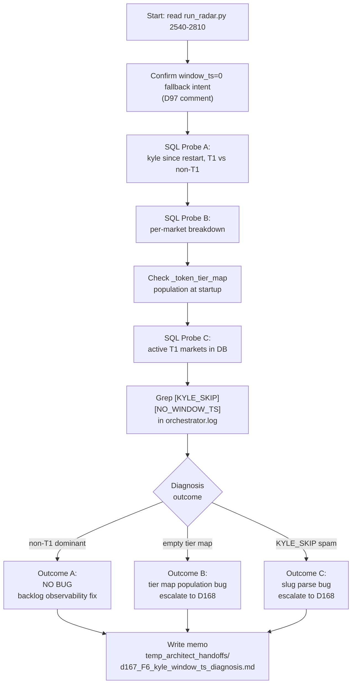

# P0 - T1 - Composer2: F6 Diagnosis — `kyle_lambda_samples.window_ts=0`

> **Sprint**: D167 | **Phase**: 0 | **LLM**: Cursor Composer 2 | **Priority**: P1
> **Estimated**: 2 hours | **Blocking**: none | **Blocks**: none (parallelizable)

---

## 1. Goal

Confirm or refute the D166 hypothesis that `kyle_lambda_samples.window_ts=0` represents a bug. Deliver a written diagnostic memo. **Do NOT modify code unless diagnosis confirms an actual bug.**

---

## 2. Context

D166 completion handoff observed:
- Total `kyle_lambda_samples`: 71,170
- Rows with `window_ts > 0`: 69,139 (stuck since pre-D166)
- Rows since latest restart: 1–13 (depending on snapshot)
- Rows with `window_ts > 0` since restart: **0**

The metric `[METRICS_SYNC] kyle=69139` reads `WHERE window_ts > 0` and is therefore static.

**Critical scope correction (already in master index)**: `panopticon_py/hunting/run_radar.py` lines 2554–2581 and 2776–2800 contain explicit comments showing `window_ts=0` is the **intended fallback** for non-T1 markets. Slugs for T2/T3/T5 markets do not embed a 5-min timestamp suffix.

The real diagnostic question is therefore:

> Are *T1 markets* getting kyle samples since restart? If yes → no bug, just a misleadingly named metric. If no → why are no T1 samples being recorded? (likely a separate issue: zero T1 trade activity, T1 token map empty, or `_token_tier_map` regression.)

---

## 3. Step-by-step guide

1. **Read** `panopticon_py/hunting/run_radar.py` lines 2540–2810 in full (covers both kyle insert sites).
2. **Read** `panopticon_py/hunting/run_radar.py` lines 570–600 (`_sync_metrics_baseline`) to confirm the `WHERE window_ts > 0` predicate.
3. **Confirm tier map population** — read where `_token_tier_map` is populated (search for `_token_tier_map[`, `_token_tier_map.update`, `_token_tier_map =`).
4. **Run SQL probe A** (counts since restart, segmented by `window_ts > 0`):
   ```sql
   SELECT
     COUNT(*) AS total_since_start,
     SUM(CASE WHEN window_ts > 0 THEN 1 ELSE 0 END) AS t1_since_start,
     SUM(CASE WHEN window_ts = 0 THEN 1 ELSE 0 END) AS non_t1_since_start
   FROM kyle_lambda_samples
   WHERE created_at >= '<orchestrator start_time from manifest>';
   ```
5. **Run SQL probe B** (per-asset breakdown — show top 10 assets contributing kyle samples since restart):
   ```sql
   SELECT market_id, COUNT(*) AS samples, MIN(window_ts) AS min_w, MAX(window_ts) AS max_w
   FROM kyle_lambda_samples
   WHERE created_at >= '<orchestrator start_time>'
   GROUP BY market_id
   ORDER BY samples DESC
   LIMIT 10;
   ```
6. **Cross-reference with `_token_tier_map`** — for each `market_id` in the probe B output, look up the tier from the live process. Easiest: grep `run/orchestrator.log` for `[TIER]` or `[TOKEN_TIER]` log lines that print the map at startup.
7. **Check active T1 universe** — run probe C against active markets:
   ```sql
   SELECT asset_id, market_id, slug FROM polymarket_markets WHERE tier='t1' AND is_active=1 LIMIT 20;
   ```
   If empty → no T1 markets active → `window_ts > 0` count cannot grow. This is a market-state observation, not a code bug.
8. **Check `[KYLE_SKIP][NO_WINDOW_TS]` log lines** — if T1 markets are active but their slugs don't end in digits, the guard at lines 2560 / 2783 logs and skips:
   ```powershell
   Select-String -Path run/orchestrator.log -Pattern "KYLE_SKIP" -SimpleMatch
   ```
9. **Decide outcome**:
   - **Outcome A (most likely)**: Non-T1 markets dominating, `window_ts=0` rows are real samples. → No fix. Memo recommends D168 backlog item: split metric into `kyle_t1_count` and `kyle_non_t1_count`.
   - **Outcome B**: Active T1 markets exist but `_token_tier_map` is empty / not updated → bug in tier-map population. → Escalate to D168 fix in `run_radar.py` `_refresh_all_subscriptions` path.
   - **Outcome C**: T1 markets exist, tier map populated, but `[KYLE_SKIP][NO_WINDOW_TS]` log lines spammed → slug→window_ts parsing bug (slugs not following `*-{ts}` convention). → Escalate to D168 fix in `_token_to_slug_map` population.
10. **Write memo** to `temp_architect_handoffs/d167_F6_kyle_window_ts_diagnosis.md` (NOT committed; in `.gitignore`). Memo must include all SQL probe outputs verbatim.

---

## 4. Flow + logic chart



---

## 5. API curl example

**N/A** — all data probes are local SQLite queries.

The SQLite CLI commands (PowerShell):

```powershell
# Probe A
sqlite3 data\panopticon.db "SELECT COUNT(*) AS total, SUM(CASE WHEN window_ts > 0 THEN 1 ELSE 0 END) AS t1, SUM(CASE WHEN window_ts = 0 THEN 1 ELSE 0 END) AS non_t1 FROM kyle_lambda_samples WHERE created_at >= '2026-05-05 07:50:56';"

# Probe B
sqlite3 -header -column data\panopticon.db "SELECT market_id, COUNT(*) AS samples FROM kyle_lambda_samples WHERE created_at >= '2026-05-05 07:50:56' GROUP BY market_id ORDER BY samples DESC LIMIT 10;"

# Probe C
sqlite3 -header -column data\panopticon.db "SELECT asset_id, market_id, slug FROM polymarket_markets WHERE tier='t1' AND is_active=1 LIMIT 20;"
```

Replace the `created_at` timestamp with the actual `orchestrator.start_time` from `run/process_manifest.json`.

---

## 6. API standard reply

For Probe A:
```
total       t1     non_t1
---------- ------ -------
13         0      13
```

For Probe B:
```
market_id                          samples
---------------------------------- -------
279116166481638532310178            8
850334084900543564692246            3
941717910970801522943291            2
```

For Probe C (if zero rows): empty result set → confirms no active T1 universe → diagnosis goes to **Outcome A**.

---

## 7. Code skeleton

**No code changes required for diagnostic outcome A or B/C escalation.** Memo content skeleton:

```markdown
# F6 diagnosis — kyle_lambda_samples.window_ts=0

## Summary
[1-line conclusion: bug / not-a-bug]

## Probe A output
total: NN
t1: NN
non_t1: NN

## Probe B output
[paste table]

## Active T1 markets (Probe C)
[count + sample]

## KYLE_SKIP log frequency
last 10 minutes: NN occurrences

## Conclusion
[outcome A/B/C with reasoning]

## Recommendation
[no-fix / D168 backlog / D168 escalation]
```

If Outcome **A** is confirmed and Architect approves the observability fix in D168, the metric change skeleton (deferred, NOT for D167):

```python
# panopticon_py/hunting/run_radar.py around line 575 (deferred to D168)
def _sync_metrics_baseline(db) -> dict:
    """Read baseline counts from DB."""
    kyle_t1 = db.conn.execute(
        "SELECT COUNT(*) FROM kyle_lambda_samples WHERE window_ts > 0"
    ).fetchone()[0] or 0
    kyle_non_t1 = db.conn.execute(
        "SELECT COUNT(*) FROM kyle_lambda_samples WHERE window_ts = 0"
    ).fetchone()[0] or 0
    return {"kyle_t1": kyle_t1, "kyle_non_t1": kyle_non_t1}
```

---

## 8. Error brainstorm + restrictions

| # | Possible error | Trigger | Restriction |
|---|---|---|---|
| E1 | Coding agent "fixes" `window_ts=0` by changing the schema or insert sites | Misreading the D166 handoff as a bug report | **HARD BAN**: Do NOT modify lines 2554–2581 or 2776–2800 of `run_radar.py` in D167. Outcome A is the most likely outcome. |
| E2 | Coding agent rewrites `_sync_metrics_baseline` without Architect approval | Following the doc's "fix" framing | Only modify the metric in D168 with a memo from this task as justification. |
| E3 | SQL probe uses string compare on `created_at` and miscompares "2026-05-05 03:08:17" vs "2026-05-05 11:48:16" | SQLite stores `created_at` as ISO string; lexical compare works for same-day but bumping date forces care | Always anchor to manifest `start_time` value. Use `datetime('now', '-X minutes')` if probing relative window. |
| E4 | `_token_tier_map` only populated after first `_refresh_all_subscriptions` call (delay ~30s after radar start) | Probing too early after restart | Wait ≥ 60s after `restart_all.ps1` before running probes. |
| E5 | Slug parse regression — slug suffix not `-{digits}` for new BTC 5m series | Polymarket changed slug format | Probe C samples must include slug column; flag any T1 row whose slug doesn't match `*-\d+$`. |
| E6 | Memo committed to repo by accident | `git add -A` includes new file | Memo MUST be at `temp_architect_handoffs/`, which is in `.gitignore`. Verify with `git status` before commit. |
| E7 | Orchestrator restarted between Probe A and Probe B → counts shift | Long diagnostic window | Run all probes within the same minute. If restart detected, restart probe set. |
| E8 | Probe C empty because `polymarket_markets` table doesn't exist | DB schema reference outdated | Use `.schema polymarket_markets` to confirm table exists; if missing, look up `radar_active_markets` or `markets` (whichever stores tier). |

### Restrictions summary

- **NO code changes** unless Outcome B or C is confirmed AND Architect explicitly approves.
- **NO** changes to `_sync_metrics_baseline` in D167.
- **NO** changes to kyle insert sites (`run_radar.py` 2554–2581, 2776–2800) in D167.
- **NO** new env vars introduced by this task.
- **NO** version bump on `run_radar.py` from this task alone (P0-T3 will bump for the dry-run gate).

---

## 9. Verification checklist

- [ ] All three SQL probes executed with output captured verbatim.
- [ ] `_token_tier_map` startup population confirmed via log grep.
- [ ] `[KYLE_SKIP][NO_WINDOW_TS]` log frequency measured (lines per 10 min).
- [ ] Memo committed to `temp_architect_handoffs/d167_F6_kyle_window_ts_diagnosis.md` with explicit Outcome A/B/C verdict.
- [ ] `git status` shows memo NOT staged for commit (must be in `.gitignore`).
- [ ] If Outcome A: D168 backlog ticket created (one-line append to `TECH_DEBT.md`).
- [ ] If Outcome B/C: escalation handoff written to `temp_architect_handoffs/2026-05-05_D167_F6_escalation.md`.

---

## 10. Exit criteria

Memo exists at `temp_architect_handoffs/d167_F6_kyle_window_ts_diagnosis.md` containing:
1. The three SQL probe outputs.
2. The tier-map population evidence.
3. An explicit `Outcome: A | B | C` verdict.
4. A recommendation: `[no-fix-needed]`, `[backlog-D168]`, or `[escalate-D168-now]`.

---

## 11. Rollback plan

This task makes no code changes. Rollback = delete the memo file. No git operations needed.
