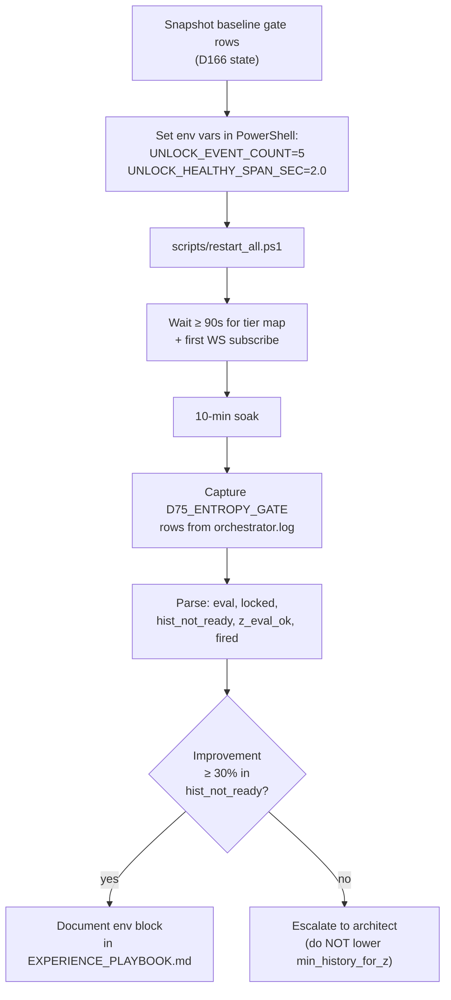

# P0 - T2 - GLM5.1: F9 — Entropy Gate Env Tuning

> **Sprint**: D167 | **Phase**: 0 | **LLM**: GLM 5.1 | **Priority**: P0
> **Estimated**: 1.5 hours | **Blocking**: none | **Blocks**: P0-T3 (dry-run benefits from healthier gate)

---

## 1. Goal

Reduce `hist_not_ready` and `locked` gate-row counts by tuning the existing D165/D166 environment variables. Verify `z_ready_count` rises and at least one `z_eval_ok > 0` is sustained across a 10-min soak. **No code changes.**

---

## 2. Context

D166 soak data:
- `data/entropy_status.json`: `total=40`, `z_ready_count=12`, `locked_count=2–3`
- `[D75_ENTROPY_GATE]` representative row: `gate_60s={eval:5, locked:1, hist_not_ready:4, z_eval_ok:0, fired:0}`

The two existing knobs (validated in D165/D166):

| Env var | D165/D166 default | Range | Effect |
|---|---|---|---|
| `HUNT_EW_UNLOCK_EVENT_COUNT` | `8` | 5–100 | How many events accumulated before `EntropyWindow` unlocks after a reconnect |
| `HUNT_EW_UNLOCK_HEALTHY_SPAN_SEC` | `3.0` | 1.0–60.0 | How many seconds of healthy receive before unlock |
| `HUNT_MIN_HISTORY_FOR_Z` | `5` (from `config.get_min_history_for_z()`) | 3–10 | Minimum H samples in `_h_history` to compute z |
| `HUNT_ENTROPY_WINDOW_SEC_T1` | `5.0` | 1.0–600.0 | T1 rolling window seconds (D166 introduced) |
| `HUNT_ENTROPY_WINDOW_SEC_T2/T3/T5` | `60.0` | 1.0–600.0 | non-T1 rolling window seconds |

`entropy_window.py` validates all values with `if count < 5: raise ValueError` for `_unlock_event_count` and `if span < 1.0: raise ValueError` for `_unlock_healthy_span_sec`. **Lower bounds must be respected.**

---

## 3. Step-by-step guide

1. **Snapshot baseline** — capture 10 minutes of D166 soak gate rows for comparison:
   ```powershell
   Select-String -Path run/orchestrator.log -Pattern "D75_ENTROPY_GATE" -Tail 10 |
     Out-File -FilePath data/d167_baseline_gate.txt
   ```
2. **Adjust env vars** in `scripts/restart_all.ps1` (or in a session-only override before launching). Recommended D167 set:
   ```powershell
   $env:HUNT_EW_UNLOCK_EVENT_COUNT      = '5'    # min allowed by entropy_window guard
   $env:HUNT_EW_UNLOCK_HEALTHY_SPAN_SEC = '2.0'  # tighter than D166's 3.0
   $env:HUNT_MIN_HISTORY_FOR_Z          = '5'    # do NOT lower without architect approval (NQ statistical validity)
   $env:HUNT_ENTROPY_WINDOW_SEC_T1      = '5'    # unchanged
   $env:HUNT_ENTROPY_WINDOW_SEC_T2      = '60'   # unchanged
   $env:HUNT_ENTROPY_WINDOW_SEC_T3      = '60'   # unchanged
   $env:HUNT_ENTROPY_WINDOW_SEC_T5      = '60'   # unchanged
   $env:DEBUG_STATS_ENABLED             = 'true'
   ```
3. **Restart**: `scripts/restart_all.ps1`.
4. **Wait ≥ 90 seconds** for `_token_tier_map` population and first WS subscription.
5. **Soak window**: 10 minutes minimum.
6. **Capture gate rows** for the soak:
   ```powershell
   Select-String -Path run/orchestrator.log -Pattern "D75_ENTROPY_GATE" -Context 0,0 |
     Where-Object { $_.Line -match "2026-05-05 (\d\d:\d\d):" } |
     Out-File -FilePath data/d167_post_tune_gate.txt
   ```
7. **Compute deltas** — for each gate row, parse `eval`, `locked`, `hist_not_ready`, `z_eval_ok`, `fired` and compute averages.
8. **Pass / fail** against D167 README exit criteria:
   - `z_ready_count ≥ 15` (vs D166's 12) on at least one snapshot.
   - `hist_not_ready` per gate row dropped by ≥ 30 % (D166 baseline 4–5; target ≤ 3 average).
   - `entropy_status.json.locked_count` ≤ 1 average.
9. **If pass**: append the env block to `scripts/restart_all.ps1` (or document as recommended D167 settings in `EXPERIENCE_PLAYBOOK.md`).
10. **If fail after 2 attempts**: stop, write escalation memo. Do NOT lower `HUNT_MIN_HISTORY_FOR_Z` or shrink `_T2/T3/T5` window without Architect approval.

---

## 4. Flow + logic chart



---

## 5. API curl example

**N/A for HTTP**, but verification probes use local sources:

```powershell
# Live entropy_status.json snapshot
Get-Content data/entropy_status.json | ConvertFrom-Json |
  Select-Object updated_ts, total, z_ready_count, locked_count

# Latest 5 gate rows
Select-String -Path run/orchestrator.log -Pattern "D75_ENTROPY_GATE" -Tail 5

# Average hist_not_ready over last 10 minutes (regex parse)
$rows = Select-String -Path run/orchestrator.log -Pattern "hist_not_ready:(\d+)" -AllMatches
$rows.Matches | ForEach-Object { [int]$_.Groups[1].Value } | Measure-Object -Average
```

---

## 6. API standard reply

`data/entropy_status.json` payload shape:

```json
{
  "updated_ts": "2026-05-05T08:15:00.000Z",
  "total": 40,
  "z_ready_count": 18,
  "locked_count": 0,
  "tokens": {
    "279116166481638532310178": {
      "tier": "t1",
      "events": 12,
      "h_hist": 7,
      "healthy_span_sec": 8.4,
      "trigger_locked": false,
      "z_ready": true
    }
  }
}
```

`[D75_ENTROPY_GATE]` log line shape:

```
2026-05-05 16:05:34,011 [INFO] ... [D75_ENTROPY_GATE] window=60s gate_60s={eval:7, locked:0, hist_not_ready:2, z_eval_ok:5, z_below_thr:0, fired:0} threshold:-4.000
```

D167 target row: `eval` similar to D166, `locked` ≤ 1, `hist_not_ready` ≤ 3, `z_eval_ok` ≥ 3.

---

## 7. Code skeleton

**No code changes.** Only `scripts/restart_all.ps1` env block (or session-level overrides).

If env block is appended to `scripts/restart_all.ps1`, the addition shape:

```powershell
# scripts/restart_all.ps1 — D167 entropy tuning block
# Inserted just before the python launch lines
$env:HUNT_EW_UNLOCK_EVENT_COUNT      = '5'
$env:HUNT_EW_UNLOCK_HEALTHY_SPAN_SEC = '2.0'
$env:HUNT_MIN_HISTORY_FOR_Z          = '5'
$env:HUNT_ENTROPY_WINDOW_SEC_T1      = '5'
$env:HUNT_ENTROPY_WINDOW_SEC_T2      = '60'
$env:HUNT_ENTROPY_WINDOW_SEC_T3      = '60'
$env:HUNT_ENTROPY_WINDOW_SEC_T5      = '60'
```

---

## 8. Error brainstorm + restrictions

| # | Possible error | Trigger | Restriction |
|---|---|---|---|
| E1 | `HUNT_EW_UNLOCK_EVENT_COUNT < 5` | Lowering past the entropy_window.py guard | Hard floor 5 (causes `ValueError` at startup). Plan recommends 5 as minimum. |
| E2 | `HUNT_MIN_HISTORY_FOR_Z < 5` | Trying to "force" z evaluation to fire | **HARD BAN**: do not lower below 5 in D167. Affects statistical validity; needs architect ruling (NQ-N). |
| E3 | Lowering `HUNT_ENTROPY_WINDOW_SEC_T2/T3/T5` from 60 to e.g. 10 | Trying to force more `_h_history` samples | **HARD BAN**: D166 just rolled out the per-tier defaults. Changing them re-opens F1 (starvation). |
| E4 | Forgetting to restart after env change | env vars only read at process startup | Always run `scripts/restart_all.ps1` after editing env. |
| E5 | Soak too short (< 5 min) → noisy comparison | Impatience | Strict 10-min soak; if baseline window was different length, normalize per-minute averages. |
| E6 | `_token_tier_map` empty during early window | Probing during the first 30s after restart | Wait ≥ 90s before the first metric capture. |
| E7 | `entropy_status.json` write thread stalled (visible as stale `updated_ts`) | DB writer thread blocked | Pre-check `data/async_writer_health.json:written_at` is within 60s of "now". If stale → escalate (different bug, not env). |
| E8 | Multiple `restart_all.ps1` runs leave zombie radar tasks | Singleton `acquire_singleton('radar')` failing → tries to register | Verify `run/orchestrator.pid` matches the latest started process. Use `Get-Process python` + `acquire_singleton` log. |
| E9 | Mid-soak WS reconnect storm (e.g. T1 5-min boundary) wipes events | A2 D166 fix should prevent it; verify | Check `[WS] on_open callback` doesn't recur within the soak window. If it does → A2 regression, escalate. |

### Restrictions summary

- **NO** code changes. Only env vars and `scripts/restart_all.ps1`.
- **NO** lowering `HUNT_MIN_HISTORY_FOR_Z` below 5.
- **NO** changing `MIN_ENTROPY_Z_THRESHOLD` (`-4.0` is product/risk decision; out of scope for D167).
- **NO** lowering `HUNT_ENTROPY_WINDOW_SEC_T2/T3/T5` from 60.
- **NO** lowering `HUNT_EW_UNLOCK_EVENT_COUNT` below 5.

---

## 9. Verification checklist

- [ ] D166 baseline gate rows captured to `data/d167_baseline_gate.txt`.
- [ ] env block applied; `scripts/restart_all.ps1` executed.
- [ ] Waited ≥ 90s after restart before metric capture.
- [ ] 10-min soak post-tune gate rows captured to `data/d167_post_tune_gate.txt`.
- [ ] Computed averages: baseline vs post-tune for `hist_not_ready`, `locked`, `z_eval_ok`.
- [ ] `data/entropy_status.json` snapshot shows `z_ready_count ≥ 15` at least once.
- [ ] No new `TypeError` or `database is locked` in soak window.
- [ ] No mid-soak `[WS] on_open` reconnect.
- [ ] If pass: env block documented in `EXPERIENCE_PLAYBOOK.md` as D167 recommended settings.

---

## 10. Exit criteria

ALL of:
1. `data/entropy_status.json:z_ready_count ≥ 15` on at least one snapshot during soak.
2. Average `hist_not_ready` per gate row drops by ≥ 30 % vs D166 baseline.
3. Average `locked` per gate row ≤ 1.
4. No regressions: zero `TypeError: a coroutine was expected` and zero `OperationalError: database is locked` during soak.

---

## 11. Rollback plan

Revert env vars to D166 baseline:
```powershell
$env:HUNT_EW_UNLOCK_EVENT_COUNT      = '8'
$env:HUNT_EW_UNLOCK_HEALTHY_SPAN_SEC = '3.0'
$env:HUNT_MIN_HISTORY_FOR_Z          = '5'
```
Restart. No code rollback required (this task makes no code changes).
