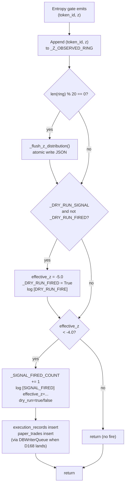

# P0 - T3 - Composer2: F5 — Dry-Run Signal Gate + Z-Distribution Logging

> **Sprint**: D167 | **Phase**: 0 | **LLM**: Cursor Composer 2 | **Priority**: P0
> **Estimated**: 4 hours | **Blocking**: P0-T2 (entropy gate must produce some `z_eval_ok>0`) | **Blocks**: D168 (downstream validated)

---

## 1. Goal

Two deliverables in one task:

1. **Force-fire path** — add a guarded dry-run gate to `panopticon_py/signal_engine.py` that, when `PANOPTICON_DRY_RUN_SIGNAL=1`, fires exactly **one** synthetic signal during a single process lifetime. Validates the entire `signal_engine → paper_trade → DB` pipeline.
2. **Z-distribution observability** — write every observed `z` value to `data/z_distribution.json` (rolling window, atomic write, capped size). Answers NQ-4: is `z` ever below `-4.0` organically?

---

## 2. Context

D166 facts:
- Long-soak window: `z_eval_ok` reached 7, but `fired = 0` always.
- `paper_trades` since restart: 0.
- `execution_records` since restart: 0.
- Entire downstream signal_engine path is **dark** — no proof it works at all.

`signal_engine.py` reference points already located:
- Line **100**: `MIN_ENTROPY_Z_THRESHOLD = float(os.getenv("MIN_ENTROPY_Z_THRESHOLD", "-4.0"))`
- Line **611**: function that "Writes ONLY to execution_records — never touches wallet_market_positions or paper_trades."
- Line **627**: `if abs(z) < abs(MIN_ENTROPY_Z_THRESHOLD): logging.debug("[SE] |z|=%.2f below threshold..., skipping")`
- Line **963**: existing `dry_run=os.getenv("LIVE_TRADING", "").lower() not in ("1", "true", "yes")` — already wired.

**Critical**: `signal_engine.py` is 39 KB. Coding agent MUST read the function around line 611 in full before any edits, including the function signature, all early returns, and how `z` is sourced.

---

## 3. Step-by-step guide

1. **Read** `panopticon_py/signal_engine.py` lines 580–680 (the fire path function).
2. **Read** `panopticon_py/signal_engine.py` lines 90–110 (env var declarations) and 945–980 (existing `dry_run` plumbing).
3. **Identify** the function name at line 611 (likely `_fire_entropy_signal` or `process_negative_entropy_signal` — verify exact name).
4. **Add module-level state** near line 100:
   ```python
   _DRY_RUN_SIGNAL = os.getenv("PANOPTICON_DRY_RUN_SIGNAL", "0") == "1"
   _DRY_RUN_FIRED = False  # one-shot guard
   _SIGNAL_FIRED_COUNT = 0  # cumulative counter
   _Z_OBSERVED_RING: list[tuple[str, float]] = []  # (asset_id_short, z_value) ring
   _Z_RING_MAX = 1000
   ```
5. **Modify the threshold gate** at line 627. Replace the early return `if abs(z) < abs(MIN_ENTROPY_Z_THRESHOLD): return` with:
   - Append `z` to ring (always, regardless of fire decision)
   - Compute `effective_z`: if `_DRY_RUN_SIGNAL and not _DRY_RUN_FIRED` → set `effective_z = MIN_ENTROPY_Z_THRESHOLD - 1.0` (e.g. `-5.0`) and set `_DRY_RUN_FIRED = True`. Else `effective_z = z`.
   - Gate continues using `effective_z`.
   - Log `[SIGNAL_FIRED]` line on every actual fire (real or dry-run), incrementing `_SIGNAL_FIRED_COUNT`.
6. **Add atomic z-distribution writer** — a small helper called every N (=20) z observations:
   ```python
   def _flush_z_distribution(path: str = "data/z_distribution.json") -> None:
       payload = {"updated_ts": _utc_now_rfc3339_ms(), "count": len(_Z_OBSERVED_RING),
                  "samples": list(_Z_OBSERVED_RING)}
       _atomic_write_json(path, payload)
   ```
7. **Mark dry-run paper trade** — propagate `dry_run=True` to the existing paper_trade insert path so analyst can identify the synthetic row in DB:
   - The paper_trades table likely has a `dry_run` BOOLEAN or `mode` TEXT column. If neither: add `note='dry_run_d167'` if a notes column exists. If neither: skip and rely on timestamp + counter to identify.
8. **Bump version**: `panopticon_py/signal_engine.py` — find existing `PROCESS_VERSION` or module version constant. If absent, add `D167_TAG = "D167-dry-run-signal"` near top.
9. **Bump** `run_radar.py` to `v1.1.63-D167` (PATCH) and `run_hft_orchestrator.py` to `v1.1.47-D167` (PATCH); update `run/versions_ref.json` in same commit.
10. **Run soak** with env:
    ```powershell
    $env:PANOPTICON_DRY_RUN_SIGNAL = '1'
    $env:LIVE_TRADING = 'false'  # paper mode
    .\scripts\restart_all.ps1
    ```
11. **Verify within 5 minutes**:
    - `[SIGNAL_FIRED]` log line appears once.
    - `paper_trades` table gets a new row.
    - `data/z_distribution.json` is being updated (`updated_ts` < 60 s old).
12. **Continue 30-min organic soak** — count organic `z` values below `-4.0` (none expected; confirms threshold is too strict for current markets).

---

## 4. Flow + logic chart



---

## 5. API curl example

Verification probes:

```powershell
# 1. Confirm dry-run env var is read by orchestrator
Select-String -Path run/orchestrator.log -Pattern "DRY_RUN_FIRE|SIGNAL_FIRED" -Tail 10

# 2. Check paper_trades table for dry-run row
sqlite3 data\panopticon.db "SELECT * FROM paper_trades WHERE created_at >= datetime('now', '-30 minutes') ORDER BY created_at DESC LIMIT 5;"

# 3. Z distribution snapshot
Get-Content data\z_distribution.json | ConvertFrom-Json |
  Select-Object updated_ts, count

# 4. Z-value histogram from ring (PowerShell stat)
$ring = (Get-Content data\z_distribution.json | ConvertFrom-Json).samples
$z_values = $ring | ForEach-Object { $_[1] }
$z_values | Measure-Object -Minimum -Maximum -Average -StandardDeviation

# 5. Backend version endpoint check
curl -s http://localhost:8001/api/versions | python -m json.tool
```

---

## 6. API standard reply

`data/z_distribution.json` payload:

```json
{
  "updated_ts": "2026-05-05T08:30:00.000Z",
  "count": 432,
  "samples": [
    ["27911616648163", -1.23],
    ["27911616648163", -0.87],
    ["85033408490054", -2.41],
    ["85033408490054", -3.05]
  ]
}
```

`[SIGNAL_FIRED]` log line shape:

```
2026-05-05 16:32:14,000 [INFO] panopticon_py.signal_engine - [SIGNAL_FIRED] asset=27911616648163... z=-5.000 dry_run=true count=1
```

`[DRY_RUN_FIRE]` log line (paired):

```
2026-05-05 16:32:14,000 [WARNING] panopticon_py.signal_engine - [DRY_RUN_FIRE] forcing effective_z=-5.000 (real_z=-1.234) one-shot consumed
```

---

## 7. Code skeleton

`panopticon_py/signal_engine.py` — only the changed sections shown:

```python
import os, json, threading
from typing import Tuple

_DRY_RUN_SIGNAL: bool = os.getenv("PANOPTICON_DRY_RUN_SIGNAL", "0") == "1"
_DRY_RUN_FIRED: bool = False
_SIGNAL_FIRED_COUNT: int = 0
_Z_OBSERVED_RING: list = []
_Z_RING_MAX: int = 1000
_Z_FLUSH_EVERY: int = 20
_Z_LOCK = threading.Lock()


def _record_z_and_maybe_flush(asset_short: str, z: float) -> None:
    """Append (asset, z) to ring and atomic-write every 20 observations."""
    with _Z_LOCK:
        _Z_OBSERVED_RING.append((asset_short, float(z)))
        if len(_Z_OBSERVED_RING) > _Z_RING_MAX:
            del _Z_OBSERVED_RING[: len(_Z_OBSERVED_RING) - _Z_RING_MAX]
        should_flush = (len(_Z_OBSERVED_RING) % _Z_FLUSH_EVERY) == 0
    if should_flush:
        _flush_z_distribution()


def _flush_z_distribution(path: str = "data/z_distribution.json") -> None:
    """Atomic write of the z-observation ring."""
    from panopticon_py.time_utils import utc_now_rfc3339_ms
    with _Z_LOCK:
        payload = {
            "updated_ts": utc_now_rfc3339_ms(),
            "count": len(_Z_OBSERVED_RING),
            "samples": list(_Z_OBSERVED_RING),
        }
    tmp = path + ".tmp"
    with open(tmp, "w", encoding="utf-8") as f:
        json.dump(payload, f, separators=(",", ":"))
    os.replace(tmp, path)


def _maybe_dry_run_override(z: float) -> Tuple[float, bool]:
    """Return (effective_z, is_dry_run_fire). One-shot per process lifetime."""
    global _DRY_RUN_FIRED
    if _DRY_RUN_SIGNAL and not _DRY_RUN_FIRED:
        _DRY_RUN_FIRED = True
        forced = MIN_ENTROPY_Z_THRESHOLD - 1.0
        logging.warning(
            "[DRY_RUN_FIRE] forcing effective_z=%.3f (real_z=%.3f) one-shot consumed",
            forced, z,
        )
        return forced, True
    return z, False


# Inside the existing fire function near line 611
def _fire_entropy_signal(asset_id: str, z: float, ...) -> None:
    """Existing function — only the gate section shown."""
    asset_short = asset_id[:14]
    _record_z_and_maybe_flush(asset_short, z)

    effective_z, is_dry = _maybe_dry_run_override(z)

    if abs(effective_z) < abs(MIN_ENTROPY_Z_THRESHOLD):
        logging.debug(
            "[SE] |z|=%.2f below threshold magnitude %.2f, skipping",
            abs(effective_z), abs(MIN_ENTROPY_Z_THRESHOLD),
        )
        return

    global _SIGNAL_FIRED_COUNT
    _SIGNAL_FIRED_COUNT += 1
    logging.info(
        "[SIGNAL_FIRED] asset=%s z=%.3f dry_run=%s count=%d",
        asset_short, effective_z, is_dry, _SIGNAL_FIRED_COUNT,
    )

    # ... existing execution_records / paper_trades insert path continues ...
    # Pass dry_run flag through to paper_trade write so DB row is identifiable.
```

`scripts/restart_all.ps1` — append D167 dry-run env (commented; coding agent must NOT enable it as default):

```powershell
# D167 dry-run gate (uncomment for one-shot validation; comment out before normal operation)
# $env:PANOPTICON_DRY_RUN_SIGNAL = '1'
```

---

## 8. Error brainstorm + restrictions

| # | Possible error | Trigger | Restriction |
|---|---|---|---|
| E1 | `_DRY_RUN_FIRED` flips to True but logging fails → silent fire | Logger configured at WARNING+ swallowing INFO | `[DRY_RUN_FIRE]` and `[SIGNAL_FIRED]` MUST be at `WARNING` or `INFO` level (not DEBUG). Verify `LOG_LEVEL` env. |
| E2 | Ring grows unbounded if `_Z_RING_MAX` guard fails | Lock held but condition wrong | Use the precise `del _Z_OBSERVED_RING[: len(_Z_OBSERVED_RING) - _Z_RING_MAX]` slice form; do NOT use `pop(0)` repeatedly (O(n²)). |
| E3 | Atomic write race when two threads call `_flush_z_distribution` simultaneously | No file-write lock | `os.replace` is atomic on Windows + POSIX. Two concurrent calls will produce one valid file, but the inner `payload` snapshot must be taken under `_Z_LOCK`. |
| E4 | Dry-run signal fires every restart → DB pollution | `_DRY_RUN_FIRED` is per-process only | Document that this env should ONLY be set for the explicit D167 verification run. Comment out in `restart_all.ps1` immediately after. |
| E5 | `paper_trades` insert blocks on DB lock (F7 still unfixed in D167) | analysis_worker concurrent write contention | Acceptable for D167 verification: dry-run fires once. If insert fails, caller logs `[SIGNAL_FIRED_INSERT_FAIL]`; verification accepts log line as proof of fire even without DB row (note in handoff). |
| E6 | `dry_run=True` paper_trade row read by downstream as real signal | Downstream analytics | If `paper_trades` schema has `dry_run`/`mode`/`note` column, set it. If not, ensure analyst is aware via handoff note. Architect to decide if D168 needs a schema column. |
| E7 | Z ring contains tokens that no longer exist in tier map | Token expired between observation and flush | Acceptable; ring is observational only. Flush JSON consumer must tolerate unknown asset_short. |
| E8 | `MIN_ENTROPY_Z_THRESHOLD - 1.0` produces a zero result if env was overridden to 0.0 | Env override foot-gun | Add assertion at startup: `assert abs(MIN_ENTROPY_Z_THRESHOLD) >= 1.0, "threshold magnitude too small for dry-run override"`. |
| E9 | `_flush_z_distribution` runs in hot path → slows down signal_engine | Synchronous JSON dump in critical path | At 1000 samples × 20-flush cadence → ~50 KB write per 20 observations. Fast enough; if profiling shows lag, push flush to background thread (not D167 scope). |
| E10 | `data/z_distribution.json` not in `.gitignore` → committed to repo | Default `git add -A` | Verify `.gitignore` covers `data/*.json` already (it does per existing entries); confirm before commit. |
| E11 | Forgetting version bumps → zero-trust check fails | Per AGENTS.md RULE-VER-1..5 | Both `run_radar.py` and `run_hft_orchestrator.py` get D167 PATCH bumps even if their files don't change directly (they orchestrate the new `signal_engine` behavior). Update `run/versions_ref.json` same commit. |
| E12 | Adding `requests` or `openai` SDK | Coding agent reflex | **HARD BAN**: per `AGENTS.md` LLM Backend rule. No new SDKs in D167. |
| E13 | `_record_z_and_maybe_flush` called with `None` z | Upstream gate sometimes returns `None` | Type-guard: `if z is None: return`. Do NOT silently coerce. |
| E14 | `_DRY_RUN_FIRED` is module-global; if the function is hot-reloaded the flag resets | Python doesn't hot-reload by default; `restart_all.ps1` always cold-starts | Acceptable; confirms one-shot behavior. |

### Restrictions summary

- **NO** changes to `MIN_ENTROPY_Z_THRESHOLD` value (`-4.0` is product/risk).
- **NO** persistent dry-run mode; one-shot per process.
- **NO** propagating dry-run to live trading path. `LIVE_TRADING=true` + `PANOPTICON_DRY_RUN_SIGNAL=1` together must still go through paper path.
- **NO** new SDKs. Use stdlib `json`, existing `_atomic_write_json` helper if it exists, else inline.
- **NO** changes to `paper_trades` schema. If the `dry_run` column doesn't exist, log it; do not migrate.
- **MUST** bump versions per RULE-VER.
- **MUST** ensure `data/z_distribution.json` is a runtime artifact (gitignored).

---

## 9. Verification checklist

- [ ] `signal_engine.py` lines 580–680 read in full before any edit.
- [ ] `_DRY_RUN_SIGNAL`, `_DRY_RUN_FIRED`, `_SIGNAL_FIRED_COUNT`, `_Z_OBSERVED_RING` declared at module level.
- [ ] `_record_z_and_maybe_flush`, `_flush_z_distribution`, `_maybe_dry_run_override` helpers added.
- [ ] Existing fire function updated to call helpers; structure preserved.
- [ ] `paper_trades` row identifiable for dry-run (column or note).
- [ ] Versions bumped (`run_radar.py` v1.1.63-D167, `run_hft_orchestrator.py` v1.1.47-D167); `run/versions_ref.json` aligned.
- [ ] `restart_all.ps1` env block for dry-run added (commented out by default).
- [ ] Restart with `PANOPTICON_DRY_RUN_SIGNAL=1` produces exactly **one** `[SIGNAL_FIRED]` line.
- [ ] `paper_trades` table has at least one new row since restart.
- [ ] `data/z_distribution.json` exists, `updated_ts` recent, `count > 0`.
- [ ] Histogram of `z` values across 30-min organic soak captured for handoff (answer to NQ-4).
- [ ] No new `TypeError` or `database is locked` errors in soak.

---

## 10. Exit criteria

ALL of:
1. Exactly one `[SIGNAL_FIRED]` log line during the dry-run-enabled soak.
2. `[DRY_RUN_FIRE]` log line exists and pairs with the SIGNAL_FIRED.
3. `paper_trades` count since orchestrator `start_time` ≥ 1.
4. `data/z_distribution.json` updated within last 60 s during soak; `count > 100`.
5. Z-distribution histogram (min, p25, p50, p75, max) included in handoff. Answers: did any organic `z` reach `-4.0`?
6. Versions match across code + `versions_ref.json` + `/api/versions` endpoint.

---

## 11. Rollback plan

1. `git revert` the signal_engine.py and version-bump commits.
2. Restore `run/versions_ref.json` to D166 values.
3. `scripts/restart_all.ps1` (no env vars).
4. Verify `[SIGNAL_FIRED]` no longer appears and `data/z_distribution.json` is no longer updated.
5. Document failure mode in `temp_architect_handoffs/2026-05-05_D167_T3_escalation.md`.
