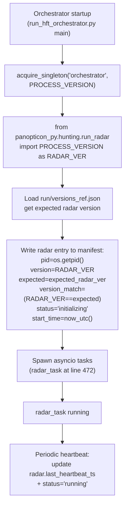

# P0 - T4 - GLM5.1: Q1 — Manifest Radar Version Drift Fix

> **Sprint**: D167 | **Phase**: 0 | **LLM**: GLM 5.1 | **Priority**: P1
> **Estimated**: 1 hour | **Blocking**: none | **Blocks**: zero-trust verification checklist

---

## 1. Goal

Fix `run/process_manifest.json:radar.version` so that after `scripts/restart_all.ps1`, the manifest reads the live `run_radar.PROCESS_VERSION` (`v1.1.63-D167` after this sprint) instead of the stale `v1.1.41-D119`. Same fix updates `radar.start_time` to the orchestrator's start time.

---

## 2. Context

D166 manifest reading:

```json
"radar": {
  "pid": 51452,
  "version": "v1.1.41-D119",
  "status": "running",
  "last_heartbeat_ts": "2026-05-05T07:56:34.315853+00:00",
  "start_time": "2026-05-01T18:51:02.067965+00:00"
}
```

Compared to:

```json
"orchestrator": {
  "pid": 51452,
  "version": "v1.1.46-D166",
  "expected": "v1.1.46-D166",
  "version_match": true,
  "start_time": "2026-05-05T07:50:56.910724+00:00"
}
```

**Critical observation**: `radar.pid` == `orchestrator.pid` == `51452`. Radar is **not a separate process**; it is `asyncio.create_task(run_polymarket_radar(...), name="radar")` inside the orchestrator (see `run_hft_orchestrator.py:472`).

**Implication**: The "stale radar version" is not a cross-process telemetry problem. It is a manifest-write path that:
- Either never writes the radar entry (it persists from a previous run from 2026-05-01).
- Or writes only `pid`/`status`/`last_heartbeat_ts` and skips `version`/`start_time`.

**Diagnostic step required first**: locate the manifest writer in `run_hft_orchestrator.py` to determine which case applies.

---

## 3. Step-by-step guide

1. **Locate manifest writer** in `run_hft_orchestrator.py`:
   ```powershell
   Select-String -Path run_hft_orchestrator.py -Pattern "process_manifest|manifest\.json|radar.*version" -Context 0,3
   ```
2. **Read** the discovered section in full.
3. **Locate `run_radar.PROCESS_VERSION`**:
   ```powershell
   Select-String -Path panopticon_py/hunting/run_radar.py -Pattern "^PROCESS_VERSION\s*=" -Context 1,1
   ```
4. **Identify the gap**:
   - **Case A**: Manifest writer exists for orchestrator/backend but not for radar.
   - **Case B**: Manifest writer exists for radar but only updates pid/heartbeat, never version/start_time.
   - **Case C**: Radar manifest entry is loaded from disk and never refreshed at orchestrator startup.
5. **Implement fix** (most likely Case C — simplest):
   - At orchestrator startup, immediately after `acquire_singleton("orchestrator", ...)`, import `run_radar` to read `PROCESS_VERSION` and write the radar entry to the manifest with fresh `pid` (orchestrator's own pid since they share), `version`, `start_time` (== orchestrator start_time), `status="initializing"`.
   - When `radar_task` actually starts (line 472), update `radar.status="running"` and emit a heartbeat.
6. **Add `expected` field for symmetry** with other entries — read from `run/versions_ref.json:radar`.
7. **Add `version_match` field** — `True` iff `version == expected`.
8. **Bump** `run_hft_orchestrator.py` to `v1.1.47-D167` (PATCH from D166's v1.1.46).
9. **Update `run/versions_ref.json`** in same commit.
10. **Restart and verify** `process_manifest.json:radar` reads:
    ```json
    {
      "pid": <orchestrator pid>,
      "version": "v1.1.63-D167",
      "expected": "v1.1.63-D167",
      "version_match": true,
      "status": "running",
      "start_time": "<fresh UTC>",
      "last_heartbeat_ts": "<fresh UTC>"
    }
    ```
11. **Verify with backend** (`/api/versions` aggregator):
    ```
    curl -s http://localhost:8001/api/versions | python -m json.tool
    ```
    All `version_match` fields must be `true`.

---

## 4. Flow + logic chart



---

## 5. API curl example

```powershell
# Pre-fix: confirm stale radar version
Get-Content run/process_manifest.json | ConvertFrom-Json |
  Select-Object -ExpandProperty radar

# Post-fix verification
.\scripts\restart_all.ps1
Start-Sleep -Seconds 30

# Manifest direct read
Get-Content run/process_manifest.json | ConvertFrom-Json |
  Select-Object -ExpandProperty radar

# Backend aggregator
curl -s http://localhost:8001/api/versions | python -m json.tool

# Cross-check: PROCESS_VERSION constant in code
Select-String -Path panopticon_py/hunting/run_radar.py -Pattern "^PROCESS_VERSION"
Select-String -Path run_hft_orchestrator.py -Pattern "^PROCESS_VERSION"
```

---

## 6. API standard reply

`run/process_manifest.json` after fix (radar entry only):

```json
{
  "radar": {
    "pid": 51452,
    "version": "v1.1.63-D167",
    "expected": "v1.1.63-D167",
    "version_match": true,
    "host": "AMOY",
    "status": "running",
    "start_time": "2026-05-05T08:00:00.000000+00:00",
    "last_heartbeat_ts": "2026-05-05T08:05:30.000000+00:00"
  }
}
```

`/api/versions` aggregator response:

```json
{
  "backend":         {"version": "v1.1.48-D165", "expected": "v1.1.48-D165", "version_match": true, "status": "running"},
  "orchestrator":    {"version": "v1.1.47-D167", "expected": "v1.1.47-D167", "version_match": true, "status": "running"},
  "analysis_worker": {"version": "v1.1.16-D163", "expected": "v1.1.16-D163", "version_match": true, "status": "running"},
  "radar":           {"version": "v1.1.63-D167", "expected": "v1.1.63-D167", "version_match": true, "status": "running"},
  "arb_scanner":     {"version": "v0.5.11-D150", "expected": "v0.5.11-D150", "version_match": true, "status": "running"},
  "watchdog":        {"version": "v1.0.5-D146",  "expected": "v1.0.5-D146",  "version_match": true, "status": "running"}
}
```

ALL `version_match` fields MUST be `true` after this fix.

---

## 7. Code skeleton

`run_hft_orchestrator.py` — add helper near top (after imports), call near startup:

```python
import json
import os
from datetime import datetime, timezone

PROCESS_VERSION = "v1.1.47-D167"  # bumped from v1.1.46-D166


def _now_utc_iso() -> str:
    return datetime.now(timezone.utc).isoformat()


def _write_radar_manifest_entry(manifest_path: str, versions_ref_path: str) -> None:
    """
    D167 Q1 fix: Radar runs as an asyncio task inside this process.
    Eagerly write a fresh radar entry to manifest at orchestrator startup
    so /api/versions reflects the live binary, not stale on-disk state.
    """
    from panopticon_py.hunting.run_radar import PROCESS_VERSION as RADAR_VER

    try:
        with open(versions_ref_path, "r", encoding="utf-8") as f:
            versions_ref = json.load(f)
        expected = versions_ref.get("radar", "unknown")
    except (FileNotFoundError, json.JSONDecodeError):
        expected = "unknown"

    try:
        with open(manifest_path, "r", encoding="utf-8") as f:
            manifest = json.load(f)
    except (FileNotFoundError, json.JSONDecodeError):
        manifest = {}

    manifest["radar"] = {
        "pid":              os.getpid(),
        "version":          RADAR_VER,
        "expected":         expected,
        "version_match":    (RADAR_VER == expected),
        "host":             os.environ.get("COMPUTERNAME") or os.environ.get("HOSTNAME") or "unknown",
        "status":           "initializing",
        "start_time":       _now_utc_iso(),
        "last_heartbeat_ts": _now_utc_iso(),
    }

    tmp = manifest_path + ".tmp"
    with open(tmp, "w", encoding="utf-8") as f:
        json.dump(manifest, f, indent=2)
    os.replace(tmp, manifest_path)


# Called once near top of main(), AFTER acquire_singleton, BEFORE radar_task creation
def _init_radar_manifest() -> None:
    _write_radar_manifest_entry(
        manifest_path=os.environ.get("PANOPTICON_MANIFEST_PATH", "run/process_manifest.json"),
        versions_ref_path=os.environ.get("PANOPTICON_VERSIONS_REF_PATH", "run/versions_ref.json"),
    )


# Inside the existing heartbeat loop, after radar_task starts:
def _radar_heartbeat_tick(manifest_path: str) -> None:
    """Refresh radar.last_heartbeat_ts and flip status to 'running'."""
    try:
        with open(manifest_path, "r", encoding="utf-8") as f:
            manifest = json.load(f)
        if "radar" in manifest:
            manifest["radar"]["status"] = "running"
            manifest["radar"]["last_heartbeat_ts"] = _now_utc_iso()
        tmp = manifest_path + ".tmp"
        with open(tmp, "w", encoding="utf-8") as f:
            json.dump(manifest, f, indent=2)
        os.replace(tmp, manifest_path)
    except Exception as e:
        logging.warning("[MANIFEST_HEARTBEAT] radar tick failed: %s", e)
```

`run/versions_ref.json` — update radar entry to D167 target:

```json
{
  "backend": "v1.1.48-D165",
  "orchestrator": "v1.1.47-D167",
  "analysis_worker": "v1.1.16-D163",
  "radar": "v1.1.63-D167",
  "arb_scanner": "v0.5.11-D150",
  "watchdog": "v1.0.5-D146"
}
```

---

## 8. Error brainstorm + restrictions

| # | Possible error | Trigger | Restriction |
|---|---|---|---|
| E1 | Importing `run_radar` causes side effects (e.g. `acquire_singleton` runs at import) | Module-level singleton acquisition | Read `run_radar.py` top imports before adding the import. If side effects exist, refactor `PROCESS_VERSION` into a separate small `panopticon_py/hunting/_version.py` module that has zero side effects. |
| E2 | Two processes (orchestrator + watchdog) both write the manifest concurrently | Race on `os.replace` | Each process writes only its own entry. Use a per-entry update pattern: read full → mutate own key → atomic write back. Lost updates on other entries are tolerable as long as keys don't overlap (orchestrator and radar share a key only after this fix; orchestrator owns radar entry by design). |
| E3 | `versions_ref.json` is missing / malformed → `expected` reads "unknown" | Operator error | The helper handles `FileNotFoundError` and `json.JSONDecodeError` gracefully; log a WARNING. Do not crash startup. |
| E4 | Heartbeat tick stomps over radar entry written by another path | Conflicting writers | Make the orchestrator the **sole** writer of the radar entry. If any other code writes `radar.*`, refactor it to call the helper. |
| E5 | `os.replace` on Windows fails because target file is locked by another reader | Backend reading manifest concurrently | `os.replace` is atomic; readers see either the old or new file, never partial. Backend reader must use `try/except FileNotFoundError` for the brief window. Verify backend code does this — if not, pre-existing bug, flag for D168. |
| E6 | `PROCESS_VERSION` constant changed but `versions_ref.json` not updated | RULE-VER violation | Always update both in the same commit. Plan exit criteria explicitly checks this. |
| E7 | Heartbeat tick rate too high → manifest write storm | Default heartbeat ~5s should be fine; verify | Heartbeat write at ≤ 1 Hz; the existing orchestrator heartbeat cadence is acceptable (visible at ~5–7 s in D166 logs). |
| E8 | Backend `/api/versions` aggregator caches manifest for too long | Stale read | Verify `/api/versions` reads manifest each request (no cache) — read `panopticon_py/api/app.py` `/api/versions` route. If it caches, that's a separate D168 fix; for D167 verification, restart backend after manifest fix. |
| E9 | `host` field reads as None on Windows when `HOSTNAME` env unset | Default Windows uses `COMPUTERNAME` | Use `os.environ.get("COMPUTERNAME") or os.environ.get("HOSTNAME") or "unknown"`. |
| E10 | start_time set to import-time of orchestrator, not actual main() start | Module-level constant | Use the helper's `_now_utc_iso()` call inside the helper at runtime; do not store as module global. |

### Restrictions summary

- **NO** changes to `run_radar.py` other than version-bump constant.
- **NO** new manifest entries (don't add fields not present in other entries' schema).
- **NO** removing the existing `radar` entry; this is an in-place update.
- **NO** writing to manifest from any process other than orchestrator and backend (where applicable).
- **MUST** atomic-write via `tmp + os.replace`.
- **MUST** bump `run_hft_orchestrator.py` and update `versions_ref.json` in same commit.
- **MUST** verify `version_match=true` for ALL processes in `/api/versions` post-fix.

---

## 9. Verification checklist

- [ ] Located manifest write path in `run_hft_orchestrator.py`.
- [ ] Helper `_write_radar_manifest_entry` added at module level.
- [ ] Helper called at startup, after `acquire_singleton`.
- [ ] Heartbeat tick updates `radar.last_heartbeat_ts` and `status`.
- [ ] `PROCESS_VERSION` bumped: `run_hft_orchestrator.py` → `v1.1.47-D167`.
- [ ] `run/versions_ref.json` updated for `orchestrator` and `radar` keys.
- [ ] `restart_all.ps1` executed; no startup errors.
- [ ] `run/process_manifest.json:radar.version` reads `v1.1.63-D167`.
- [ ] `run/process_manifest.json:radar.start_time` is post-restart UTC.
- [ ] `run/process_manifest.json:radar.version_match` is `true`.
- [ ] `curl /api/versions` returns all `version_match: true`.
- [ ] Heartbeat updates `radar.last_heartbeat_ts` within last 60 s.

---

## 10. Exit criteria

ALL of:
1. `process_manifest.json:radar` reflects D167 version, fresh `start_time`, fresh `last_heartbeat_ts`.
2. `version_match=true` for all six processes via `/api/versions`.
3. `versions_ref.json` aligned with code constants.
4. Restart cycle completes without errors.
5. Manifest entry refreshes within 60 s of every heartbeat tick.

---

## 11. Rollback plan

1. `git revert` the orchestrator and versions_ref.json commits.
2. Restore `run_hft_orchestrator.py` to v1.1.46-D166.
3. `scripts/restart_all.ps1`.
4. Manifest will return to its prior stale state — acceptable since this is a non-functional issue.
