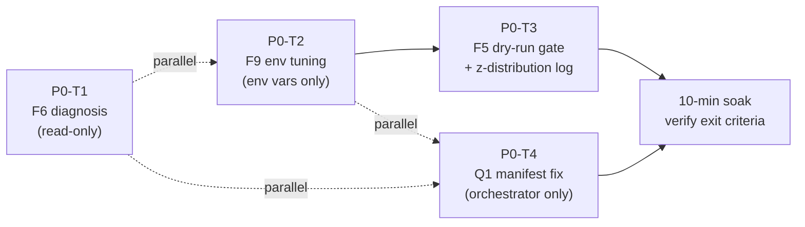

# D167 — Phase 0 Diagnosis + Q1 Manifest Drift

> **Sprint**: D167 | **Predecessor**: D166 (shipped) | **Successor**: D168 (Phase 1)
> **Duration target**: 3 calendar days | **Risk**: Low (no new architecture)

---

## Sprint goal

Resolve the four open observations from `2026-05-05_D166_completion.md`:

| Code | Observation (D166) | D167 task | LLM |
|---|---|---|---|
| F5 | `SIGNAL_FIRED` counter = 0; downstream untested | P0-T3 | Composer2 |
| F6 | `kyle_lambda_samples.window_ts=0` interpreted as bug | P0-T1 | Composer2 |
| F9 | `z_eval_ok=0` persistent / fired=0 even when `z_eval_ok>0` | P0-T2 + P0-T3 | GLM5.1 + Composer2 |
| Q1 | `process_manifest.radar.version=v1.1.41-D119` (stale) | P0-T4 | GLM5.1 |

F7 (`analysis_worker` DB lock) and F8 (`ORDER_RECON RETRY/SKIP` noise) are **deferred to D168** — they require `DBWriterQueue` (Phase 1 architecture), not point fixes.

---

## Critical scope corrections

### F6 is a diagnostic task, not a fix task

`run_radar.py` lines 2554–2581 and 2776–2800 prove `window_ts=0` is the **intended fallback** for non-T1 markets (whose slugs do not embed a 5-min timestamp). The "kyle=69139 stuck" baseline counter filters `WHERE window_ts > 0` **by design** to count T1-only samples.

**P0-T1's real question**: are *T1 markets* getting kyle samples? If yes, the apparent bug is just a misnamed metric. If no T1 samples since restart, that is a separate issue (likely zero T1 trade activity in the soak window, not a code bug).

### F9 has two sub-questions

`z_eval_ok=0` (most rows) AND `fired=0` (even when `z_eval_ok>0` was observed in long-soak). These are different problems:
- `z_eval_ok=0` → `hist_not_ready` or `locked` — solvable by P0-T2 (env tuning).
- `z_eval_ok>0 but fired=0` → `z` never reached `-4.0` — solvable only by P0-T3 (z-distribution logging) + Architect threshold decision.

---

## Task ordering



**Order**:
1. **P0-T1 + P0-T2 + P0-T4** can run in parallel (different files, different LLMs).
2. **P0-T3** must follow P0-T2 (dry-run gate is more useful once z_eval_ok recovers).
3. Single soak window verifies all four.

---

## D167 exit criteria

The sprint ships when ALL of:

- [ ] **F5 (P0-T3)**: ≥ 1 `SIGNAL_FIRED` log line during soak (forced via dry-run env var).
- [ ] **F5 (P0-T3)**: ≥ 1 `paper_trades` row inserted since orchestrator `start_time` (`mode='PAPER'`, `dry_run=true`).
- [ ] **F5 (P0-T3)**: z-distribution log emits at least 100 z-values across the soak window; histogram of z values written to `data/z_distribution.json`.
- [ ] **F6 (P0-T1)**: Diagnostic memo committed to `temp_architect_handoffs/d167_F6_kyle_window_ts_diagnosis.md` confirming or refuting bug status. If refuted, observability fix (split T1/non-T1 counters) optional and tagged `[D168 backlog]`.
- [ ] **F9 (P0-T2)**: After tuning, soak window shows `z_ready_count ≥ 15` and `hist_not_ready` count drops by ≥ 30 % vs D166 baseline (`hist_not_ready=4–5` per gate row).
- [ ] **Q1 (P0-T4)**: `process_manifest.radar.version` reads `v1.1.63-D167` immediately after `restart_all.ps1`. Manifest `start_time` updates to fresh UTC.
- [ ] **Versions**: `run_radar.py` → `v1.1.63-D167`, `run_hft_orchestrator.py` → `v1.1.47-D167`, `signal_engine.py` bumped if changed, `versions_ref.json` aligned.
- [ ] **No regressions**: no new `TypeError: a coroutine was expected` or `sqlite3.OperationalError: database is locked` in 30-min soak.

---

## Verification commands (run during soak)

```powershell
# 1. Version check
curl -s http://localhost:8001/api/versions | python -m json.tool

# 2. Manifest freshness
Get-Content run/process_manifest.json | ConvertFrom-Json | Select-Object -ExpandProperty radar

# 3. Entropy gate evaluation
Select-String -Path run/orchestrator.log -Pattern "D75_ENTROPY_GATE" -Tail 20

# 4. Signal fired counter
Select-String -Path run/orchestrator.log -Pattern "SIGNAL_FIRED" -Tail 5

# 5. Paper trades since restart
sqlite3 data/panopticon.db "SELECT COUNT(*) FROM paper_trades WHERE created_at >= datetime('now', '-30 minutes');"

# 6. Z distribution
Get-Content data/z_distribution.json | ConvertFrom-Json
```

---

## Rollback plan

If exit criteria fail after 2 attempts (per AGENTS.md hard-stop rule):

1. `git revert HEAD~N` for the failing task's commits.
2. Restore env vars to D166 baseline (`HUNT_EW_UNLOCK_EVENT_COUNT=8`, `HUNT_EW_UNLOCK_HEALTHY_SPAN_SEC=3.0`).
3. `scripts/restart_all.ps1`.
4. Write escalation handoff to `temp_architect_handoffs/2026-05-05_D167_escalation.md`.

---

## Files modified by D167 (expected)

| File | Tasks | Change scope |
|---|---|---|
| `panopticon_py/signal_engine.py` | P0-T3 | Add `SIGNAL_FIRED` counter, z-distribution log, dry-run env gate. ~30 lines added. |
| `run_hft_orchestrator.py` | P0-T4 + P0-T3 (version bump) | Manifest write path (~15 lines added), version bump. |
| `panopticon_py/hunting/run_radar.py` | P0-T3 (version bump only if signal_engine call site changes) | Version bump. |
| `run/versions_ref.json` | P0-T3 + P0-T4 | Version sync. |
| `temp_architect_handoffs/d167_F6_kyle_window_ts_diagnosis.md` | P0-T1 | New diagnostic memo (NOT committed; in .gitignore). |
| `data/z_distribution.json` | P0-T3 | Runtime artifact (NOT committed; in .gitignore). |

**No changes** in D167 to: `entropy_window.py`, `clob_ws_client.py`, `db.py`, `analysis_worker.py`, `pol_monitor.py`. Those land in D168/D169.
