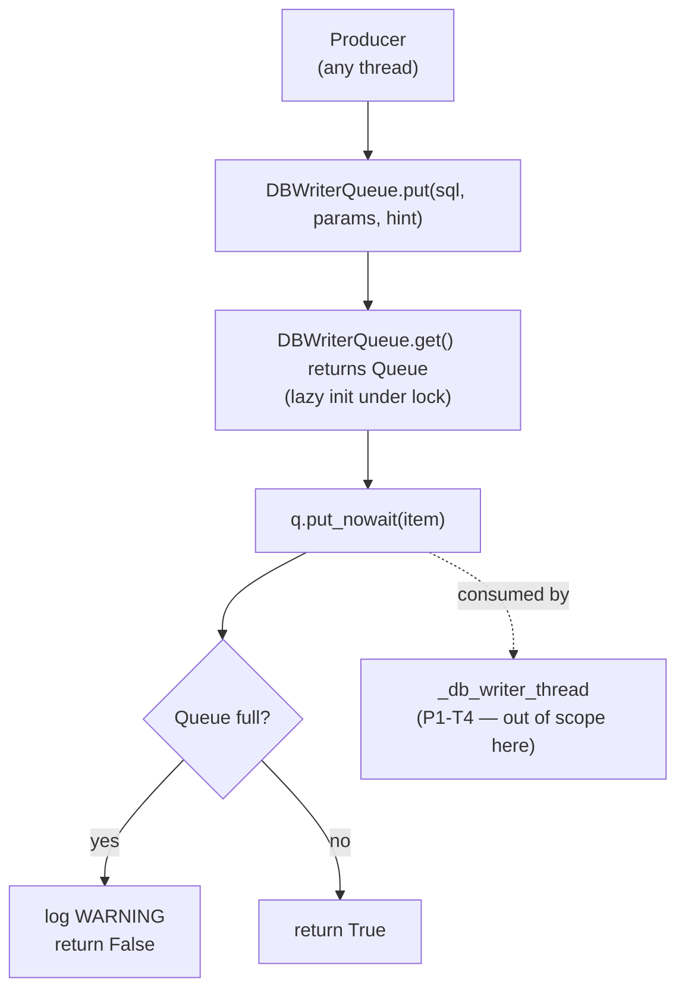

# P1 - T1 - Composer2: `DBWriterQueue` API in `db.py`

> **Sprint**: D168 | **Phase**: 1 | **LLM**: Cursor Composer 2 | **Priority**: P0
> **Estimated**: 3 hours | **Blocking**: none | **Blocks**: P1-T2, P1-T3, P1-T4

---

## 1. Goal

Add a thread-safe singleton `DBWriterQueue` class to `panopticon_py/db.py` providing `put(sql, params, table_hint="") -> bool` non-blocking enqueue. Foundation for all D168 producer-side work.

---

## 2. Context

`db.py` is 165 KB. Append-only change to avoid disturbing existing API.

Producer–consumer model:
- **Producers**: any thread / asyncio task in any process. Use `DBWriterQueue.put(...)`.
- **Consumer**: a single `_db_writer_thread` started by orchestrator (P1-T4).
- **Queue**: `queue.Queue` (thread-safe) — keeping the writer as a thread in orchestrator process avoids `multiprocessing.Queue` pickle constraints.

Note: cross-process producers (analysis_worker, arb_scanner — separate processes per `process_manifest.json`) cannot use this thread-local queue. They must keep their own DB connections. **D168 scope is intra-orchestrator-process only.** Cross-process write coordination is deferred to D169+ (likely never needed; analysis_worker writes a small set of rows infrequently).

---

## 3. Step-by-step guide

1. **Read** `panopticon_py/db.py` last ~200 lines to find the natural append point (after the last class / function).
2. **Read** `panopticon_py/time_utils.py` to confirm `utc_now_rfc3339_ms` exists (used for health JSON).
3. **Append** the `DBWriterQueue` class at the file end:
   - Class-level `_queue: queue.Queue | None = None` and `_lock: threading.Lock`.
   - `get() -> queue.Queue` — lazy init under lock.
   - `put(sql, params, table_hint="") -> bool` — `put_nowait`; on `queue.Full`, log WARNING and return `False`.
   - `enqueue_sentinel()` — pushes `None` for shutdown.
   - `qsize_safe() -> int` — returns approximate size for health reporting.
4. **Define** `_DBWriteItem` named tuple `(sql: str, params: tuple, table_hint: str, ts_ms: str)`.
5. **Add module-level `D168_TAG = "D168-db-writer-queue"`** for traceability.
6. **Do NOT add a writer thread here** — that's P1-T4. This task only ships the queue + producer API.
7. **Add lightweight unit test** at `tests/test_d168_db_writer_queue.py`:
   - Singleton: two `get()` calls return same instance.
   - put/get round-trip.
   - put returns `False` when queue full.
   - Sentinel flows through.
8. **Bump** `db.py` version comment / `D168_TAG`. (`db.py` does not have `PROCESS_VERSION` — only entry-points do.)
9. **Run test**: `pytest tests/test_d168_db_writer_queue.py -q`.

---

## 4. Flow + logic chart



---

## 5. API curl example

**N/A** — pure library code. Verification via pytest.

```powershell
# Run the new unit test only
pytest tests/test_d168_db_writer_queue.py -q

# Smoke-import to verify class loads
python -c "from panopticon_py.db import DBWriterQueue; print(DBWriterQueue.__name__)"
```

---

## 6. API standard reply

`DBWriterQueue.put(...)` returns `bool`:
- `True`: enqueued.
- `False`: queue full or class disabled, item dropped (logged at WARNING).

`DBWriterQueue.qsize_safe()` returns `int`:
- Approximate queue size (Python's `Queue.qsize` is approximate on Windows).

Item shape:
```python
_DBWriteItem(
    sql="INSERT INTO foo VALUES (?, ?)",
    params=(1, 2),
    table_hint="foo",
    ts_ms="2026-05-05T16:00:00.000Z",
)
```

---

## 7. Code skeleton

`panopticon_py/db.py` — append at end of file:

```python
import os
import logging
import queue
import threading
from typing import NamedTuple, Optional

D168_TAG = "D168-db-writer-queue"

logger = logging.getLogger(__name__)


class _DBWriteItem(NamedTuple):
    sql: str
    params: tuple
    table_hint: str
    ts_ms: str  # RFC3339 UTC ms; used by health JSON


class DBWriterQueue:
    """
    Thread-safe singleton queue for SQLite writes.

    All producers in the orchestrator process should call DBWriterQueue.put(...)
    instead of `db.conn.execute(...)` for INSERT / UPDATE / DELETE statements.
    SELECT statements remain synchronous (callers need return values).

    Consumer (single _db_writer_thread) is started by run_hft_orchestrator.py.
    """

    _MAXSIZE = int(os.getenv("PANOPTICON_DB_WRITER_QSIZE", "50000"))
    _queue: Optional["queue.Queue[_DBWriteItem | None]"] = None
    _lock = threading.Lock()
    _enabled: bool = True

    @classmethod
    def get(cls) -> "queue.Queue[_DBWriteItem | None]":
        if cls._queue is None:
            with cls._lock:
                if cls._queue is None:
                    cls._queue = queue.Queue(maxsize=cls._MAXSIZE)
        return cls._queue

    @classmethod
    def put(cls, sql: str, params: tuple, table_hint: str = "") -> bool:
        """
        Non-blocking enqueue. Returns True on success, False if dropped.
        On Full or disabled state, logs WARNING and returns False.
        Producers MUST NOT block on this call.
        """
        if not cls._enabled:
            return False
        from panopticon_py.time_utils import utc_now_rfc3339_ms
        item = _DBWriteItem(
            sql=sql,
            params=tuple(params),
            table_hint=table_hint or "",
            ts_ms=utc_now_rfc3339_ms(),
        )
        try:
            cls.get().put_nowait(item)
            return True
        except queue.Full:
            logger.warning(
                "[DB_WRITER] queue full (max=%d) dropping write table=%s",
                cls._MAXSIZE, table_hint,
            )
            return False

    @classmethod
    def enqueue_sentinel(cls) -> None:
        """Push a None sentinel; consumer thread exits when it sees this."""
        try:
            cls.get().put_nowait(None)
        except queue.Full:
            logger.warning("[DB_WRITER] sentinel enqueue failed — queue full")

    @classmethod
    def qsize_safe(cls) -> int:
        try:
            return cls.get().qsize()
        except Exception:
            return -1

    @classmethod
    def disable(cls) -> None:
        """Used in tests only."""
        cls._enabled = False

    @classmethod
    def enable(cls) -> None:
        cls._enabled = True
```

`tests/test_d168_db_writer_queue.py` (new file):

```python
import queue
import pytest
from panopticon_py.db import DBWriterQueue, _DBWriteItem


def test_singleton_identity():
    q1 = DBWriterQueue.get()
    q2 = DBWriterQueue.get()
    assert q1 is q2


def test_put_round_trip():
    DBWriterQueue.put("INSERT INTO t VALUES (?)", (1,), "t")
    item = DBWriterQueue.get().get_nowait()
    assert isinstance(item, _DBWriteItem)
    assert item.sql.startswith("INSERT")
    assert item.params == (1,)
    assert item.table_hint == "t"


def test_put_returns_false_when_full(monkeypatch):
    monkeypatch.setattr(DBWriterQueue, "_MAXSIZE", 2)
    DBWriterQueue._queue = None  # reset
    DBWriterQueue.put("X", (), "a")
    DBWriterQueue.put("Y", (), "b")
    ok = DBWriterQueue.put("Z", (), "c")
    assert ok is False


def test_sentinel_flows_through():
    DBWriterQueue._queue = None  # reset
    DBWriterQueue.enqueue_sentinel()
    assert DBWriterQueue.get().get_nowait() is None
```

---

## 8. Error brainstorm + restrictions

| # | Possible error | Trigger | Restriction |
|---|---|---|---|
| E1 | Producer in another process imports `DBWriterQueue` and gets a separate, useless queue | Singleton is per-process | Document that this queue is **orchestrator-process only**. Cross-process producers (analysis_worker, arb_scanner) keep their own DB connections. |
| E2 | `params` includes a non-picklable / non-bindable type (e.g. dict) | Coding agent passes wrong type | Validate `params` is `tuple` of (str, int, float, bytes, None). Add isinstance check + raise `TypeError` early. |
| E3 | `get()` called from many threads concurrently before init | Concurrent producers at startup | Double-checked locking pattern is correct. Verify in test. |
| E4 | `qsize_safe` returns -1 on every call → health JSON misleading | Queue not initialized | Init queue lazily on first `put`. `qsize_safe` should call `get()` first. Already in skeleton. |
| E5 | Memory pressure: 50000 × ~200 bytes = 10 MB peak | Sustained backpressure | 10 MB peak is acceptable. If `[DB_WRITER] queue full` warnings sustain > 100/min, architect must intervene. |
| E6 | Sentinel `None` confuses consumer that doesn't handle it | P1-T4 must handle `None` | Cross-task contract: consumer breaks loop on `None`. Document in `db.py` docstring. |
| E7 | `put` called from inside an `asyncio` event loop hot path → no problem (lock is thread-safe and uncontended) | — | OK. `put_nowait` doesn't block. |
| E8 | `_DBWriteItem` becomes a memory hog if SQL is huge (e.g. 10 KB blob) | Large param values | Add size guard: if `sum(len(str(p)) for p in params) > 1_000_000` log WARNING and drop. (Optional; backlog if not encountered.) |
| E9 | Tests run in parallel and pollute each other's queue state | pytest with `-n auto` | Each test resets `DBWriterQueue._queue = None`. Add explicit cleanup in fixture if `-n` used. |
| E10 | Importing `panopticon_py.time_utils` causes circular import | If `time_utils` already imports from `db` | Verify with `python -c "from panopticon_py.db import DBWriterQueue"`. If circular, do the import inside `put()` (already deferred in skeleton). |

### Restrictions summary

- **NO** integration with the writer thread (P1-T4 owns that).
- **NO** cross-process pickling. This is single-process scope.
- **NO** synchronous `db.conn.execute` callers in `db.py` modified.
- **NO** changes to existing `db.py` public API.
- **NO** new dependencies beyond stdlib `queue`, `threading`, `typing`.
- **MUST** non-blocking `put`.
- **MUST** thread-safe singleton.
- **MUST** ship with unit test that runs green via `pytest tests/test_d168_db_writer_queue.py -q`.

---

## 9. Verification checklist

- [ ] Append point in `db.py` does not duplicate `D168_TAG` or break existing imports.
- [ ] Class-level `_queue` and `_lock` declared.
- [ ] `get()` is double-checked locking.
- [ ] `put()` returns `bool` and never raises on Full.
- [ ] `enqueue_sentinel()` pushes `None`.
- [ ] `qsize_safe()` returns int and never raises.
- [ ] Smoke-import succeeds: `python -c "from panopticon_py.db import DBWriterQueue"`.
- [ ] All four unit tests pass.
- [ ] No new `requests`/`openai` imports.

---

## 10. Exit criteria

ALL of:
1. `DBWriterQueue` importable from `panopticon_py.db`.
2. `pytest tests/test_d168_db_writer_queue.py -q` passes (4 tests green).
3. No regressions in existing tests: `pytest tests/test_d165_entropy_unlock.py tests/test_d166_entropy_window_per_tier.py -q` still passes.
4. `D168_TAG` present in `db.py`.

---

## 11. Rollback plan

`git revert` the single commit. `db.py` returns to D167 state. No runtime impact since no producer is using the new API yet (P1-T2/T3/T4 are blocked on this).
