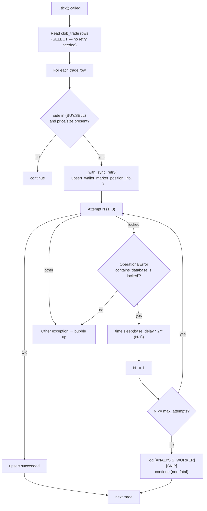

# P1 - T2 - Composer2: `analysis_worker` Sync Retry Wrapper (F7)

> **Sprint**: D168 | **Phase**: 1 | **LLM**: Cursor Composer 2 | **Priority**: P0
> **Estimated**: 2 hours | **Blocking**: P1-T1 (queue not strictly required, but `_with_sync_retry` should mirror its semantics) | **Blocks**: D168 exit criteria

---

## 1. Goal

Wrap `panopticon_py/ingestion/analysis_worker._tick`'s call to `upsert_wallet_market_position_lifo` (line 96) in a synchronous retry helper. On `sqlite3.OperationalError("database is locked")`, retry up to 3 times with backoff (50/200/500 ms), then log + skip — never crash the worker.

**Note**: `analysis_worker.py` runs as its own OS process (per `process_manifest.json`, pid 40364, distinct from orchestrator pid 51452). It cannot use the in-orchestrator `DBWriterQueue`. It needs its own retry wrapper.

---

## 2. Context

D166 finding (line 173 of completion handoff):

```
2026-05-05 11:49:09,714 ERROR __main__ [ANALYSIS_WORKER] tick failed: database is locked
sqlite3.OperationalError: database is locked
  File "...analysis_worker.py", line 96, in _tick
    self.db.upsert_wallet_market_position_lifo(
```

The D166 hardening only added retries to `run_radar.py` paths. `analysis_worker.py` was not covered.

`analysis_worker._tick`:
- Synchronous (uses `time.sleep(self.interval_sec)` per line 58).
- Reads `clob_trade` rows, builds insider scores, upserts wallet positions.
- Single call to `upsert_wallet_market_position_lifo` per BUY/SELL trade.

---

## 3. Step-by-step guide

1. **Read** `panopticon_py/ingestion/analysis_worker.py` lines 1–120 in full. Confirm:
   - `_tick` signature: `def _tick(self) -> None`.
   - Whether `upsert_wallet_market_position_lifo` runs in a transaction (resolves AQ-5).
   - Whether `self.db` is `ShadowDB` or another wrapper.
2. **Read** `panopticon_py/db.py` for `upsert_wallet_market_position_lifo` body — does it call `self.conn.execute` directly, or does it use a context manager (`with self.conn:`)?
3. **AQ-5 resolution**:
   - If `with self.conn:` is used → SQLite implicit transaction; on `OperationalError`, the context manager rolls back. Retry is safe.
   - If raw `self.conn.execute` without explicit `BEGIN` → autocommit mode; each statement is its own implicit transaction. Retry is safe.
   - If explicit `BEGIN ... COMMIT` blocks exist → retry must call `ROLLBACK` first. **Inspect carefully** before deciding.
4. **Add a module-level helper** `_with_sync_retry(func, *args, max_attempts=3, base_delay=0.05, **kwargs)`:
   - Calls `func(*args, **kwargs)`.
   - On `sqlite3.OperationalError` whose message contains `"database is locked"`, sleeps `base_delay * (2 ** attempt)` and retries.
   - On exhaustion or other exceptions, raises (caller catches).
5. **Wrap the line 96 call** with the retry helper. Catch `sqlite3.OperationalError` from the wrapper's exhaustion case and log `[ANALYSIS_WORKER][SKIP] DB locked after retries`.
6. **Bump version** in `analysis_worker.py`: `PROCESS_VERSION` from `v1.1.16-D163` → `v1.1.17-D168`.
7. **Update `run/versions_ref.json`** in same commit.
8. **Add unit test** `tests/test_d168_analysis_worker_retry.py`:
   - Mock `upsert_wallet_market_position_lifo` to raise `OperationalError("database is locked")` twice then succeed.
   - Assert call count = 3 (2 fails + 1 success).
   - Mock to raise 4 times.
   - Assert call count = 3 (max_attempts) and worker logs SKIP without crashing.
9. **Soak verification** (after P1-T1, P1-T3, P1-T4 land):
   - 20 min run.
   - `analysis_worker.err.log` shows zero `database is locked` ERROR.
   - `[ANALYSIS_WORKER][SKIP]` count ≤ 5 (acceptable noise).

---

## 4. Flow + logic chart



---

## 5. API curl example

Verification:

```powershell
# 1. Confirm version bump applied
curl -s http://localhost:8001/api/versions | python -m json.tool | Select-String "analysis_worker"

# 2. Lock-error count post-soak
Select-String -Path run/analysis_worker.err.log -Pattern "database is locked" -Tail 50

# 3. SKIP count
Select-String -Path run/analysis_worker.err.log -Pattern "ANALYSIS_WORKER.*SKIP" -AllMatches |
  ForEach-Object { $_.Matches.Count } | Measure-Object -Sum

# 4. Wallet position progress
sqlite3 data\panopticon.db "SELECT COUNT(*) FROM wallet_market_positions WHERE updated_at >= datetime('now', '-30 minutes');"
```

---

## 6. API standard reply

`/api/versions` after fix:

```json
{
  "analysis_worker": {
    "version": "v1.1.17-D168",
    "expected": "v1.1.17-D168",
    "version_match": true,
    "status": "running"
  }
}
```

`[ANALYSIS_WORKER][SKIP]` log line:

```
2026-05-05 17:00:00,000 [WARNING] __main__ [ANALYSIS_WORKER][SKIP] DB locked after retries (3) wallet=0xabc... market=...
```

---

## 7. Code skeleton

`panopticon_py/ingestion/analysis_worker.py` — append helper near top, wrap line 96:

```python
import sqlite3
import time
import logging
from typing import Callable, TypeVar

PROCESS_VERSION = "v1.1.17-D168"  # bumped from v1.1.16-D163

logger = logging.getLogger(__name__)

T = TypeVar("T")


def _with_sync_retry(
    func: Callable[..., T],
    *args,
    max_attempts: int = 3,
    base_delay: float = 0.05,
    **kwargs,
) -> T:
    """
    Synchronous retry wrapper for SQLite OperationalError 'database is locked'.

    AQ-5 resolution: this function does NOT issue ROLLBACK because:
      - upsert_wallet_market_position_lifo uses sqlite3 connection in autocommit
        (or the implicit transaction is contained within the call's `with self.conn:`).
      - On OperationalError raised by execute(), SQLite has already discarded
        the partial work; nothing to roll back.

    If a future refactor adds explicit BEGIN ... COMMIT blocks around this call,
    revisit and add ROLLBACK before retry.
    """
    last_exc: Exception | None = None
    for attempt in range(1, max_attempts + 1):
        try:
            return func(*args, **kwargs)
        except sqlite3.OperationalError as exc:
            msg = str(exc).lower()
            if "database is locked" not in msg:
                raise
            last_exc = exc
            if attempt >= max_attempts:
                break
            time.sleep(base_delay * (2 ** (attempt - 1)))
    assert last_exc is not None
    raise last_exc


# Inside AnalysisWorker._tick (line 96 area)
def _tick(self) -> None:
    # ... existing read of clob_trade rows ...
    for o in observations:
        side = ...
        price = ...
        size = ...
        if side in ("BUY", "SELL") and price is not None and size is not None:
            try:
                _with_sync_retry(
                    self.db.upsert_wallet_market_position_lifo,
                    wallet_address=o["address"].lower(),
                    market_id=o["market_id"],
                    side=side,
                    price=price,
                    size=size,
                )
            except sqlite3.OperationalError:
                logger.warning(
                    "[ANALYSIS_WORKER][SKIP] DB locked after retries wallet=%s market=%s",
                    o["address"][:10], str(o["market_id"])[:20],
                )
                continue
            except Exception as exc:
                logger.error(
                    "[ANALYSIS_WORKER][ERROR] upsert failed wallet=%s err=%s",
                    o["address"][:10], type(exc).__name__,
                )
                continue
    # ... rest of _tick unchanged ...
```

---

## 8. Error brainstorm + restrictions

| # | Possible error | Trigger | Restriction |
|---|---|---|---|
| E1 | Using `await asyncio.sleep` inside sync `_tick` | Coding agent confuses async vs sync | **HARD BAN**: must be `time.sleep`. `_tick` is synchronous (uses `time.sleep(self.interval_sec)` at line 58). |
| E2 | Catching all `Exception` swallows real bugs | Over-broad except | Catch `sqlite3.OperationalError` specifically. Log other exceptions and continue (non-fatal per AGENTS.md hot-path policy). |
| E3 | `OperationalError` message format varies across SQLite versions | "database is locked" vs "database is busy" | Use `.lower()` substring check on `"database is locked"`. If observation shows `"database is busy"`, expand the predicate. |
| E4 | Retry helper called for non-retryable errors (e.g. `IntegrityError`) | Coding agent generalizes too much | Helper handles only `OperationalError` with "database is locked"; everything else re-raises immediately. |
| E5 | Backoff times too short → pile-up | `base_delay=0.05` × (1+2+4) = 0.35 s | Acceptable. Adjust to `0.1` and `0.5` cap if monitoring shows insufficient. |
| E6 | Retry exhausted, function returns without raising → caller assumes success | Bug in helper return path | Skeleton uses `assert last_exc is not None; raise last_exc`. Verify in unit test. |
| E7 | `upsert_wallet_market_position_lifo` has side effects partially applied before raising | Multi-statement upsert without atomic block | Read `db.py` body of `upsert_*` to confirm. If multi-statement and not wrapped in `with self.conn:`, fix in `db.py` first. **Escalate to architect.** |
| E8 | Test fixture leaks DB connections | `pytest -n auto` issue | Use temp DB per test (`tmp_path` fixture) or in-memory `:memory:`. |
| E9 | Version bump but `versions_ref.json` not updated | RULE-VER-3 violation | Plan exit criteria explicitly checks. |
| E10 | Logger uses `logging.getLogger("__main__")` but module is imported elsewhere as `panopticon_py.ingestion.analysis_worker` | Logger naming inconsistency | Use `logging.getLogger(__name__)` consistently. The existing `__main__` logger in error logs is from when `analysis_worker.py` runs as the main entrypoint of its own process — that's correct. |
| E11 | Worker process doesn't restart after crash | Outside D168 scope | If worker crashes, supervisor / watchdog should restart. Verify watchdog covers it; if not, add to D169 backlog. |

### Restrictions summary

- **NO** `await` / `asyncio` — `_tick` is synchronous.
- **NO** changes to `upsert_wallet_market_position_lifo` body in `db.py` (out of scope; if needed → escalate).
- **NO** retry on non-OperationalError exceptions.
- **NO** changes to `_tick` interval / loop structure.
- **NO** removing the existing `time.sleep(self.interval_sec)` at line 58.
- **MUST** version bump.
- **MUST** unit test passes.

---

## 9. Verification checklist

- [ ] `analysis_worker.py` lines 1–120 read in full.
- [ ] `db.py` `upsert_wallet_market_position_lifo` body inspected for transaction shape.
- [ ] `_with_sync_retry` helper added; uses `time.sleep` (not async).
- [ ] Wrap applied at line 96 area.
- [ ] `OperationalError` exhausted → `[ANALYSIS_WORKER][SKIP]` log, non-fatal.
- [ ] `PROCESS_VERSION` bumped to `v1.1.17-D168`.
- [ ] `run/versions_ref.json:analysis_worker` aligned.
- [ ] Unit test `tests/test_d168_analysis_worker_retry.py` passes (3 cases: success, retry-then-success, exhaustion).
- [ ] Soak: zero `database is locked` ERROR in `analysis_worker.err.log`.
- [ ] Soak: `wallet_market_positions` row count grows since restart.

---

## 10. Exit criteria

ALL of:
1. `analysis_worker.err.log` contains zero `OperationalError: database is locked` lines in 20-min soak.
2. `[ANALYSIS_WORKER][SKIP]` count ≤ 5 in 20-min soak.
3. `wallet_market_positions` table grows since restart (at least 1 new row).
4. `/api/versions:analysis_worker.version_match = true`.
5. New unit test green.

---

## 11. Rollback plan

1. `git revert` the analysis_worker + versions_ref commits.
2. `scripts/restart_all.ps1`.
3. Verify worker still running (will resume D166 behavior with intermittent locks).
