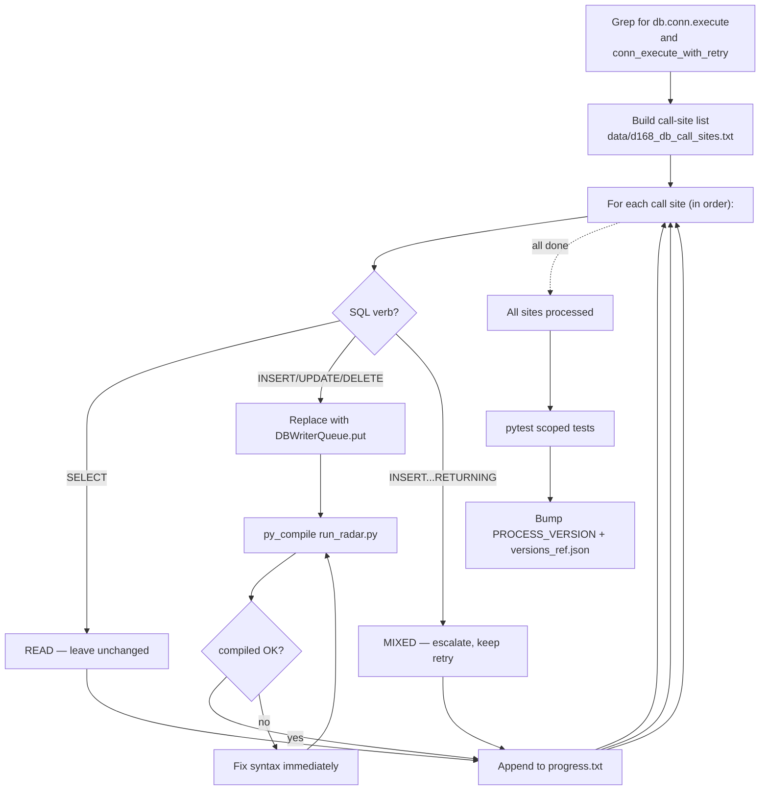

# P1 - T3 - GLM5.1: `run_radar.py` Batch Replace Direct DB Writes

> **Sprint**: D168 | **Phase**: 1 | **LLM**: GLM 5.1 | **Priority**: P0
> **Estimated**: 6 hours | **Blocking**: P1-T1 (`DBWriterQueue` API must exist) | **Blocks**: D168 soak

---

## 1. Goal

Find every direct write call to SQLite in `panopticon_py/hunting/run_radar.py` (160 KB) and replace it with `DBWriterQueue.put(sql, params, table_hint)`. Read calls remain synchronous. This is the **bulk mechanical work** that GLM 5.1 specializes in.

---

## 2. Context

`run_radar.py` is 160 KB. It cannot be loaded in full into a single LLM context. Strategy:
1. Pre-grep to enumerate every `db.conn.execute` and `db.execute` call site.
2. Classify each by SQL verb (SELECT vs INSERT/UPDATE/DELETE/UPSERT/INSERT OR REPLACE).
3. Process in 200–300 line batches.

**The D166 hardening already wrapped some of these in `conn_execute_with_retry`.** Those wrapped sites should also be replaced — `DBWriterQueue` makes the retry obsolete (writes are serialized by the writer thread, eliminating contention).

---

## 3. Step-by-step guide

1. **Pre-survey** — enumerate all DB call sites with line numbers:
   ```powershell
   Select-String -Path panopticon_py/hunting/run_radar.py -Pattern "db\.conn\.execute|db\.execute|conn_execute_with_retry" -Context 1,5 |
     Out-File -FilePath data/d168_db_call_sites.txt
   ```
2. **Classify each call site** — for each line in `data/d168_db_call_sites.txt`, mark as:
   - `READ`: SQL starts with `SELECT` (case-insensitive). Leave unchanged.
   - `WRITE`: SQL starts with `INSERT`, `UPDATE`, `DELETE`, or `INSERT OR REPLACE`. Convert.
   - `MIXED`: e.g. `INSERT ... RETURNING`. **Escalate** — these need return values, can't queue. Leave wrapped in `conn_execute_with_retry` for now.
3. **For each WRITE site**, perform the replacement:
   ```python
   # BEFORE
   db.conn.execute(
       "INSERT INTO kyle_lambda_samples (...) VALUES (?, ?, ?, ?)",
       (val1, val2, val3, val4),
   )

   # AFTER
   from panopticon_py.db import DBWriterQueue
   DBWriterQueue.put(
       "INSERT INTO kyle_lambda_samples (...) VALUES (?, ?, ?, ?)",
       (val1, val2, val3, val4),
       table_hint="kyle_lambda_samples",
   )
   ```
4. **For sites previously wrapped in `conn_execute_with_retry`**:
   ```python
   # BEFORE
   conn_execute_with_retry(db.conn, sql, params, max_retries=4, base_delay=0.05)

   # AFTER
   DBWriterQueue.put(sql, params, table_hint="<inferred>")
   ```
   Remove the now-dead `conn_execute_with_retry` import if no remaining callers.
5. **Process in 200–300 line chunks** — load each chunk, apply changes, save, move to next.
6. **Track progress** — keep `data/d168_db_call_sites_progress.txt`:
   ```
   line 1234: WRITE — converted
   line 1567: READ  — skipped
   line 2049: WRITE — converted
   line 2552: WRITE — converted (kyle insert site #1)
   line 2796: WRITE — converted (kyle insert site #2)
   ...
   ```
7. **Lint after each chunk** — `python -m py_compile panopticon_py/hunting/run_radar.py`. Fix immediately if syntax error.
8. **Bump** `run_radar.py` `PROCESS_VERSION` from `v1.1.62-D166` to `v1.2.0-D168` (MINOR bump — write semantics changed).
9. **Update `run/versions_ref.json`**.
10. **Run existing tests** to confirm no regression: `pytest tests/test_d165_entropy_unlock.py tests/test_d166_entropy_window_per_tier.py -q`.
11. **Run soak** (after P1-T4 lands; this task ships before P1-T4 but is verified together).

---

## 4. Flow + logic chart



---

## 5. API curl example

Verification probes:

```powershell
# 1. Compile check
python -m py_compile panopticon_py/hunting/run_radar.py

# 2. Count remaining direct writes (should be 0 except MIXED)
Select-String -Path panopticon_py/hunting/run_radar.py -Pattern "db\.conn\.execute" -CaseSensitive

# 3. Count DBWriterQueue uses
Select-String -Path panopticon_py/hunting/run_radar.py -Pattern "DBWriterQueue\.put" -CaseSensitive |
  ForEach-Object { $_.LineNumber }

# 4. Existing tests still green
pytest tests/test_d165_entropy_unlock.py tests/test_d166_entropy_window_per_tier.py -q

# 5. Post-soak: kyle inserts continue
sqlite3 data\panopticon.db "SELECT COUNT(*) FROM kyle_lambda_samples WHERE created_at >= datetime('now','-20 minutes');"

# 6. ORDER_RECON SKIP drop
$skips_post = (Select-String -Path run/orchestrator.log -Pattern "ORDER_RECON.*SKIP" -AllMatches).Matches.Count
"ORDER_RECON SKIP count: $skips_post"
```

---

## 6. API standard reply

`run_radar.py` after conversion — typical write site:

```python
DBWriterQueue.put(
    "INSERT INTO kyle_lambda_samples (asset_id, lambda_obs, delta_price, window_ts, source, market_id, created_at) VALUES (?, ?, ?, ?, ?, ?, ?)",
    (asset_id, lambda_obs, delta_price, window_ts, "standalone", asset_id, _utc_now_rfc3339_ms()),
    table_hint="kyle_lambda_samples",
)
```

`data/async_writer_health.json` after P1-T4 lands:

```json
{
  "written_at": "2026-05-05T17:30:00.000Z",
  "queue_size": 4,
  "batch_count": 12345,
  "drop_count": 0,
  "consumer_alive": true
}
```

---

## 7. Code skeleton

Pattern catalog GLM 5.1 should follow:

### Pattern A — simple INSERT

```python
# BEFORE
db.conn.execute(
    "INSERT INTO foo (a, b) VALUES (?, ?)",
    (a_val, b_val),
)

# AFTER
DBWriterQueue.put(
    "INSERT INTO foo (a, b) VALUES (?, ?)",
    (a_val, b_val),
    table_hint="foo",
)
```

### Pattern B — wrapped in `conn_execute_with_retry` (D166 leftover)

```python
# BEFORE
conn_execute_with_retry(
    db.conn,
    "INSERT INTO order_reconstructions (...) VALUES (...)",
    params,
    max_retries=4,
    base_delay=0.05,
)

# AFTER
DBWriterQueue.put(
    "INSERT INTO order_reconstructions (...) VALUES (...)",
    params,
    table_hint="order_reconstructions",
)
```

### Pattern C — multiple statements (transaction shape)

```python
# BEFORE
with db.conn:
    db.conn.execute("INSERT INTO a ...", a_params)
    db.conn.execute("UPDATE b SET ...", b_params)

# AFTER (two enqueues — order preserved by single consumer)
DBWriterQueue.put("INSERT INTO a ...", a_params, table_hint="a")
DBWriterQueue.put("UPDATE b SET ...", b_params, table_hint="b")
```

⚠️ Pattern C **breaks atomic transaction semantics**. If the original required atomicity (e.g. write to two tables that must be consistent), DO NOT split. Mark as MIXED and escalate.

### Pattern D — INSERT ... RETURNING (MIXED)

```python
# DO NOT QUEUE — caller needs return value
row_id = db.conn.execute(
    "INSERT INTO foo (...) VALUES (...) RETURNING id", params
).fetchone()[0]
```

Leave as-is. Add a comment `# D168 MIXED: needs return value, cannot queue`.

### Import addition

At top of `run_radar.py`:

```python
from panopticon_py.db import DBWriterQueue
```

### Version bump

```python
PROCESS_VERSION = "v1.2.0-D168"  # MINOR bump: write semantics changed (queue-based)
```

---

## 8. Error brainstorm + restrictions

| # | Possible error | Trigger | Restriction |
|---|---|---|---|
| E1 | Converting a SELECT statement | GLM regex too greedy | Always inspect `sql.strip().upper().startswith("SELECT")` before converting. SELECT must NEVER go through the queue. |
| E2 | Breaking atomic multi-write transaction | Pattern C applied to mutually dependent writes | Inspect each `with db.conn:` block. If both writes must succeed-or-fail together → DO NOT split, mark MIXED. |
| E3 | INSERT ... RETURNING converted (loses return value) | Pattern D | Search for `RETURNING` in upper-case SQL; skip those entirely. |
| E4 | UPDATE with `WHERE` predicate that depends on previous SELECT in same scope → race | If reader sees stale write timing | Acceptable: writer thread serializes within ~10 ms. Document with comment if discovered. |
| E5 | `table_hint` typo doesn't match real table name | Hint is purely observational, not validated | Tolerable. Hints are for log readability, not correctness. |
| E6 | Dropped writes (queue full) lose data silently | Sustained backpressure | `DBWriterQueue.put` returns `bool`. For critical writes (paper_trades, execution_records), check return and log ERROR if `False`. For high-volume writes (kyle_lambda_samples), drop is acceptable. |
| E7 | `from panopticon_py.db import DBWriterQueue` causes circular import | If `run_radar` is imported by `db.py` | Verify with `python -c "import panopticon_py.hunting.run_radar"`. If circular, defer import inside hot path. |
| E8 | Mass replacement breaks indentation in nested with-blocks | Mechanical regex tools | Use `StrReplace` per-instance with explicit context lines, NOT `replace_all`. |
| E9 | GLM truncates context mid-replacement → produces partial conversion | 160 KB file too large | **MANDATORY 200–300 line chunks**. Do not attempt the whole file in one read. |
| E10 | Removed `conn_execute_with_retry` import that was used elsewhere | Import cleanup too aggressive | Run `Select-String -Pattern "conn_execute_with_retry"` after change to confirm no stragglers. |
| E11 | Replacement skips `executemany` calls | Different API surface | If `db.conn.executemany(sql, list_of_params)` exists, queue each as separate `put` calls **or** preserve `executemany` for atomicity (preferred — keep as-is and mark MIXED). Inspect each. |
| E12 | Coding agent loses track of progress mid-file | Context exhaustion | Persistent progress file `data/d168_db_call_sites_progress.txt` updated after EACH chunk. Resume from last completed chunk on restart. |

### Restrictions summary

- **NO** SELECT conversion.
- **NO** INSERT ... RETURNING conversion.
- **NO** breaking atomic multi-write blocks.
- **NO** `replace_all` — every replacement requires verified context.
- **NO** processing > 300 lines per LLM step.
- **MUST** version bump (MINOR — `v1.2.0-D168`).
- **MUST** progress file kept current.
- **MUST** `py_compile` after each chunk.

---

## 9. Verification checklist

- [ ] `data/d168_db_call_sites.txt` enumeration complete.
- [ ] Every line classified (READ / WRITE / MIXED).
- [ ] All WRITE sites converted to `DBWriterQueue.put`.
- [ ] All `conn_execute_with_retry` callers either converted or marked MIXED.
- [ ] If unused, `conn_execute_with_retry` import removed.
- [ ] `python -m py_compile panopticon_py/hunting/run_radar.py` clean.
- [ ] D165/D166 tests still pass.
- [ ] `PROCESS_VERSION = "v1.2.0-D168"`.
- [ ] `versions_ref.json:run_radar` aligned.
- [ ] Post-soak: `kyle_lambda_samples` count grows.
- [ ] Post-soak: `[ORDER_RECON][SKIP]` count drops below 100/15 min.
- [ ] No new `requests`/`openai` imports.

---

## 10. Exit criteria

ALL of:
1. Zero direct `db.conn.execute` calls for INSERT/UPDATE/DELETE remain in `run_radar.py` (except MIXED-flagged INSERT ... RETURNING, max 3 such sites tolerated).
2. All four scoped tests still pass.
3. 20-min soak: `[ORDER_RECON][SKIP]` count drops by ≥ 80 % vs D167.
4. 20-min soak: `kyle_lambda_samples` post-restart count ≥ 50.

---

## 11. Rollback plan

1. `git revert` the run_radar + versions_ref commits.
2. `restart_all.ps1`.
3. D167 baseline behavior restored (with retry-but-noisy locks).
4. Document the failing replacement pattern in escalation handoff.
