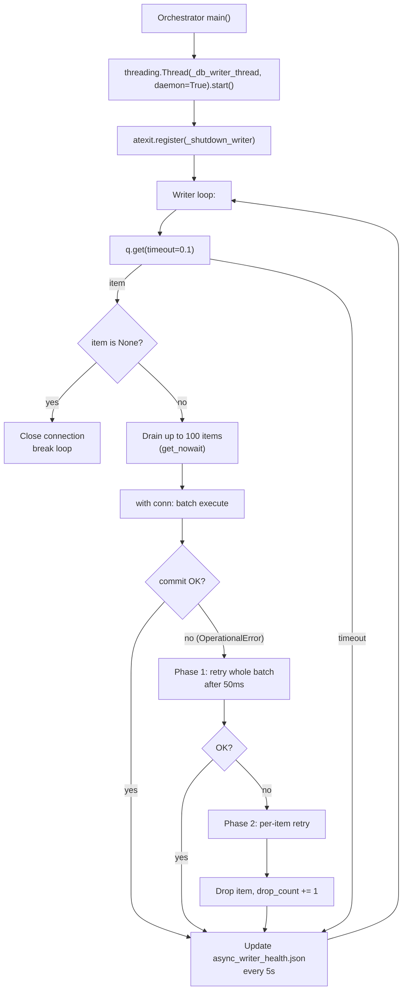

# P1 - T4 - Minimax2.7: Supervisor Writer Thread + atexit Sentinel

> **Sprint**: D168 | **Phase**: 1 | **LLM**: Minimax M2.7 | **Priority**: P0
> **Estimated**: 3 hours | **Blocking**: P1-T1 (`DBWriterQueue` API), P1-T3 (producers in place) | **Blocks**: D168 soak

---

## 1. Goal

Start the consumer side of `DBWriterQueue` — a daemon thread inside `run_hft_orchestrator.py` that batches up to 100 items, commits with single `with conn:` blocks, handles WAL `OperationalError` with two-phase fallback (whole batch retry, then per-item retry), and writes a heartbeat to `data/async_writer_health.json` every 5 s. Graceful shutdown via `atexit` sentinel.

---

## 2. Context

After P1-T1 (queue API) and P1-T3 (producers), there is no consumer yet. Items pile up in the queue with nothing draining them. P1-T4 closes the loop.

Existing `data/async_writer_health.json` is already written by some path (D166 noted `written_at: 2026-05-05T04:02:05.634Z`). P1-T4 takes ownership of that file. The schema MUST remain backward-compatible (the backend reads it).

`AGENTS.md` constraints relevant here:
- WAL mode + `busy_timeout=5000` (already set; P1-T4 does not change PRAGMAs).
- Time format: `_ts_utc` columns are RFC3339 ms strings.

---

## 3. Step-by-step guide

1. **Read** `run_hft_orchestrator.py` lines 230–290 (existing `run_polymarket_radar` and main launch path).
2. **Identify** the open SQLite connection used by orchestrator (look for `db = ShadowDB(...)` or similar in main).
3. **Decide writer connection strategy**:
   - **Option A**: Reuse the existing connection (`db.conn`). Risk: same connection shared with reader paths. WAL allows concurrent reads + single writer; this is fine but blocks if a long SELECT is mid-flight.
   - **Option B (chosen)**: Open a **new** dedicated SQLite connection in the writer thread, with `check_same_thread=False`. WAL handles concurrent connections gracefully.
4. **Add `_db_writer_thread(db_path: str)` function** at module level:
   - Opens new connection.
   - Sets WAL + busy_timeout.
   - Loops: `q.get(timeout=0.1)`, drain up to 100 items, `with conn:` commit batch.
   - On `sqlite3.OperationalError`, two-phase fallback:
     - Phase 1: retry whole batch once after 50 ms.
     - Phase 2: retry items one by one; ones that still fail get logged and dropped (counted in `drop_count`).
   - On sentinel (`None`), break and close connection.
5. **Add `_writer_health_tick(stats: dict)` function** — atomic-write `data/async_writer_health.json` every 5 s.
6. **Wire into `main()`**:
   ```python
   writer_thread = threading.Thread(
       target=_db_writer_thread,
       args=(os.environ.get("PANOPTICON_DB_PATH", "data/panopticon.db"),),
       daemon=True,
       name="db_writer",
   )
   writer_thread.start()

   atexit.register(_shutdown_writer, writer_thread)
   ```
7. **`_shutdown_writer`**: enqueue sentinel, `thread.join(timeout=10.0)`. If still alive, log ERROR (queue had 50k items?).
8. **Bump** `run_hft_orchestrator.py` to `v1.2.0-D168` (MINOR — new thread).
9. **Update `versions_ref.json`**.
10. **Soak verification**:
    - `data/async_writer_health.json:written_at` updates every 5 s.
    - `data/async_writer_health.json:consumer_alive: true`.
    - DB rows growing.
    - On Ctrl-C / supervisor stop, `atexit` flushes; verify by checking `len(queue)` is 0 before exit.

---

## 4. Flow + logic chart



---

## 5. API curl example

Verification:

```powershell
# Health JSON freshness
$h = Get-Content data/async_writer_health.json | ConvertFrom-Json
"$($h.written_at) queue=$($h.queue_size) batches=$($h.batch_count) drops=$($h.drop_count) alive=$($h.consumer_alive)"

# Should update every 5s; check twice with 6s gap
Start-Sleep -Seconds 6
$h2 = Get-Content data/async_writer_health.json | ConvertFrom-Json
"$($h2.written_at) (delta = $((Get-Date $h2.written_at) - (Get-Date $h.written_at)))"

# Logs from writer thread
Select-String -Path run/orchestrator.log -Pattern "DB_WRITER" -Tail 20

# Graceful shutdown evidence (after Ctrl-C)
Select-String -Path run/orchestrator.log -Pattern "DB_WRITER.*shutdown|sentinel|atexit" -Tail 10
```

---

## 6. API standard reply

`data/async_writer_health.json`:

```json
{
  "written_at": "2026-05-05T17:35:00.000Z",
  "queue_size": 12,
  "batch_count": 5847,
  "drop_count": 0,
  "consumer_alive": true,
  "last_batch_size": 23,
  "last_batch_duration_ms": 4
}
```

`[DB_WRITER]` log lines:

```
2026-05-05 17:30:00,000 [INFO] run_hft_orchestrator [DB_WRITER] thread started conn=data/panopticon.db
2026-05-05 17:35:01,234 [INFO] run_hft_orchestrator [DB_WRITER] batch_count=5847 drop_count=0 qsize=12
2026-05-05 17:36:02,000 [WARNING] run_hft_orchestrator [DB_WRITER] batch failed (OperationalError), entering phase-2 per-item
2026-05-05 17:40:00,000 [INFO] run_hft_orchestrator [DB_WRITER] sentinel received, draining 14 items then exiting
2026-05-05 17:40:00,123 [INFO] run_hft_orchestrator [DB_WRITER] thread exited cleanly
```

---

## 7. Code skeleton

`run_hft_orchestrator.py`:

```python
import atexit
import json
import logging
import os
import queue
import sqlite3
import threading
import time
from typing import Optional

PROCESS_VERSION = "v1.2.0-D168"  # MINOR bump

_DB_WRITER_HEALTH_PATH = os.environ.get(
    "PANOPTICON_WRITER_HEALTH_PATH", "data/async_writer_health.json"
)
_DB_WRITER_HEARTBEAT_SEC = 5.0
_DB_WRITER_BATCH_MAX = 100
_DB_WRITER_BATCH_TIMEOUT = 0.1
_DB_WRITER_PHASE1_RETRY_DELAY = 0.05

_writer_stats = {
    "batch_count": 0,
    "drop_count": 0,
    "last_batch_size": 0,
    "last_batch_duration_ms": 0,
    "consumer_alive": False,
}
_writer_stats_lock = threading.Lock()

logger = logging.getLogger(__name__)


def _now_iso_z() -> str:
    from panopticon_py.time_utils import utc_now_rfc3339_ms
    return utc_now_rfc3339_ms()


def _writer_health_flush() -> None:
    from panopticon_py.db import DBWriterQueue
    with _writer_stats_lock:
        snap = dict(_writer_stats)
    payload = {
        "written_at": _now_iso_z(),
        "queue_size": DBWriterQueue.qsize_safe(),
        **snap,
    }
    tmp = _DB_WRITER_HEALTH_PATH + ".tmp"
    with open(tmp, "w", encoding="utf-8") as f:
        json.dump(payload, f, separators=(",", ":"))
    os.replace(tmp, _DB_WRITER_HEALTH_PATH)


def _execute_batch(conn: sqlite3.Connection, items: list) -> int:
    """Execute a batch within an implicit transaction. Returns count of rows committed."""
    with conn:
        for item in items:
            conn.execute(item.sql, item.params)
    return len(items)


def _execute_per_item(conn: sqlite3.Connection, items: list) -> int:
    """Phase-2 fallback: try each item individually, drop the failures."""
    committed = 0
    for item in items:
        try:
            with conn:
                conn.execute(item.sql, item.params)
            committed += 1
        except sqlite3.OperationalError as exc:
            logger.warning(
                "[DB_WRITER] phase2 drop sql=%s table=%s err=%s",
                item.sql[:60], item.table_hint, exc,
            )
            with _writer_stats_lock:
                _writer_stats["drop_count"] += 1
        except Exception as exc:
            logger.error(
                "[DB_WRITER] phase2 unexpected sql=%s table=%s err=%s",
                item.sql[:60], item.table_hint, type(exc).__name__,
            )
            with _writer_stats_lock:
                _writer_stats["drop_count"] += 1
    return committed


def _db_writer_thread(db_path: str) -> None:
    """Daemon writer thread for DBWriterQueue."""
    from panopticon_py.db import DBWriterQueue

    conn = sqlite3.connect(db_path, timeout=30, check_same_thread=False)
    conn.execute("PRAGMA journal_mode=WAL")
    conn.execute("PRAGMA busy_timeout=5000")
    conn.execute("PRAGMA synchronous=NORMAL")

    with _writer_stats_lock:
        _writer_stats["consumer_alive"] = True
    logger.info("[DB_WRITER] thread started conn=%s", db_path)

    q = DBWriterQueue.get()
    last_health = time.monotonic()

    try:
        while True:
            try:
                first = q.get(timeout=_DB_WRITER_BATCH_TIMEOUT)
            except queue.Empty:
                if (time.monotonic() - last_health) >= _DB_WRITER_HEARTBEAT_SEC:
                    _writer_health_flush()
                    last_health = time.monotonic()
                continue

            if first is None:
                logger.info("[DB_WRITER] sentinel received, exiting")
                break

            batch = [first]
            while len(batch) < _DB_WRITER_BATCH_MAX:
                try:
                    nxt = q.get_nowait()
                except queue.Empty:
                    break
                if nxt is None:
                    batch.append(None)
                    break
                batch.append(nxt)

            sentinel_inside = batch and batch[-1] is None
            payload_items = batch[:-1] if sentinel_inside else batch

            t0 = time.monotonic()
            try:
                committed = _execute_batch(conn, payload_items)
            except sqlite3.OperationalError as exc:
                logger.warning(
                    "[DB_WRITER] batch failed (%s), phase-1 retry after %.0fms",
                    exc, _DB_WRITER_PHASE1_RETRY_DELAY * 1000,
                )
                time.sleep(_DB_WRITER_PHASE1_RETRY_DELAY)
                try:
                    committed = _execute_batch(conn, payload_items)
                except sqlite3.OperationalError as exc2:
                    logger.warning(
                        "[DB_WRITER] phase-1 also failed (%s), entering phase-2 per-item", exc2,
                    )
                    committed = _execute_per_item(conn, payload_items)

            duration_ms = int((time.monotonic() - t0) * 1000)
            with _writer_stats_lock:
                _writer_stats["batch_count"] += 1
                _writer_stats["last_batch_size"] = len(payload_items)
                _writer_stats["last_batch_duration_ms"] = duration_ms

            if (time.monotonic() - last_health) >= _DB_WRITER_HEARTBEAT_SEC:
                _writer_health_flush()
                last_health = time.monotonic()

            if sentinel_inside:
                logger.info("[DB_WRITER] drained sentinel-inside batch, exiting")
                break
    except Exception:
        logger.critical("[DB_WRITER] FATAL exception, thread dying", exc_info=True)
    finally:
        try:
            conn.close()
        except Exception:
            pass
        with _writer_stats_lock:
            _writer_stats["consumer_alive"] = False
        _writer_health_flush()
        logger.info("[DB_WRITER] thread exited cleanly")


def _shutdown_writer(thread: threading.Thread) -> None:
    """atexit handler: enqueue sentinel and wait for drain."""
    from panopticon_py.db import DBWriterQueue
    logger.info("[DB_WRITER] atexit: enqueuing sentinel for graceful shutdown")
    DBWriterQueue.enqueue_sentinel()
    thread.join(timeout=10.0)
    if thread.is_alive():
        logger.error("[DB_WRITER] thread did not exit within 10s — items may be lost")


# Inside main(), after acquire_singleton + before radar_task creation:
def _start_db_writer_thread() -> threading.Thread:
    t = threading.Thread(
        target=_db_writer_thread,
        args=(os.environ.get("PANOPTICON_DB_PATH", "data/panopticon.db"),),
        daemon=True,
        name="db_writer",
    )
    t.start()
    atexit.register(_shutdown_writer, t)
    return t
```

---

## 8. Error brainstorm + restrictions

| # | Possible error | Trigger | Restriction |
|---|---|---|---|
| E1 | Writer thread dies silently → queue grows unboundedly | Uncaught exception | Outer `try/except Exception` logs CRITICAL with traceback. supervisor's `atexit` will see `consumer_alive=false`. Optionally: respawn-on-death (D169 backlog). |
| E2 | Two writer threads accidentally created | Multiple imports of `_start_db_writer_thread` | Make it idempotent: check a module-global `_writer_thread_started: bool`. Or rely on `acquire_singleton` (orchestrator is already a singleton). |
| E3 | `with conn:` raises non-OperationalError → batch lost without phase-2 | Programming bug (e.g. IntegrityError, syntax) | Specific catch on `OperationalError` only; other exceptions bubble to phase-2 per-item which catches all and drops. |
| E4 | `os.replace` race between writer's flush and backend's read | Backend reads `async_writer_health.json` mid-write | `os.replace` is atomic; backend reads either old or new payload. Verify backend reader has try/except for malformed JSON. |
| E5 | Sentinel processed mid-batch loses subsequent items in the same batch | Skeleton handles it: sentinel ends the batch | Verify behavior with unit test (push 3 items, sentinel, 2 more items → should drain first 3, exit). |
| E6 | `q.get(timeout=0.1)` precision on Windows is ~15 ms → polling overhead | Acceptable for D168 throughput target | If profiling shows > 1 % CPU on the thread, increase timeout to 0.5 s. |
| E7 | `PRAGMA journal_mode=WAL` returns "wal" the first time, but "delete" later if another connection holds exclusive lock | Other writer in autocommit | Verify; usually fine. Worst case: log warning and proceed (WAL persists from previous successful set). |
| E8 | `db_writer` thread starts before existing connection is initialized → conflict | Order in main() | Start writer thread AFTER any existing initialization writes. Plan: writer starts after `acquire_singleton` and `_init_radar_manifest` (D167 P0-T4) but BEFORE `radar_task = asyncio.create_task(...)`. |
| E9 | atexit handlers not called on hard kill (SIGKILL) | OS process kill | Items lost; acceptable per drop-with-WARN policy. Nothing to do. |
| E10 | Time-format violation: `_now_iso_z` returns wrong shape | Should be RFC3339 UTC ms per AGENTS.md | Use `panopticon_py.time_utils.utc_now_rfc3339_ms` (already mandated). |
| E11 | `synchronous=NORMAL` reduces durability under power loss | WAL mode + NORMAL is industry-standard for high-throughput SQLite; acceptable for trading data | Document in handoff. If durability is required (e.g. paper_trades), can be flipped to FULL with throughput cost. |

### Restrictions summary

- **NO** changes to `db.py` (P1-T1's territory).
- **NO** new SDK imports.
- **NO** `asyncio` inside writer thread — pure threading.
- **NO** processing items > 100 per batch.
- **NO** removing the `atexit` handler.
- **MUST** use `_writer_stats_lock` for stat updates (multiple producers vs the writer access the dict).
- **MUST** atomic-write the health JSON.
- **MUST** version bump.

---

## 9. Verification checklist

- [ ] Writer thread starts after `acquire_singleton`, before `radar_task`.
- [ ] `data/async_writer_health.json:written_at` updates every 5 s during soak.
- [ ] `consumer_alive` field is `true` while orchestrator runs.
- [ ] On Ctrl-C, `[DB_WRITER] sentinel received` log appears.
- [ ] On hard kill (SIGKILL/Stop-Process), no recovery needed (queue is in-memory).
- [ ] No regressions in D165/D166 tests.
- [ ] Soak: `batch_count` grows monotonically.
- [ ] Soak: `drop_count` is 0 (or < 5 acceptable).
- [ ] Versions match in code + ref + endpoint.

---

## 10. Exit criteria

ALL of:
1. Writer thread runs as daemon and processes the queue.
2. Health JSON updates every 5 s.
3. `paper_trades` and `kyle_lambda_samples` insert counts grow during soak.
4. `[DB_WRITER]` log line cadence ≤ 1 ERROR per 5 minutes.
5. atexit shutdown flushes within 10 s.
6. `version_match=true` for orchestrator on `/api/versions`.

---

## 11. Rollback plan

1. `git revert` the orchestrator + versions_ref commits (P1-T4).
2. **Important**: P1-T3 (producers) without P1-T4 (consumer) means writes pile up in queue and are LOST. So if rolling back P1-T4, MUST also rollback P1-T3.
3. `restart_all.ps1`.
4. Confirm baseline restored.
