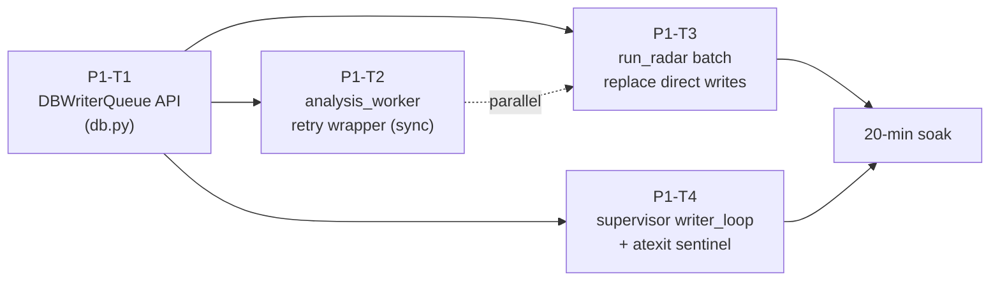

# D168 — Phase 1 DBWriterQueue + DB Lock Eradication

> **Sprint**: D168 | **Predecessor**: D167 (must ship first) | **Successor**: D169 (Phase 2)
> **Duration target**: 3–4 calendar days | **Risk**: HIGH (touches `run_radar.py` 160 KB)

---

## Sprint goal

Eliminate `sqlite3.OperationalError: database is locked` and `[ORDER_RECON][SKIP]` noise by routing all SQLite writes through a single async writer queue. Resolves D166 residual issues F7 (analysis_worker locks) and F8 (ORDER_RECON RETRY/SKIP at 768/15min).

| Code | Issue | D168 task |
|---|---|---|
| F7 | `analysis_worker.upsert_wallet_market_position_lifo` hits DB lock | P1-T2 |
| F8 | `[ORDER_RECON][SKIP]` 768 RETRY/SKIPs in 15 min sample | P1-T3 |
| AQ-1 | Backpressure: drop-with-WARN | resolved by P1-T1 design |
| AQ-2 | SQLite vs PostgreSQL | resolved as "SQLite + DBWriterQueue is sufficient" |
| AQ-3 | `run_radar.py` 160KB refactor strategy | resolved as "wrap, don't split" |
| AQ-5 | analysis_worker transaction shape | resolved by P1-T2 |

---

## Critical risks (read before any task)

### CR-1: `run_radar.py` size — 160 KB

The plan adopts **AQ-3 Option B** ("wrap, don't split"): replace direct `db.conn.execute(...)` calls with `DBWriterQueue.put(sql, params)` calls. No structural refactor. GLM 5.1 handles batch search-and-replace in 200-line chunks. The wrapping change is mechanical.

### CR-2: Read-vs-write distinction

Many `db.conn.execute(...)` calls are **reads** (SELECT) that return rows. **Reads MUST stay synchronous** (return values are needed inline). Only **writes** (INSERT, UPDATE, DELETE, INSERT OR REPLACE) get queued. Coding agent must distinguish before each replacement.

### CR-3: Transactions in `analysis_worker`

`analysis_worker._tick` is **synchronous** (uses `time.sleep` per `analysis_worker.py:58`). The retry wrapper for AQ-5 must use `time.sleep`, not `await asyncio.sleep`. Mixing them causes the same TypeError class as D166's root cause.

### CR-4: Windows `spawn` mode pickle constraints (AQ-4)

If D168 introduces a separate writer process (it should NOT — see P1-T4), payloads must be picklable. Plan keeps the writer as a **thread** in the orchestrator process to avoid pickle complexity.

### CR-5: Sentinel for graceful shutdown

The writer thread must stop on supervisor shutdown. Use a `None` sentinel item; `atexit` handler enqueues sentinel and `join()`s the thread. Without this, queued writes are lost on shutdown.

---

## Task ordering



**Order**:
1. **P1-T1** must land first — defines the API everyone depends on.
2. **P1-T2** and **P1-T3** can run in parallel after T1.
3. **P1-T4** integrates the writer into supervisor; ships last.
4. Single 20-min soak validates all four.

---

## D168 exit criteria

- [ ] **P1-T1**: `DBWriterQueue` class in `panopticon_py/db.py` with `put(sql, params, table_hint)` API, `Queue(maxsize=50000)`, drop-with-WARN on `Full`.
- [ ] **P1-T2**: `analysis_worker._tick` wraps `upsert_wallet_market_position_lifo` in synchronous retry (3× attempts, 50/200/500 ms backoff), non-fatal on exhaustion.
- [ ] **P1-T3**: All `db.conn.execute(...)` write calls in `run_radar.py` and downstream paths routed through `DBWriterQueue.put(...)`. Reads unchanged.
- [ ] **P1-T4**: `_db_writer_thread` running as daemon in orchestrator; `atexit` enqueues sentinel and joins.
- [ ] **F8**: `[ORDER_RECON][SKIP]` count drops from 768/15min to < 100/15min.
- [ ] **F7**: `analysis_worker.err.log` shows zero `database is locked` ERROR lines in 20-min soak.
- [ ] **No regressions**: `paper_trades`, `execution_records`, `kyle_lambda_samples` continue to insert. Counts since restart > 0.
- [ ] **Versions**: `run_radar.py` → `v1.2.0-D168` (MINOR), `run_hft_orchestrator.py` → `v1.2.0-D168` (MINOR), `analysis_worker.py` → `v1.1.17-D168` (PATCH), `db.py` adds `D168_TAG`. `versions_ref.json` aligned.

---

## Verification commands

```powershell
# 1. Lock-free analysis worker
Select-String -Path run/analysis_worker.err.log -Pattern "database is locked" -Tail 20

# 2. ORDER_RECON SKIP count
$skips = Select-String -Path run/orchestrator.log -Pattern "ORDER_RECON.*SKIP" -AllMatches
$skips.Matches.Count

# 3. DB writer health
Get-Content data/async_writer_health.json | ConvertFrom-Json |
  Select-Object written_at, queue_size, batch_count

# 4. Insert progress
sqlite3 data\panopticon.db @"
SELECT
  (SELECT COUNT(*) FROM kyle_lambda_samples WHERE created_at >= datetime('now', '-30 minutes')) AS kyle_30m,
  (SELECT COUNT(*) FROM paper_trades WHERE created_at >= datetime('now', '-30 minutes')) AS paper_30m,
  (SELECT COUNT(*) FROM execution_records WHERE created_at >= datetime('now', '-30 minutes')) AS exec_30m
"@
```

---

## Files modified by D168 (expected)

| File | Tasks | Change scope |
|---|---|---|
| `panopticon_py/db.py` | P1-T1 | Add `DBWriterQueue` class (~80 lines append). |
| `panopticon_py/ingestion/analysis_worker.py` | P1-T2 | Add `_with_sync_retry` helper, wrap `upsert_*` call. ~30 lines. |
| `panopticon_py/hunting/run_radar.py` | P1-T3 | Replace ~30 direct write call sites with `DBWriterQueue.put(...)`. |
| `run_hft_orchestrator.py` | P1-T4 | Add `_db_writer_thread` daemon + atexit handler. ~50 lines. |
| `run/versions_ref.json` | all | Sync. |
| `data/async_writer_health.json` | runtime | Schema unchanged; written by writer thread. |

---

## Rollback plan

D168 is the highest-risk sprint. If exit criteria fail:

1. `git revert` all D168 commits in reverse order (T4 → T3 → T2 → T1).
2. Restore `versions_ref.json` to D167 values.
3. `scripts/restart_all.ps1`.
4. Verify D167 baseline restored: `[ORDER_RECON][SKIP]` count returns to D167 levels.
5. Write escalation handoff with the failing soak metrics.

---

## Architect deferrals

- **NQ-6**: `[ORDER_RECON][SKIP]` 768/15min — D168 plans for < 100/15min. If post-D168 the count is still > 200/15min, escalate to architect for throttle policy decision.
- **AQ-2**: SQLite scaling. If D168 reveals throughput > 2k writes/sec sustained, architect to evaluate PostgreSQL.
