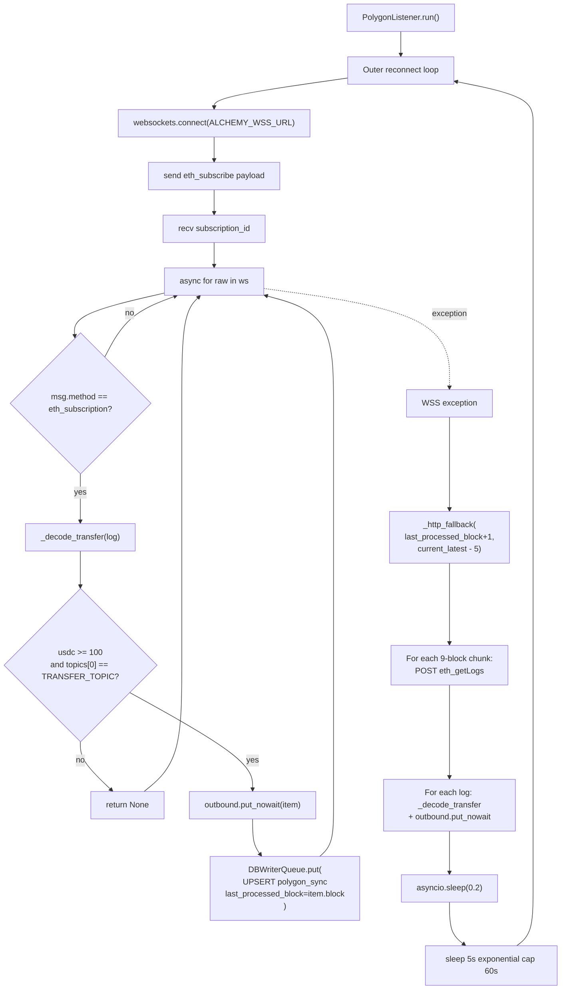

# P2 - T1 - Composer2: `PolygonListener` (Alchemy WSS + HTTP fallback)

> **Sprint**: D169 | **Phase**: 2 | **LLM**: Cursor Composer 2 | **Priority**: P0
> **Estimated**: 8 hours | **Blocking**: D168 ship + AQ-6 architect ruling | **Blocks**: P2-T2

---

## 1. Goal

Implement `PolygonListener` in `panopticon_py/hunting/pol_monitor.py`. Subscribes to USDC.e Transfer events on Polygon via Alchemy WSS (`eth_subscribe`), falls back to HTTP `eth_getLogs` on reconnect to backfill missed blocks. Persists `last_processed_block` in `polygon_sync` table. Pushes decoded Transfer dicts to an `asyncio.Queue` consumed by `whale_scanner` (P2-T2).

---

## 2. Context (CRITICAL — read CR-1 .. CR-5 in README first)

Repeating the most error-prone constants:

```python
USDC_E_ADDRESS    = "0x2791Bca1f2de4661ED88A30C99A7a9449Aa84174"
TRANSFER_TOPIC    = "0xddf252ad1be2c89b69c2b068fc378daa952ba7f163c4a11628f55a4df523b3ef"
ALCHEMY_WSS_URL   = "wss://polygon-mainnet.g.alchemy.com/v2/{api_key}"
ALCHEMY_HTTP_URL  = "https://polygon-mainnet.g.alchemy.com/v2/{api_key}"
USDC_DECIMALS     = 6   # NOT 18 — USDC has 6 decimals
MIN_USDC_FILTER   = 100.0
MAX_BLOCKS_PER_LOGS_QUERY = 9   # Free tier hard limit is 10; use 9 for safety
```

`pol_monitor.py` currently has `scan_pol_markets` (HTTP market scanner, unrelated). New code is purely additive.

`API key`: read from `os.environ["ALCHEMY_API_KEY"]`. **MUST NOT be hardcoded** (AGENTS.md). If absent, log ERROR at startup and refuse to run.

---

## 3. Step-by-step guide

1. **Read** `panopticon_py/hunting/pol_monitor.py` in full (~280 lines).
2. **Confirm** `aiohttp` and `websockets` are in `requirements.txt`. If absent, propose addition; do NOT add unilaterally — it's an architect decision per AGENTS.md.
3. **Add new schema** in `panopticon_py/db.py` migration:
   ```sql
   CREATE TABLE IF NOT EXISTS polygon_sync (
     id INTEGER PRIMARY KEY,
     last_processed_block INTEGER NOT NULL DEFAULT 0,
     updated_ts_utc TEXT NOT NULL
   );
   ```
4. **Define module-level constants** (above) at top of `pol_monitor.py`.
5. **Define `PolygonListener` class**:
   - `__init__(self, api_key: str, outbound: asyncio.Queue, db_path: str)`.
   - `_load_last_block()` — synchronous, called at __init__.
   - `_save_last_block(block: int)` — uses `DBWriterQueue.put`.
   - `_decode_transfer(log: dict) -> dict | None` — returns canonical event dict or None on filter.
   - `async def _wss_loop()` — main loop: connect → subscribe → drain.
   - `async def _http_fallback(start: int, end: int)` — eth_getLogs in ≤ 9-block chunks.
   - `async def run()` — entrypoint; outer loop with reconnect backoff.
6. **Outbound payload shape** (P2-T2 must consume this):
   ```python
   {
       "tx_hash":     "0x...",
       "block":       int,
       "from":        "0x...",  # 40-char lowercase
       "to":          "0x...",  # 40-char lowercase
       "usdc_amount": float,    # decoded with /1_000_000
       "log_index":   int,
       "received_ts_utc": "2026-05-05T17:00:00.000Z",
   }
   ```
7. **Outbound queue maxsize**: 5000. On full, drop with WARNING (mirrors `DBWriterQueue` policy).
8. **Subscribe message** (Alchemy WSS):
   ```json
   {
     "jsonrpc": "2.0",
     "id": 1,
     "method": "eth_subscribe",
     "params": ["logs", {
       "address": "0x2791Bca1f2de4661ED88A30C99A7a9449Aa84174",
       "topics":  ["0xddf252ad1be2c89b69c2b068fc378daa952ba7f163c4a11628f55a4df523b3ef"]
     }]
   }
   ```
9. **HTTP fallback chunking**:
   - `latest = current_block - 5` (avoid reorgs).
   - `start = max(_last_block + 1, latest - 100)` (cap backlog at 100).
   - Iterate `[start, min(start + 8, latest)]` until caught up.
10. **Wire into orchestrator** (`run_hft_orchestrator.py`):
    ```python
    from panopticon_py.hunting.pol_monitor import PolygonListener
    polygon_outbound: asyncio.Queue = asyncio.Queue(maxsize=5000)
    listener = PolygonListener(
        api_key=os.environ["ALCHEMY_API_KEY"],
        outbound=polygon_outbound,
        db_path=os.environ.get("PANOPTICON_DB_PATH", "data/panopticon.db"),
    )
    polygon_task = asyncio.create_task(listener.run(), name="polygon")
    ```
11. **`PROCESS_VERSION = "v1.0.0-D169"`** in `pol_monitor.py`.
12. **Update `versions_ref.json`** with orchestrator MINOR bump (`v1.3.0-D169`).
13. **Soak** (1 hour minimum) — observe Transfer ingestion rate.

---

## 4. Flow + logic chart



---

## 5. API curl example

### eth_subscribe (WSS — equivalent HTTP probe for sanity)

```bash
# WSS subscribe payload (as JSON over WS)
echo '{"jsonrpc":"2.0","id":1,"method":"eth_subscribe","params":["logs",{"address":"0x2791Bca1f2de4661ED88A30C99A7a9449Aa84174","topics":["0xddf252ad1be2c89b69c2b068fc378daa952ba7f163c4a11628f55a4df523b3ef"]}]}'
```

### eth_blockNumber (HTTP — used to set fallback toBlock)

```bash
curl -X POST https://polygon-mainnet.g.alchemy.com/v2/$ALCHEMY_API_KEY \
  -H "Content-Type: application/json" \
  -d '{"jsonrpc":"2.0","id":1,"method":"eth_blockNumber","params":[]}'
```

### eth_getLogs (HTTP — used by fallback)

```bash
curl -X POST https://polygon-mainnet.g.alchemy.com/v2/$ALCHEMY_API_KEY \
  -H "Content-Type: application/json" \
  -d '{
    "jsonrpc": "2.0",
    "id": 2,
    "method": "eth_getLogs",
    "params": [{
      "fromBlock": "0x4d7a800",
      "toBlock":   "0x4d7a808",
      "address":   "0x2791Bca1f2de4661ED88A30C99A7a9449Aa84174",
      "topics":    ["0xddf252ad1be2c89b69c2b068fc378daa952ba7f163c4a11628f55a4df523b3ef"]
    }]
  }'
```

---

## 6. API standard reply

### eth_blockNumber

```json
{"jsonrpc":"2.0","id":1,"result":"0x4d7a812"}
```

(`0x4d7a812` = 81,366,034 decimal)

### eth_getLogs

```json
{
  "jsonrpc": "2.0",
  "id": 2,
  "result": [
    {
      "address": "0x2791bca1f2de4661ed88a30c99a7a9449aa84174",
      "topics": [
        "0xddf252ad1be2c89b69c2b068fc378daa952ba7f163c4a11628f55a4df523b3ef",
        "0x000000000000000000000000abc...", // from
        "0x000000000000000000000000def..."  // to
      ],
      "data": "0x000000000000000000000000000000000000000000000000000000003b9aca00", // 1,000,000,000 raw = 1000 USDC
      "blockNumber": "0x4d7a800",
      "transactionHash": "0xabc...",
      "logIndex": "0x12",
      "removed": false
    }
  ]
}
```

### eth_subscribe over WSS

```json
{"jsonrpc":"2.0","id":1,"result":"0xcd0c3e8473d70f15b1f96b03b1c..."}
```

Then events:

```json
{
  "jsonrpc": "2.0",
  "method": "eth_subscription",
  "params": {
    "subscription": "0xcd0c...",
    "result": {
      "address": "0x2791bca...",
      "topics": ["0xddf252...", "0x...from", "0x...to"],
      "data": "0x...",
      "blockNumber": "0x4d7a800",
      ...
    }
  }
}
```

### Error reply (e.g. invalid API key)

```json
{
  "jsonrpc": "2.0",
  "id": 1,
  "error": {
    "code": -32600,
    "message": "Invalid API key"
  }
}
```

---

## 7. Code skeleton

`panopticon_py/hunting/pol_monitor.py` — appended after existing `scan_pol_markets`:

```python
import asyncio
import json
import logging
import os
import sqlite3
from typing import Optional

import aiohttp
import websockets

from panopticon_py.db import DBWriterQueue
from panopticon_py.time_utils import utc_now_rfc3339_ms

PROCESS_VERSION = "v1.0.0-D169"

USDC_E_ADDRESS    = "0x2791bca1f2de4661ed88a30c99a7a9449aa84174"  # lowercase canonical
TRANSFER_TOPIC    = "0xddf252ad1be2c89b69c2b068fc378daa952ba7f163c4a11628f55a4df523b3ef"
ALCHEMY_WSS_URL   = "wss://polygon-mainnet.g.alchemy.com/v2/{api_key}"
ALCHEMY_HTTP_URL  = "https://polygon-mainnet.g.alchemy.com/v2/{api_key}"
USDC_DECIMALS     = 6
MIN_USDC_FILTER   = float(os.getenv("PANOPTICON_MIN_USDC_FILTER", "100.0"))
MAX_BLOCKS_PER_LOGS_QUERY = 9
REORG_BUFFER      = 5  # subtract from latest block before fallback toBlock

logger = logging.getLogger(__name__)


class PolygonListener:
    def __init__(self, api_key: str, outbound: asyncio.Queue, db_path: str):
        if not api_key:
            raise ValueError("ALCHEMY_API_KEY env var is required")
        self._api_key = api_key
        self._outbound = outbound
        self._db_path = db_path
        self._last_block: int = self._load_last_block()
        self._http_session: Optional[aiohttp.ClientSession] = None

    def _load_last_block(self) -> int:
        try:
            with sqlite3.connect(self._db_path, timeout=10) as conn:
                row = conn.execute(
                    "SELECT last_processed_block FROM polygon_sync WHERE id=1"
                ).fetchone()
                return int(row[0]) if row else 0
        except sqlite3.Error as exc:
            logger.warning("[POL_LISTENER] cannot load last_block: %s", exc)
            return 0

    def _save_last_block(self, block: int) -> None:
        DBWriterQueue.put(
            "INSERT OR REPLACE INTO polygon_sync (id, last_processed_block, updated_ts_utc) VALUES (1, ?, ?)",
            (int(block), utc_now_rfc3339_ms()),
            table_hint="polygon_sync",
        )

    def _decode_transfer(self, log: dict) -> Optional[dict]:
        if not isinstance(log, dict):
            return None
        topics = log.get("topics") or []
        if len(topics) < 3:
            return None
        if str(topics[0]).lower() != TRANSFER_TOPIC:
            return None
        try:
            from_addr = ("0x" + topics[1][-40:]).lower()
            to_addr   = ("0x" + topics[2][-40:]).lower()
            raw       = int(log.get("data", "0x0"), 16)
            usdc      = raw / (10 ** USDC_DECIMALS)
        except (ValueError, TypeError) as exc:
            logger.debug("[POL_LISTENER] decode error: %s", exc)
            return None
        if usdc < MIN_USDC_FILTER:
            return None
        try:
            block = int(log["blockNumber"], 16)
        except (KeyError, ValueError, TypeError):
            return None
        return {
            "tx_hash":         log.get("transactionHash", ""),
            "block":           block,
            "from":            from_addr,
            "to":              to_addr,
            "usdc_amount":     usdc,
            "log_index":       int(log.get("logIndex", "0x0"), 16),
            "received_ts_utc": utc_now_rfc3339_ms(),
        }

    def _put_safe(self, item: dict) -> None:
        try:
            self._outbound.put_nowait(item)
        except asyncio.QueueFull:
            logger.warning(
                "[POL_LISTENER] outbound queue full, dropping tx=%s",
                item.get("tx_hash", "?")[:18],
            )

    async def _ensure_http_session(self) -> aiohttp.ClientSession:
        if self._http_session is None or self._http_session.closed:
            self._http_session = aiohttp.ClientSession(
                timeout=aiohttp.ClientTimeout(total=30)
            )
        return self._http_session

    async def _http_post_rpc(self, payload: dict) -> dict:
        session = await self._ensure_http_session()
        url = ALCHEMY_HTTP_URL.format(api_key=self._api_key)
        async with session.post(url, json=payload) as resp:
            return await resp.json()

    async def _get_latest_block(self) -> int:
        data = await self._http_post_rpc({
            "jsonrpc": "2.0", "id": 1,
            "method":  "eth_blockNumber", "params": [],
        })
        if not isinstance(data, dict) or not isinstance(data.get("result"), str):
            raise RuntimeError(f"eth_blockNumber malformed: {data}")
        return int(data["result"], 16)

    async def _http_fallback(self) -> None:
        try:
            latest = await self._get_latest_block() - REORG_BUFFER
        except Exception as exc:
            logger.error("[POL_LISTENER] cannot get latest block: %s", exc)
            return

        start = max(self._last_block + 1, latest - 100)
        if start > latest:
            return
        logger.info("[POL_LISTENER] fallback start=%d latest=%d", start, latest)

        while start <= latest:
            end = min(start + MAX_BLOCKS_PER_LOGS_QUERY - 1, latest)
            try:
                data = await self._http_post_rpc({
                    "jsonrpc": "2.0", "id": 2,
                    "method":  "eth_getLogs",
                    "params": [{
                        "fromBlock": hex(start),
                        "toBlock":   hex(end),
                        "address":   USDC_E_ADDRESS,
                        "topics":    [TRANSFER_TOPIC],
                    }],
                })
                logs = data.get("result")
                if not isinstance(logs, list):
                    logger.warning("[POL_LISTENER] eth_getLogs malformed: %s", data)
                    break
                for log in logs:
                    item = self._decode_transfer(log)
                    if item:
                        self._put_safe(item)
                self._last_block = end
                self._save_last_block(end)
                logger.info(
                    "[POL_LISTENER] eth_getLogs blocks=%d-%d items=%d",
                    start, end, len(logs),
                )
            except Exception as exc:
                logger.error("[POL_LISTENER] eth_getLogs blocks=%d-%d error=%s",
                             start, end, exc)
                break
            start = end + 1
            await asyncio.sleep(0.2)  # gentle pacing

    async def _wss_loop(self) -> None:
        url = ALCHEMY_WSS_URL.format(api_key=self._api_key)
        backoff = 5.0
        while True:
            try:
                async with websockets.connect(url, ping_interval=30, ping_timeout=15) as ws:
                    await ws.send(json.dumps({
                        "jsonrpc": "2.0", "id": 1,
                        "method":  "eth_subscribe",
                        "params": ["logs", {
                            "address": USDC_E_ADDRESS,
                            "topics":  [TRANSFER_TOPIC],
                        }],
                    }))
                    sub_resp = json.loads(await ws.recv())
                    sub_id = sub_resp.get("result")
                    if not sub_id:
                        logger.error("[POL_LISTENER] eth_subscribe failed: %s", sub_resp)
                        await asyncio.sleep(backoff)
                        backoff = min(backoff * 2, 60.0)
                        continue
                    backoff = 5.0
                    logger.info("[POL_LISTENER] WSS subscribed sub_id=%s", sub_id)

                    async for raw in ws:
                        try:
                            msg = json.loads(raw)
                        except json.JSONDecodeError:
                            continue
                        if msg.get("method") != "eth_subscription":
                            continue
                        log = (msg.get("params") or {}).get("result")
                        item = self._decode_transfer(log)
                        if item:
                            self._put_safe(item)
                            self._last_block = item["block"]
                            self._save_last_block(item["block"])
            except Exception as exc:
                logger.warning("[POL_LISTENER] WSS error: %s — fallback then reconnect", exc)
                await self._http_fallback()
                await asyncio.sleep(backoff)
                backoff = min(backoff * 2, 60.0)

    async def run(self) -> None:
        logger.info("[POL_LISTENER] starting version=%s last_block=%d",
                    PROCESS_VERSION, self._last_block)
        try:
            await self._wss_loop()
        finally:
            if self._http_session and not self._http_session.closed:
                await self._http_session.close()
```

`panopticon_py/db.py` — add migration helper:

```python
def _ensure_polygon_sync_table(conn: sqlite3.Connection) -> None:
    conn.execute("""
        CREATE TABLE IF NOT EXISTS polygon_sync (
          id INTEGER PRIMARY KEY,
          last_processed_block INTEGER NOT NULL DEFAULT 0,
          updated_ts_utc TEXT NOT NULL
        )
    """)
```

Call this from `ShadowDB.__init__` so the table exists before `PolygonListener` queries it.

---

## 8. Error brainstorm + restrictions

| # | Possible error | Trigger | Restriction |
|---|---|---|---|
| E1 | API key hardcoded | Coding agent shortcut | **HARD BAN** per AGENTS.md. Read from env only. |
| E2 | USDC_DECIMALS = 18 (Ethereum mainnet USDC has 6, Polygon USDC.e also has 6) | Confusion with WETH | Constant pinned at 6. Never change without checking the contract. |
| E3 | `int(log["data"], 16)` on missing `data` field | Malformed log | `log.get("data", "0x0")` with int parse in try/except. |
| E4 | `await ws.send(eth_getLogs)` — Alchemy WSS does not support it | Coding agent assumes WSS = HTTP-over-WS | **HARD BAN**: WSS for `eth_subscribe` only. HTTP via `aiohttp.ClientSession`. |
| E5 | `aiohttp.ClientSession` created in `__init__` before event loop exists | Wrong lifecycle | Lazy create in `_ensure_http_session()` (inside an async coroutine). |
| E6 | Unbounded backoff on persistent auth failure → log spam | Bad API key | Cap backoff at 60 s. After 10 consecutive failures, log CRITICAL with retry_count. |
| E7 | `eth_getLogs` returns `result: null` on Alchemy timeout | Spurious result | Always `isinstance(data.get("result"), list)` before iterating. |
| E8 | Reorg: a block we've already saved gets a different log set | Polygon reorgs are rare but possible | `REORG_BUFFER = 5` blocks under latest. Acceptable trade-off (slight delay vs reorg-safety). |
| E9 | Outbound queue full → real Transfer events dropped | P2-T2 consumer too slow | Drop with WARNING. P2-T2 must keep up; if drops > 5/min, escalate. |
| E10 | `last_processed_block` saved per event → too many writes | Each Transfer triggers `DBWriterQueue.put` for `polygon_sync` | Acceptable: rate is < 10 per second on Polygon USDC.e for ≥100 USDC. If observed higher, batch-update every 30 s instead. |
| E11 | `websockets` library version drift causes `subprotocols=[]` TypeError (D166 root cause class) | websockets 13/14 quirks | Mirror D166's clob_ws_client fix: `websockets.connect(url, ping_interval=30, ping_timeout=15, subprotocols=None, extensions=None)`. |
| E12 | Windows asyncio default policy fails for WSS | Older Python versions on Windows | At orchestrator startup add: `if sys.platform == "win32": asyncio.set_event_loop_policy(asyncio.WindowsSelectorEventLoopPolicy())`. Verify if this isn't already set. |
| E13 | HTTP fallback never triggered → silent data loss | Bug in reconnect path | Add `[POL_LISTENER] fallback start=...` log on every fallback. Verify in soak. |
| E14 | `outbound.put_nowait` from inside an async function → not blocking | Documented behavior, fine | OK. asyncio.Queue's put_nowait is synchronous and never blocks. |
| E15 | `DBWriterQueue.put` called before P1-T4 writer thread starts | Order-of-init bug | Plan: orchestrator main() starts writer thread BEFORE `polygon_task = asyncio.create_task(...)`. |

### Restrictions summary

- **NO** hardcoded API keys.
- **NO** `eth_getLogs` over WSS.
- **NO** `requests` library; use `aiohttp` only.
- **NO** USDC decimals other than 6.
- **NO** processing logs without all guards (E3, E7).
- **NO** unbounded backoff.
- **MUST** `subprotocols=None, extensions=None` in websockets.connect.
- **MUST** Windows `WindowsSelectorEventLoopPolicy` if not already set.
- **MUST** version bump.

---

## 9. Verification checklist

- [ ] `aiohttp` and `websockets` confirmed in `requirements.txt` (architect to approve if added).
- [ ] `polygon_sync` table created at startup.
- [ ] `PolygonListener` class implemented per skeleton.
- [ ] WSS subscribed: `[POL_LISTENER] WSS subscribed sub_id=...` log line within 30 s of orchestrator start.
- [ ] HTTP fallback triggers exactly once on forced disconnect (test by `Stop-Process` on a network proxy or block IP temporarily).
- [ ] `last_processed_block` advances during soak.
- [ ] Outbound queue drained by P2-T2 (verify after T2 ships).
- [ ] No regression in D165/D166/D167/D168 tests.
- [ ] Versions match.

---

## 10. Exit criteria

ALL of:
1. 1-hour soak with sustained WSS connection (zero hangs > 30 s).
2. ≥ 100 Transfer events ingested in soak (`outbound.qsize()` history shows non-zero throughput).
3. `polygon_sync.last_processed_block` updates within last 60 s during soak.
4. HTTP fallback exercise: artificially disconnect once, verify gap is filled within 60 s.
5. Daily CU consumption estimate documented (calculation + observation).

---

## 11. Rollback plan

1. `git revert` the pol_monitor + orchestrator + db migration commits.
2. `DROP TABLE polygon_sync;` (one-time SQL).
3. `restart_all.ps1`.
4. D168 baseline restored.
