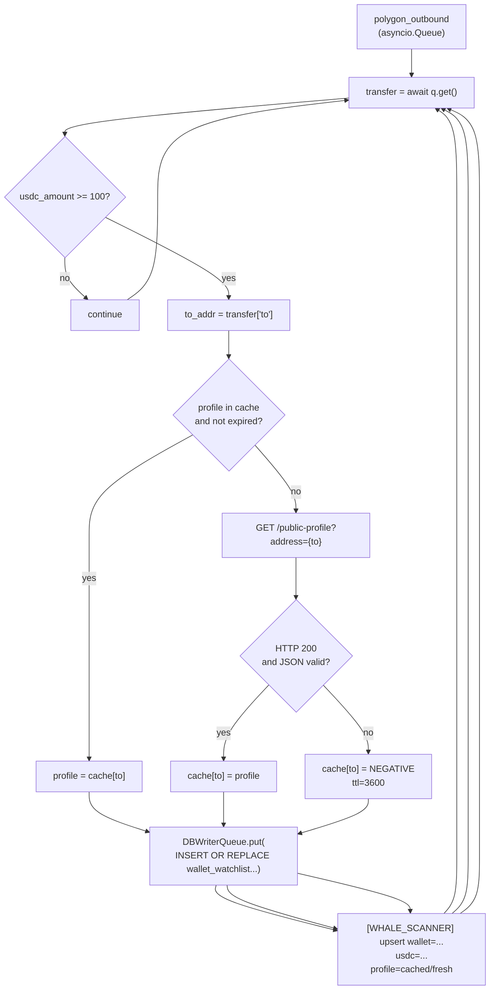

# P2 - T2 - GLM5.1: `whale_scanner` + `discovery_loop` Integration

> **Sprint**: D169 | **Phase**: 2 | **LLM**: GLM 5.1 | **Priority**: P0
> **Estimated**: 5 hours | **Blocking**: P2-T1 (PolygonListener queue must exist) | **Blocks**: P2-T3 verification, D170

---

## 1. Goal

Consume Transfer events from `polygon_outbound: asyncio.Queue` produced by `PolygonListener`. Apply ≥ 100 USDC filter (already filtered upstream — second guard kept for defense-in-depth). For each unique recipient address, query Polymarket Gamma `/public-profile` (LRU cache, 24 h TTL). Upsert into `wallet_watchlist` table via `DBWriterQueue`.

---

## 2. Context

`whale_scanner.py` and `discovery_loop.py` both exist in `panopticon_py/hunting/`. This task **extends** them; both are smaller files than `run_radar.py` and can be read in full.

D169 does NOT compute insider scores. It only collects raw Transfer events + profile metadata. Score computation is D171.

Polymarket Gamma rate limit (per AGENTS.md and D167 doc):
- General: 4,000 req / 10 s. Plenty of headroom.
- 24h LRU cache → effective rate < 10 req/10s.

---

## 3. Step-by-step guide

1. **Read** `panopticon_py/hunting/whale_scanner.py` in full.
2. **Read** `panopticon_py/hunting/discovery_loop.py` in full.
3. **Add new schema** (in `panopticon_py/db.py` migration):
   ```sql
   CREATE TABLE IF NOT EXISTS wallet_watchlist (
     wallet_address TEXT PRIMARY KEY,
     first_seen_block INTEGER NOT NULL,
     first_seen_ts_utc TEXT NOT NULL,
     last_seen_block INTEGER NOT NULL,
     last_seen_ts_utc TEXT NOT NULL,
     transfer_count INTEGER NOT NULL DEFAULT 0,
     total_usdc_in REAL NOT NULL DEFAULT 0.0,
     profile_json TEXT,            -- raw /public-profile response
     profile_fetched_ts_utc TEXT
   );
   CREATE INDEX IF NOT EXISTS idx_watchlist_last_seen ON wallet_watchlist(last_seen_ts_utc);
   ```
4. **Add `WhaleScanner.consume_transfers(self, queue: asyncio.Queue)`** as an async method:
   - Loop: `transfer = await queue.get()`.
   - Apply gate: `if usdc_amount < 100: continue` (defensive duplicate of upstream filter).
   - Look up `to` address profile via `_get_profile_cached(to_addr)`.
   - Upsert `wallet_watchlist` via `DBWriterQueue.put`.
5. **`_get_profile_cached(wallet: str) -> dict`** — LRU + TTL hybrid:
   - Use `functools.lru_cache(maxsize=10000)`-ish but with TTL. Recommend `cachetools.TTLCache(maxsize=10000, ttl=86400)` if the architect approves the dependency. Otherwise hand-rolled dict + monotonic timestamp.
   - On miss: HTTP GET `https://gamma-api.polymarket.com/public-profile?address={wallet}`.
   - On 404 / empty / error: cache the negative result for 1 hour to avoid retry storms.
6. **Discovery loop** (`discovery_loop.py`):
   - Periodic task (every 5 min) that scans `wallet_watchlist` ordered by `last_seen_ts_utc DESC` and emits `[DISCOVERY]` log lines for new entries (last 5 min). Pure observation; no decisions yet.
7. **Wire into orchestrator** (`run_hft_orchestrator.py`):
   ```python
   scanner = WhaleScanner(...)
   whale_task = asyncio.create_task(scanner.consume_transfers(polygon_outbound), name="whale_scanner")
   discovery_task = asyncio.create_task(run_discovery_loop(), name="discovery_loop")
   ```
8. **Bump versions**: `whale_scanner.py` and `discovery_loop.py` get `PROCESS_VERSION = "v1.0.0-D169"` (new functionality).
9. **Soak verification**.

---

## 4. Flow + logic chart



---

## 5. API curl example

### Polymarket Gamma `/public-profile`

```bash
curl -s "https://gamma-api.polymarket.com/public-profile?address=0x1234567890abcdef1234567890abcdef12345678"
```

---

## 6. API standard reply

### Profile (success)

```json
{
  "address": "0x1234567890abcdef1234567890abcdef12345678",
  "username": "satoshi42",
  "bio": "...",
  "creationTime": 1690000000,
  "isFollower": false,
  "totalProfit": 12345.67,
  "totalVolume": 543210.98,
  "positionsCount": 27,
  "winLossRatio": 0.62
}
```

### Profile (not found / unknown)

HTTP 404 or:

```json
{}
```

### Wallet watchlist row (after upsert)

```json
{
  "wallet_address":         "0x1234...",
  "first_seen_block":       81000000,
  "first_seen_ts_utc":      "2026-05-05T17:00:00.000Z",
  "last_seen_block":        81005432,
  "last_seen_ts_utc":       "2026-05-05T17:30:00.000Z",
  "transfer_count":         3,
  "total_usdc_in":          5400.0,
  "profile_json":           "{\"username\":\"satoshi42\",...}",
  "profile_fetched_ts_utc": "2026-05-05T17:00:01.000Z"
}
```

---

## 7. Code skeleton

`panopticon_py/hunting/whale_scanner.py` — append:

```python
import asyncio
import json
import logging
import time
from typing import Optional

import aiohttp

from panopticon_py.db import DBWriterQueue
from panopticon_py.time_utils import utc_now_rfc3339_ms

PROCESS_VERSION = "v1.0.0-D169"

GAMMA_PROFILE_URL = "https://gamma-api.polymarket.com/public-profile"
PROFILE_CACHE_TTL_SEC = 86400          # 24 h for hits
PROFILE_NEG_CACHE_TTL_SEC = 3600       # 1 h for misses
PROFILE_CACHE_MAX = 10000
MIN_USDC_DEFENSIVE_GATE = 100.0

logger = logging.getLogger(__name__)


class _TTLCache:
    """Tiny TTL cache; replace with cachetools.TTLCache if approved."""

    def __init__(self, maxsize: int):
        self._maxsize = maxsize
        self._d: dict[str, tuple[float, dict | None]] = {}

    def get(self, key: str) -> Optional[tuple[dict | None, bool]]:
        v = self._d.get(key)
        if not v:
            return None
        expires_at, value = v
        if time.monotonic() > expires_at:
            self._d.pop(key, None)
            return None
        return value, True

    def set(self, key: str, value: dict | None, ttl: float) -> None:
        if len(self._d) >= self._maxsize:
            for k in list(self._d.keys())[: max(1, self._maxsize // 10)]:
                self._d.pop(k, None)
        self._d[key] = (time.monotonic() + ttl, value)


class WhaleScanner:
    def __init__(self):
        self._profile_cache = _TTLCache(maxsize=PROFILE_CACHE_MAX)
        self._http: Optional[aiohttp.ClientSession] = None
        self._stats = {"hits": 0, "misses": 0, "negatives": 0, "errors": 0}

    async def _ensure_http(self) -> aiohttp.ClientSession:
        if self._http is None or self._http.closed:
            self._http = aiohttp.ClientSession(timeout=aiohttp.ClientTimeout(total=10))
        return self._http

    async def _get_profile(self, wallet: str) -> Optional[dict]:
        cached = self._profile_cache.get(wallet)
        if cached is not None:
            self._stats["hits"] += 1
            return cached[0]
        self._stats["misses"] += 1
        session = await self._ensure_http()
        try:
            async with session.get(GAMMA_PROFILE_URL, params={"address": wallet}) as resp:
                if resp.status == 200:
                    data = await resp.json()
                    if not isinstance(data, dict) or not data:
                        self._profile_cache.set(wallet, None, PROFILE_NEG_CACHE_TTL_SEC)
                        self._stats["negatives"] += 1
                        return None
                    self._profile_cache.set(wallet, data, PROFILE_CACHE_TTL_SEC)
                    return data
                if resp.status == 404:
                    self._profile_cache.set(wallet, None, PROFILE_NEG_CACHE_TTL_SEC)
                    self._stats["negatives"] += 1
                    return None
                self._stats["errors"] += 1
                return None
        except Exception as exc:
            logger.warning("[WHALE_SCANNER] profile fetch error wallet=%s err=%s",
                           wallet[:10], exc)
            self._stats["errors"] += 1
            return None

    def _upsert_watchlist(self, transfer: dict, profile: Optional[dict]) -> None:
        wallet = transfer["to"]
        block  = transfer["block"]
        usdc   = transfer["usdc_amount"]
        now    = utc_now_rfc3339_ms()
        profile_json = json.dumps(profile) if profile else None

        DBWriterQueue.put(
            """
            INSERT INTO wallet_watchlist
              (wallet_address, first_seen_block, first_seen_ts_utc,
               last_seen_block, last_seen_ts_utc, transfer_count, total_usdc_in,
               profile_json, profile_fetched_ts_utc)
            VALUES (?, ?, ?, ?, ?, 1, ?, ?, ?)
            ON CONFLICT(wallet_address) DO UPDATE SET
              last_seen_block        = excluded.last_seen_block,
              last_seen_ts_utc       = excluded.last_seen_ts_utc,
              transfer_count         = transfer_count + 1,
              total_usdc_in          = total_usdc_in + ?,
              profile_json           = COALESCE(excluded.profile_json, profile_json),
              profile_fetched_ts_utc = COALESCE(excluded.profile_fetched_ts_utc, profile_fetched_ts_utc)
            """,
            (wallet, block, now, block, now, usdc, profile_json, now if profile else None, usdc),
            table_hint="wallet_watchlist",
        )

    async def consume_transfers(self, queue: asyncio.Queue) -> None:
        logger.info("[WHALE_SCANNER] starting version=%s", PROCESS_VERSION)
        last_log = time.monotonic()
        while True:
            transfer = await queue.get()
            if not isinstance(transfer, dict):
                continue
            usdc = transfer.get("usdc_amount", 0.0)
            if usdc < MIN_USDC_DEFENSIVE_GATE:
                continue
            wallet = transfer.get("to")
            if not wallet:
                continue
            profile = await self._get_profile(wallet)
            self._upsert_watchlist(transfer, profile)

            if (time.monotonic() - last_log) >= 60.0:
                logger.info(
                    "[PROFILE_CACHE] hits=%d misses=%d neg=%d err=%d",
                    self._stats["hits"], self._stats["misses"],
                    self._stats["negatives"], self._stats["errors"],
                )
                last_log = time.monotonic()
```

`panopticon_py/hunting/discovery_loop.py` — minimal:

```python
import asyncio
import logging
import sqlite3
import os

PROCESS_VERSION = "v1.0.0-D169"
DISCOVERY_INTERVAL_SEC = 300

logger = logging.getLogger(__name__)


async def run_discovery_loop() -> None:
    db_path = os.environ.get("PANOPTICON_DB_PATH", "data/panopticon.db")
    while True:
        try:
            with sqlite3.connect(db_path, timeout=10) as conn:
                rows = conn.execute("""
                    SELECT wallet_address, transfer_count, total_usdc_in, last_seen_ts_utc
                    FROM wallet_watchlist
                    WHERE last_seen_ts_utc >= datetime('now', '-5 minutes')
                    ORDER BY total_usdc_in DESC
                    LIMIT 20
                """).fetchall()
            logger.info("[DISCOVERY] last-5min new/active wallets=%d", len(rows))
            for r in rows:
                logger.info(
                    "[DISCOVERY] wallet=%s n_transfers=%d total_usdc=%.2f last=%s",
                    r[0][:10], r[1], r[2], r[3],
                )
        except Exception as exc:
            logger.warning("[DISCOVERY] loop error: %s", exc)
        await asyncio.sleep(DISCOVERY_INTERVAL_SEC)
```

---

## 8. Error brainstorm + restrictions

| # | Possible error | Trigger | Restriction |
|---|---|---|---|
| E1 | Profile cache grows beyond `maxsize` because eviction logic broken | LRU not implemented strictly | Skeleton evicts 10 % oldest on overflow. Acceptable approximation. If precise LRU needed, use `collections.OrderedDict.move_to_end`. |
| E2 | Concurrent calls to `_get_profile` for same wallet → duplicate fetches | No request deduplication | Acceptable for D169 (low concurrency, 24h TTL absorbs the duplicate). If problematic, add an `asyncio.Lock` per-wallet (D170 backlog). |
| E3 | Profile JSON contains non-ASCII characters → SQL bind issue | Should be fine with sqlite3 driver | sqlite3 stores TEXT as UTF-8; verify with a non-ASCII test wallet. |
| E4 | `excluded.profile_json` is NULL when fetch failed → kills existing profile_json | ON CONFLICT update | `COALESCE(excluded.profile_json, profile_json)` keeps existing value when new is null. Skeleton already correct. |
| E5 | `total_usdc_in + ?` parameter binding wrong index | SQL parameter order | The `excluded.*` references in the UPDATE clause refer to the INSERT row, not parameters. The `+ ?` gets the next bind value. Verify positional binding count matches. Test with a single insert + single update. |
| E6 | aiohttp ClientSession leaks if WhaleScanner is recreated | Unclean shutdown | Add `async def close(self)` and call from atexit. For D169, daemon task is fine. |
| E7 | 404 vs network error treated identically → 1h negative cache for transient errors | Errors are transient | Skeleton caches 404 as "not found" but only logs errors without negative caching. Verify behavior matches: errors return None without caching, 404 sets negative cache. Skeleton does that. |
| E8 | Gamma rate limit hit during cold start (e.g. 100 wallets × first lookup) | 4000 req / 10 s ceiling — should be safe | Even with 1000 cold-start lookups, well under limit. Document if hit. |
| E9 | Soak time too short → cache miss rate appears 100 % | 1 hr soak with sparse Transfer activity may have < 50 unique wallets | Cache stats meaningful only after 30 min + 50 unique wallets. Document. |
| E10 | Discovery loop blocking event loop with synchronous SQLite call | `sqlite3.connect` is sync | The loop runs every 5 min for ~50 ms; blocking is negligible. Acceptable for D169. |

### Restrictions summary

- **NO** `requests` SDK; use `aiohttp` only.
- **NO** Architect-unapproved external dependencies (`cachetools` would need approval).
- **NO** writing decisions or scores in D169.
- **NO** removing the defensive `usdc < 100` gate.
- **NO** persisting profile_json larger than 10 KB without truncation (theoretical guard).
- **MUST** version bump on both files.
- **MUST** TTL cache for both hit and negative paths.

---

## 9. Verification checklist

- [ ] `wallet_watchlist` table created at startup.
- [ ] `WhaleScanner.consume_transfers` running as orchestrator task.
- [ ] `run_discovery_loop` running.
- [ ] Soak: ≥ 50 wallets in `wallet_watchlist` after 1 hour.
- [ ] Soak: cache hit rate > 90 % after 30 min (visible in `[PROFILE_CACHE]` log).
- [ ] No regressions.
- [ ] Versions match.

---

## 10. Exit criteria

ALL of:
1. `wallet_watchlist` row count grows during soak.
2. `[PROFILE_CACHE]` log lines emitted every minute with hit/miss counts.
3. `[DISCOVERY]` log lines emitted every 5 min.
4. No HTTP errors / rate limits in soak.
5. `version_match=true`.

---

## 11. Rollback plan

1. `git revert` whale_scanner + discovery_loop + db migration commits.
2. `DROP TABLE wallet_watchlist;` (one-time SQL).
3. `restart_all.ps1`.
4. P2-T1 (PolygonListener) keeps producing; queue may grow until `whale_task` removed from orchestrator. Also remove that line.
