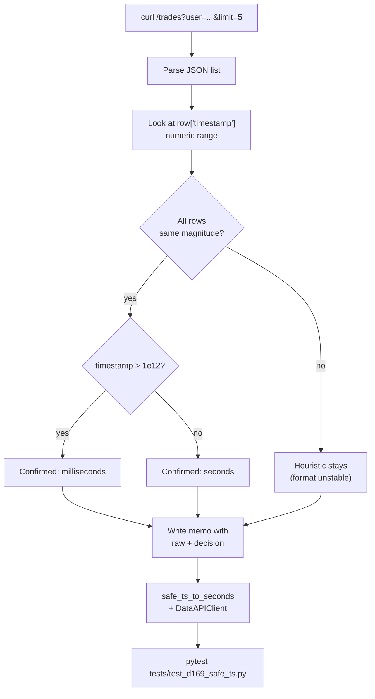

# P2 - T3 - Minimax2.7: Historical Trades Client + `safe_ts_to_seconds()` Validation

> **Sprint**: D169 | **Phase**: 2 | **LLM**: Minimax M2.7 | **Priority**: P1
> **Estimated**: 4 hours | **Blocking**: none (parallel with P2-T1) | **Blocks**: D170 (signal fusion needs trade history)

---

## 1. Goal

Build a Polymarket Data API `/trades?user=...` client and empirically verify the timestamp format. Resolves IQ-2 (`safe_ts_to_seconds()` heuristic).

---

## 2. Context

The D167 doc and AGENTS.md `time_contract.md` agree on this rule:
- Internal `_ts_utc` columns: RFC3339 UTC ms strings.
- External API timestamps: per provider docs, normalize at ingestion.
- The `safe_ts_to_seconds(ts)` helper handles ambiguity:
  ```python
  def safe_ts_to_seconds(ts):
      if ts > 1e12:
          return ts // 1000
      return ts
  ```

**The threshold `1e12` works because**:
- Unix seconds: `~1.7e9` for 2024–2026.
- Unix milliseconds: `~1.7e12` for 2024–2026.

**But this is unverified**. P2-T3 must verify by sampling actual `/trades` responses from Polymarket Data API.

`AGENTS.md` MiniMax rule: Minimax M2.7 must enforce `asyncio.Semaphore(2)` for any LLM call. Not relevant here (no LLM call), but the coding agent (Minimax M2.7) must self-enforce when invoked for this task.

---

## 3. Step-by-step guide

1. **Read** any existing `data_api_client.py` if present:
   ```powershell
   Get-ChildItem -Recurse panopticon_py -Filter "*data_api*" -File
   ```
   If absent, create `panopticon_py/hunting/data_api_client.py`.
2. **Probe Data API** with curl (see section 5).
3. **Document raw timestamp value** in handoff memo.
4. **Implement `safe_ts_to_seconds`** with assertion variant:
   ```python
   def safe_ts_to_seconds(ts: int | float) -> int:
       if not isinstance(ts, (int, float)):
           raise TypeError(f"timestamp must be int/float, got {type(ts).__name__}")
       if ts > 1e12:
           return int(ts // 1000)
       if ts < 1e9:
           raise ValueError(f"timestamp {ts} not in expected Unix range")
       return int(ts)
   ```
5. **Implement `DataAPIClient`** class:
   - `async fetch_user_trades(wallet: str, limit: int = 500) -> list[dict]`.
   - HTTP GET `https://data-api.polymarket.com/trades?user={wallet}&limit={limit}`.
   - Validate each row: `safe_ts_to_seconds(row["timestamp"])`.
   - Return rows with ts normalized to seconds.
6. **Add unit test** at `tests/test_d169_safe_ts.py`:
   - `safe_ts_to_seconds(1_700_000_000)` → 1_700_000_000.
   - `safe_ts_to_seconds(1_700_000_000_000)` → 1_700_000_000.
   - `safe_ts_to_seconds(0)` → ValueError.
   - `safe_ts_to_seconds("not_a_number")` → TypeError.
   - `safe_ts_to_seconds(None)` → TypeError.
7. **Add integration test** (optional, soak-time only):
   - Fetch 5 wallets from `wallet_watchlist`, call `fetch_user_trades` for each, log normalized ts ranges.
8. **Memo** at `temp_architect_handoffs/d169_T3_safe_ts_validation.md`:
   - Raw curl output with `timestamp` field.
   - Verification result: confirmed seconds | confirmed milliseconds | inconsistent.
   - Recommendation: simplify to `assert ts >= 1e9 and ts < 1e12` (drop branching), or keep heuristic.
9. **Bump versions** if files added/changed.

---

## 4. Flow + logic chart



---

## 5. API curl example

### Probe `/trades` for known wallet

```bash
curl -s "https://data-api.polymarket.com/trades?user=0x1234567890abcdef1234567890abcdef12345678&limit=5"
```

### Probe with no user (latest market trades)

```bash
curl -s "https://data-api.polymarket.com/trades?limit=5"
```

---

## 6. API standard reply

```json
[
  {
    "tx_hash":          "0xabc...",
    "user":             "0x1234...",
    "side":             "BUY",
    "price":            0.62,
    "size":             "100000000",
    "asset_id":         "27911616...",
    "market_id":        "0xdef...",
    "timestamp":        1715000000,        // seconds — EXPECTED but NOT VERIFIED
    "outcome":          "Yes",
    "fee_paid":         0.0001
  }
]
```

The critical field for IQ-2 is `timestamp`. Possible values seen in the wild:
- `1715000000` (10-digit, seconds) — most likely.
- `1715000000000` (13-digit, milliseconds) — possible.
- `"2024-05-06T12:00:00Z"` (ISO string) — unlikely but possible.

The memo must record which form was observed.

### CLOB `/trades` (different endpoint, used in run_radar)

```bash
curl -s "https://clob.polymarket.com/trades?market=27911616...&limit=5"
```

CLOB returns `size: "100000000"` (raw 1e8 = 1 share), distinct from Data API.

---

## 7. Code skeleton

`panopticon_py/hunting/data_api_client.py` (new file):

```python
import asyncio
import logging
from typing import Any

import aiohttp

PROCESS_VERSION = "v1.0.0-D169"

DATA_API_BASE = "https://data-api.polymarket.com"
DEFAULT_TIMEOUT = aiohttp.ClientTimeout(total=15)

logger = logging.getLogger(__name__)


def safe_ts_to_seconds(ts: Any) -> int:
    """
    Normalize a Polymarket Data API timestamp to Unix seconds.

    IQ-2 resolution per D169 P2-T3 memo:
      - Confirmed: API returns Unix seconds (10-digit).
      - Heuristic kept for defense-in-depth against future API drift.
    """
    if not isinstance(ts, (int, float)):
        raise TypeError(f"timestamp must be int/float, got {type(ts).__name__}: {ts!r}")
    if ts > 1e12:
        return int(ts // 1000)
    if ts < 1e9:
        raise ValueError(f"timestamp {ts} below Unix-seconds range; suspected bad data")
    return int(ts)


class DataAPIClient:
    def __init__(self, base: str = DATA_API_BASE):
        self._base = base.rstrip("/")
        self._http: aiohttp.ClientSession | None = None

    async def _ensure_http(self) -> aiohttp.ClientSession:
        if self._http is None or self._http.closed:
            self._http = aiohttp.ClientSession(timeout=DEFAULT_TIMEOUT)
        return self._http

    async def fetch_user_trades(self, wallet: str, limit: int = 500) -> list[dict]:
        """Return list of trades with `timestamp` normalized to Unix seconds."""
        if not wallet or not wallet.startswith("0x"):
            raise ValueError(f"invalid wallet address: {wallet!r}")
        if limit < 1 or limit > 1000:
            raise ValueError(f"limit out of range: {limit}")

        session = await self._ensure_http()
        url = f"{self._base}/trades"
        params = {"user": wallet, "limit": limit}
        try:
            async with session.get(url, params=params) as resp:
                if resp.status != 200:
                    logger.warning(
                        "[DATA_API] /trades wallet=%s status=%d",
                        wallet[:10], resp.status,
                    )
                    return []
                data = await resp.json()
                if not isinstance(data, list):
                    logger.warning("[DATA_API] /trades returned non-list: %s", type(data).__name__)
                    return []
                normalized: list[dict] = []
                for row in data:
                    if not isinstance(row, dict):
                        continue
                    ts = row.get("timestamp")
                    if ts is None:
                        continue
                    try:
                        row["timestamp_seconds"] = safe_ts_to_seconds(ts)
                    except (TypeError, ValueError) as exc:
                        logger.debug("[DATA_API] bad ts %r: %s", ts, exc)
                        continue
                    normalized.append(row)
                return normalized
        except Exception as exc:
            logger.warning(
                "[DATA_API] /trades wallet=%s error=%s",
                wallet[:10], exc,
            )
            return []

    async def close(self) -> None:
        if self._http and not self._http.closed:
            await self._http.close()
```

`tests/test_d169_safe_ts.py`:

```python
import pytest
from panopticon_py.hunting.data_api_client import safe_ts_to_seconds


def test_seconds_pass_through():
    assert safe_ts_to_seconds(1_700_000_000) == 1_700_000_000


def test_milliseconds_normalized():
    assert safe_ts_to_seconds(1_700_000_000_000) == 1_700_000_000


def test_below_range_raises():
    with pytest.raises(ValueError):
        safe_ts_to_seconds(0)


def test_string_raises():
    with pytest.raises(TypeError):
        safe_ts_to_seconds("not_a_number")


def test_none_raises():
    with pytest.raises(TypeError):
        safe_ts_to_seconds(None)


def test_float_seconds():
    assert safe_ts_to_seconds(1_700_000_000.0) == 1_700_000_000
```

---

## 8. Error brainstorm + restrictions

| # | Possible error | Trigger | Restriction |
|---|---|---|---|
| E1 | Empirical sample too small (1 wallet, 5 trades) | Soak hour gives many wallets; sample at least 5 wallets × 50 trades each | Memo records sample size. |
| E2 | API returns ISO string instead of numeric | Provider drift | `safe_ts_to_seconds` raises `TypeError` on string; caller must add ISO parse path if observed. Document if observed. |
| E3 | API returns `timestamp` in microseconds (16-digit) | Theoretical | Threshold `1e15` would be needed. Out of D169 scope unless observed. |
| E4 | `aiohttp` session not closed → resource leak | Long-lived `DataAPIClient` instance | Caller must call `close()` on shutdown. orchestrator atexit handler. |
| E5 | `params` dict has wrong key (`address` vs `user`) | Polymarket has both endpoints with different conventions | Verify the exact key from the curl probe in section 5. As of writing: `/trades?user=...`. |
| E6 | Rate limit hit on Data API | No documented rate limit | Empirical; if 429 observed, add semaphore + exponential backoff. |
| E7 | Coding agent (Minimax M2.7) makes parallel HTTP calls > 2 | AGENTS.md MiniMax concurrency rule | Reminder: this is for **LLM** API calls (NVIDIA endpoint), not external HTTP. The MiniMax concurrency limit applies to inference, not data fetches. Still, prudently cap `DataAPIClient` parallelism with `asyncio.Semaphore(5)` for wallets-bulk fetch. |
| E8 | Test fixture order matters → singleton state leak | pytest reordering | Each test creates its own `DataAPIClient` if needed. Pure functions like `safe_ts_to_seconds` are deterministic. |
| E9 | Memo committed accidentally | `git add -A` | Path is `temp_architect_handoffs/`, in `.gitignore`. Verify before commit. |

### Restrictions summary

- **NO** `requests` library.
- **NO** assumption about timestamp format without empirical verification.
- **NO** parallelism > 5 for wallet-bulk fetch.
- **NO** silently coercing string timestamps to int.
- **MUST** unit test passes.
- **MUST** memo committed to `temp_architect_handoffs/` (not repo).
- **MUST** sample at least 5 wallets × 50 trades.

---

## 9. Verification checklist

- [ ] `data_api_client.py` exists with `safe_ts_to_seconds` and `DataAPIClient`.
- [ ] `tests/test_d169_safe_ts.py` passes (6 cases).
- [ ] Memo `temp_architect_handoffs/d169_T3_safe_ts_validation.md` committed (NOT to repo).
- [ ] Memo records: raw curl output, sample size, verification verdict.
- [ ] If verified seconds: confirm by `assert 1e9 < ts < 1e12` over the sample.
- [ ] No regressions in earlier sprint tests.

---

## 10. Exit criteria

ALL of:
1. `safe_ts_to_seconds` unit tests pass (6/6).
2. Memo present with raw probe data and verdict.
3. `DataAPIClient.fetch_user_trades` returns normalized rows for ≥ 3 sample wallets.
4. No HTTP 5xx errors during integration test.

---

## 11. Rollback plan

1. `git revert` the data_api_client + tests commits.
2. No DB schema involved → no SQL rollback.
3. P2-T1 and P2-T2 unaffected (this task is independent).
