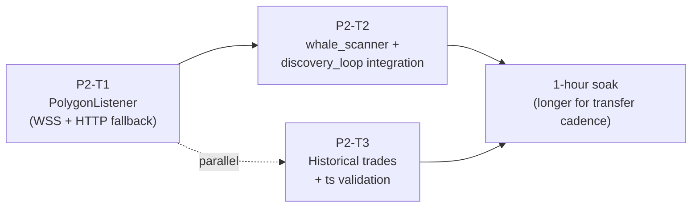

# D169 — Phase 2 PolygonListener + Wallet Engine Basics

> **Sprint**: D169 | **Predecessor**: D168 (DBWriterQueue) | **Successor**: D170 (Phase 3 Signal Fusion)
> **Duration target**: 5 calendar days | **Risk**: HIGH (net-new subsystem) | **STATUS: BLOCKED ON ARCHITECT (AQ-6)**

---

## ARCHITECT BLOCK — DO NOT START WITHOUT RULING

**AQ-6 must be answered before any task in this sprint begins.**

### The decision

`PolygonListener` ingests USDC.e Transfer events on Polygon (Alchemy WSS + HTTP fallback). Two architectures:

#### Option A — Real OS process via `multiprocessing.Process`

- Spawned by `run_hft_orchestrator.py main()`.
- Communicates via `multiprocessing.Queue`.
- Windows uses `spawn` (not `fork`) → all Queue payloads must be picklable.
- Crash isolation: WSS hang doesn't starve orchestrator's asyncio loop.
- New singleton entry: `acquire_singleton("polygon_listener", ...)`.
- Runs as the 7th OS process (per `process_manifest.json`).

#### Option B — Asyncio task inside orchestrator process (preferred default)

- `polygon_task = asyncio.create_task(PolygonListener(...).run(), name="polygon")`.
- Communicates via `asyncio.Queue`.
- No pickling. Simpler.
- WSS hang risks starving radar task. Mitigation: `aiohttp` client and `websockets` library both yield to the loop.
- No new singleton; orchestrator owns it (mirrors `radar_task`, `ofi_task`, `graph_task`).

### Why Option B is the plan default (until architect overrides)

1. Mirrors existing pattern (radar / ofi / graph are all asyncio tasks).
2. Avoids Windows `spawn` pickle complications (AQ-4).
3. `DBWriterQueue` from D168 is intra-process; producer in same process = simpler.
4. Single `acquire_singleton` instead of two.
5. Crash isolation can be retrofit later if WSS proves to starve the loop.

### Architect ruling required on

- Option A vs B (default: B).
- If A: how do `multiprocessing.Queue` items reach `DBWriterQueue` (which is intra-orchestrator)? Either: (a) PolygonListener has its own DB connection + retry like analysis_worker, or (b) cross-process queue → consumer in orchestrator → re-enqueue to `DBWriterQueue`.

**Until architect resolves AQ-6, all D169 task files describe Option B. If A is chosen, reissue these tasks.**

---

## Sprint goal

Begin PATH-B (insider wallet detection). Three pieces:

| # | Task | LLM |
|---|---|---|
| P2-T1 | `PolygonListener` (Alchemy WSS subscribe + HTTP eth_getLogs fallback) in `pol_monitor.py` | Composer2 |
| P2-T2 | `whale_scanner` + `discovery_loop` integration: consume Transfers, gate by ≥100 USDC, query `/public-profile`, populate watchlist DB | GLM5.1 |
| P2-T3 | Historical trades enrichment: `Data API /trades?user=...` + `safe_ts_to_seconds()` validation | Minimax2.7 |

D169 does **NOT** yet compute insider scores or fire signals. That is D171.

---

## Critical risks (read before any task)

### CR-1: Alchemy Free tier CU budget (IQ-4)

300M CU/month limit. eth_subscribe is typically 0 CU. eth_getLogs is ~80 CU per 10-block query. If WSS drops once and we need to backfill 100 blocks → 800 CU. Daily worst-case if WSS drops 100×/day: 80,000 CU/day = 2.4M CU/month. **Within budget**. But sustained HTTP polling instead of WSS would burn budget fast.

**Operating rule**: WSS is primary. HTTP fallback runs ONLY on reconnect, ONLY for the gap window (`last_processed_block + 1` to `current_latest - 5`), bounded to 100 blocks per fallback episode. Document the daily CU consumption in soak handoff.

### CR-2: WSS does NOT support `eth_getLogs` over the same connection

Alchemy: WSS supports `eth_subscribe` only. HTTP RPC must use a separate `aiohttp.ClientSession`. If a coding agent tries `await ws.send(getLogs)`, Alchemy returns a method-not-supported error and silently breaks reconnect loops.

### CR-3: USDC.e on Polygon has 6 decimals (NOT 18)

```
USDC.e address: 0x2791Bca1f2de4661ED88A30C99A7a9449Aa84174
Transfer topic: 0xddf252ad1be2c89b69c2b068fc378daa952ba7f163c4a11628f55a4df523b3ef
amount = int(data, 16) / 1_000_000   # 6 decimals
```

### CR-4: `_token_to_slug_map` and Polymarket address space

The eventual goal (D171) is to map watchlist wallets → Polymarket positions. D169 only collects Transfers; the cross-reference comes later. Do not attempt to match wallets in D169.

### CR-5: Data API `/trades` timestamp format (IQ-2)

The doc's `safe_ts_to_seconds(ts)` helper uses heuristic: `if ts > 1e12: ts //= 1000`. This must be **verified empirically** in P2-T3 before any historical analysis logic depends on it.

---

## Task ordering



**Order**:
1. P2-T1 first; it produces the Transfer event stream.
2. P2-T2 consumes that stream once T1 is shipping events.
3. P2-T3 can run in parallel with T2 (different module).
4. Single 1-hour soak (Transfer events are sparse — need a longer window to validate).

---

## D169 exit criteria

- [ ] **P2-T1**: `PolygonListener.run()` ingests Transfers via WSS for ≥ 1 hour without disconnect; on forced disconnect, HTTP fallback fills gap of ≤ 100 blocks within 60 s.
- [ ] **P2-T1**: `polygon_sync` table has `last_processed_block` updating every minute or two.
- [ ] **P2-T2**: `wallet_watchlist` table has at least 50 entries from the soak hour.
- [ ] **P2-T2**: `/public-profile` cache hit rate > 90 % after 30 minutes.
- [ ] **P2-T3**: `safe_ts_to_seconds()` empirical verification documented; if format is consistent, `assert` simplification proposed (D170 backlog).
- [ ] **No regression**: D167 + D168 exit criteria still pass.
- [ ] **Versions**: `run_radar.py` PATCH bump if `pol_monitor.py` is imported into radar's task graph; `run_hft_orchestrator.py` MINOR bump (`v1.3.0-D169`) for new `polygon_task`; `pol_monitor.py` adds `PROCESS_VERSION = "v1.0.0-D169"`. `versions_ref.json` aligned (add `polygon_listener` key if Option A; otherwise track via orchestrator).

---

## Verification commands

```powershell
# 1. Polygon listener heartbeat
Select-String -Path run/orchestrator.log -Pattern "PolygonListener|POL_LISTENER|eth_subscribe|TRANSFER" -Tail 30

# 2. Last processed block
sqlite3 data\panopticon.db "SELECT * FROM polygon_sync WHERE id=1;"

# 3. Watchlist size
sqlite3 data\panopticon.db "SELECT COUNT(*) FROM wallet_watchlist;"

# 4. Profile cache stats (in-memory; via log)
Select-String -Path run/orchestrator.log -Pattern "PROFILE_CACHE" -Tail 20

# 5. CU consumption estimate (manual — count eth_getLogs in log)
Select-String -Path run/orchestrator.log -Pattern "eth_getLogs blocks" -AllMatches |
  ForEach-Object { $_.Matches.Count }
```

---

## Files modified by D169

| File | Tasks | Change scope |
|---|---|---|
| `panopticon_py/hunting/pol_monitor.py` | P2-T1 | Add `PolygonListener` class + run path. Existing `scan_pol_markets` unchanged. |
| `panopticon_py/hunting/whale_scanner.py` | P2-T2 | Wire to PolygonListener queue, ≥100 USDC gate, `/public-profile` LRU cache. |
| `panopticon_py/hunting/discovery_loop.py` | P2-T2 | Watchlist DB upsert via `DBWriterQueue`. |
| `panopticon_py/hunting/data_api_client.py` (new or extended) | P2-T3 | `/trades?user=...` client + `safe_ts_to_seconds()`. |
| `run_hft_orchestrator.py` | P2-T1 wiring | `polygon_task = asyncio.create_task(...)`. |
| Schema: `polygon_sync`, `wallet_watchlist` tables | P2-T1 + P2-T2 | New tables. Migration script in `panopticon_py/db.py`. |
| `requirements.txt` | P2-T1 | `aiohttp`, `websockets` (verify versions; do NOT add `requests` or `openai`). |
| `run/versions_ref.json` | all | Sync. |

---

## Architect deferrals

| Code | Question | Default | Action |
|---|---|---|---|
| AQ-4 | Windows spawn pickle constraints | N/A under Option B | Reaffirm Option B. |
| AQ-6 | Process vs asyncio task | **Option B** | Architect must rule before T1 starts. |
| IQ-4 | Alchemy CU budget | Within 300M/month | Document soak CU consumption. |
| IQ-3 | Moralis dual-track | Defer to D171 | Do not call moralis in D169. |
| NQ-2 | ILLIQ volume unit | USDC notional | Already documented; D169 doesn't compute ILLIQ. |

---

## Rollback plan

1. `git revert` D169 commits (T3 → T2 → T1 → orchestrator wiring).
2. Drop new tables: `DROP TABLE polygon_sync; DROP TABLE wallet_watchlist;`.
3. `restart_all.ps1`.
4. D168 baseline restored.
