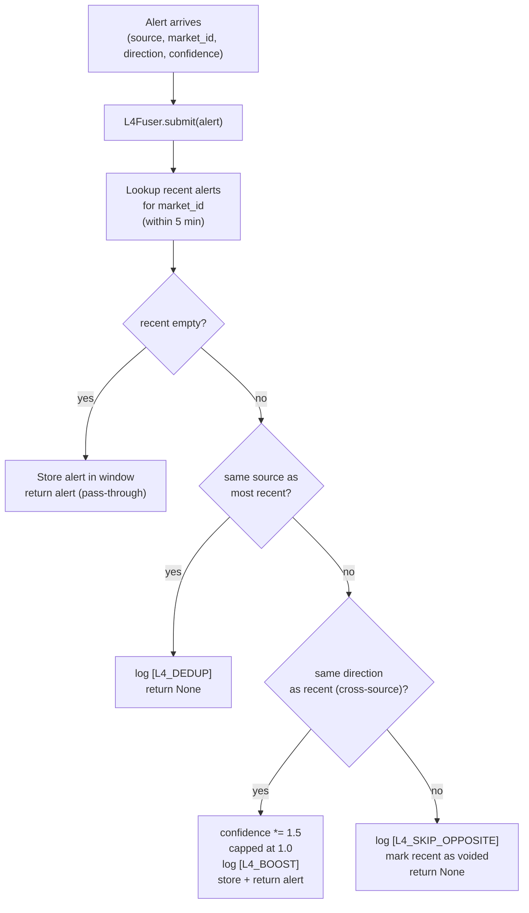

# P3 - T1 - Minimax2.7: L4 Signal Fusion Logic

> **Sprint**: D170 | **Phase**: 3 | **LLM**: Minimax M2.7 | **Priority**: P0
> **Estimated**: 6 hours | **Blocking**: AQ-7 ruling, D169 ship | **Blocks**: D171

---

## 1. Goal

Add `L4Fuser` class and integrate into the existing fire function in `panopticon_py/signal_engine.py`. Implements the fusion rules: same-direction boost (× 1.5), opposite skip, dedup within 5 min, single-source pass-through.

---

## 2. Context

- `signal_engine.py` is 39 KB. Fire function near line 611. Existing dry-run from D167 P0-T3 is in place.
- `MIN_ENTROPY_Z_THRESHOLD = -4.0` line 100.
- Invariant 5.1: signal_engine writes only to `execution_records`. Plan respects that.
- AGENTS.md MiniMax rule applies if any LLM API call occurs (none in this task).

---

## 3. Step-by-step guide

1. **Read** `panopticon_py/signal_engine.py` lines 580–700 (existing fire function and dry-run instrumentation from D167).
2. **Define `Alert` dataclass** module-scope:
   ```python
   @dataclass
   class Alert:
       source:     str       # "PATH_A" | "PATH_B"
       market_id:  str
       direction:  str       # "YES" | "NO" (mapped from z sign or wallet side)
       confidence: float     # 0..1
       raw_z:      float | None = None    # PATH_A only
       raw_wallet: str | None = None      # PATH_B only
       received_ts: float = field(default_factory=time.monotonic)
   ```
3. **Define `L4Fuser`** class:
   - `submit(alert: Alert) -> Optional[Alert]`: returns fused alert (`confidence` boosted) or `None` if skipped (dedup or opposite).
   - 5-min sliding window of recent alerts per `market_id`.
4. **Integrate into existing fire function**:
   - Build PATH-A `Alert` from incoming `(asset_id, z)` data.
   - Submit to fuser.
   - On `None`: log `[L4_SKIP_OPPOSITE]` or `[L4_DEDUP]`, return.
   - On boosted `Alert`: continue with existing fire path using `effective_z = -|alert.confidence * threshold|`-equivalent boost or directly call `_fire_with_confidence(alert)`.
5. **Add PATH-B input stub**: a placeholder function `_path_b_stub_emit_alert(market_id) -> None` that does nothing in D170. D171 will populate.
6. **Wire into orchestrator** (`run_hft_orchestrator.py`):
   - Single global `_l4_fuser = L4Fuser()`.
   - Already-existing PATH-A path passes through fuser.
   - PATH-B alert queue stub: `path_b_alerts: asyncio.Queue` declared but never populated in D170.
7. **Add unit tests** (`tests/test_d170_signal_fusion.py`):
   - Single PATH-A alert → returned unchanged.
   - PATH-A then PATH-B same direction within 5 min → second alert returned with `confidence` boosted by 1.5×, dedup of first.
   - PATH-A then PATH-B opposite direction → both return `None` (skip).
   - Two PATH-A alerts same market within 5 min → second returns `None` (dedup).
   - Two PATH-A alerts same market 6 min apart → both pass through.
8. **Bump versions**: `signal_engine.py` MINOR bump (`v1.0.X-D170` — first time we explicitly version it).

---

## 4. Flow + logic chart



---

## 5. API curl example

**N/A** — pure in-process logic. Verification via pytest + soak log inspection.

```powershell
# Run unit tests
pytest tests/test_d170_signal_fusion.py -q

# Post-soak: count fusion events
Select-String -Path run/orchestrator.log -Pattern "L4_BOOST|L4_DEDUP|L4_SKIP_OPPOSITE" -AllMatches |
  ForEach-Object { $_.Matches.Count } | Measure-Object -Sum
```

---

## 6. API standard reply

`[L4_BOOST]` log line:
```
2026-05-05 18:00:00,000 [INFO] panopticon_py.signal_engine - [L4_BOOST] market=27911616 source=PATH_B direction=YES confidence=0.97 (was 0.65) prior=PATH_A age_sec=42
```

`[L4_DEDUP]` log line:
```
2026-05-05 18:00:00,000 [INFO] panopticon_py.signal_engine - [L4_DEDUP] market=27911616 source=PATH_A age_sec=120 dropping
```

`[L4_SKIP_OPPOSITE]` log line:
```
2026-05-05 18:00:00,000 [WARNING] panopticon_py.signal_engine - [L4_SKIP_OPPOSITE] market=27911616 path_a=YES path_b=NO age_sec=15
```

---

## 7. Code skeleton

`panopticon_py/signal_engine.py` — additions near top:

```python
import time
import logging
import threading
from dataclasses import dataclass, field
from typing import Optional, List

D170_TAG = "D170-l4-fusion"
L4_WINDOW_SEC = float(os.getenv("PANOPTICON_L4_WINDOW_SEC", "300"))   # 5 minutes
L4_BOOST_FACTOR = float(os.getenv("PANOPTICON_L4_BOOST_FACTOR", "1.5"))
L4_BOOST_CAP = float(os.getenv("PANOPTICON_L4_BOOST_CAP", "1.0"))

logger = logging.getLogger(__name__)


@dataclass
class Alert:
    source:      str                       # "PATH_A" | "PATH_B"
    market_id:   str
    direction:   str                       # "YES" | "NO"
    confidence:  float
    raw_z:       Optional[float] = None
    raw_wallet:  Optional[str]   = None
    received_at: float = field(default_factory=time.monotonic)
    voided:      bool = False              # set True if opposite-direction caused skip


class L4Fuser:
    """
    Fuses PATH-A and PATH-B alerts within a 5-min window per market_id.

    Returns the alert that should fire (with possibly boosted confidence),
    or None if the alert should be suppressed (dedup or opposite-direction skip).
    """

    def __init__(self):
        self._window: dict[str, List[Alert]] = {}
        self._lock = threading.Lock()

    def _purge_expired(self, market_id: str, now_mono: float) -> None:
        recent = self._window.get(market_id, [])
        kept = [a for a in recent if (now_mono - a.received_at) <= L4_WINDOW_SEC]
        if kept:
            self._window[market_id] = kept
        else:
            self._window.pop(market_id, None)

    def submit(self, alert: Alert) -> Optional[Alert]:
        if alert.source not in ("PATH_A", "PATH_B"):
            raise ValueError(f"unknown alert.source: {alert.source!r}")
        if alert.direction not in ("YES", "NO"):
            raise ValueError(f"unknown alert.direction: {alert.direction!r}")

        with self._lock:
            now_mono = time.monotonic()
            self._purge_expired(alert.market_id, now_mono)
            recent = self._window.get(alert.market_id, [])

            if not recent:
                self._window.setdefault(alert.market_id, []).append(alert)
                return alert

            most_recent = recent[-1]
            age = now_mono - most_recent.received_at

            if most_recent.source == alert.source:
                logger.info(
                    "[L4_DEDUP] market=%s source=%s age_sec=%.1f dropping",
                    alert.market_id, alert.source, age,
                )
                return None

            if most_recent.direction == alert.direction:
                boosted = min(alert.confidence * L4_BOOST_FACTOR, L4_BOOST_CAP)
                fused = Alert(
                    source=alert.source,
                    market_id=alert.market_id,
                    direction=alert.direction,
                    confidence=boosted,
                    raw_z=alert.raw_z,
                    raw_wallet=alert.raw_wallet,
                    received_at=now_mono,
                )
                logger.info(
                    "[L4_BOOST] market=%s source=%s direction=%s confidence=%.2f (was %.2f) "
                    "prior=%s age_sec=%.1f",
                    alert.market_id, alert.source, alert.direction,
                    boosted, alert.confidence, most_recent.source, age,
                )
                self._window[alert.market_id].append(fused)
                return fused

            most_recent.voided = True
            logger.warning(
                "[L4_SKIP_OPPOSITE] market=%s path_a=%s path_b=%s age_sec=%.1f",
                alert.market_id, most_recent.direction, alert.direction, age,
            )
            return None


_l4_fuser = L4Fuser()


def submit_path_a_alert(market_id: str, z: float, confidence: float) -> Optional[Alert]:
    direction = "NO" if z < 0 else "YES"   # AQ-7 default mapping; verify with architect
    a = Alert(
        source="PATH_A",
        market_id=market_id,
        direction=direction,
        confidence=confidence,
        raw_z=z,
    )
    return _l4_fuser.submit(a)


def submit_path_b_alert(market_id: str, wallet: str, side: str, confidence: float) -> Optional[Alert]:
    """
    D170 stub. D171 will populate from real wallet engine.
    side BUY → YES; side SELL → NO. Architect to verify.
    """
    direction = "YES" if side == "BUY" else "NO"
    a = Alert(
        source="PATH_B",
        market_id=market_id,
        direction=direction,
        confidence=confidence,
        raw_wallet=wallet,
    )
    return _l4_fuser.submit(a)
```

`tests/test_d170_signal_fusion.py`:

```python
import time
import pytest
from panopticon_py.signal_engine import Alert, L4Fuser


def test_single_alert_passes():
    f = L4Fuser()
    out = f.submit(Alert(source="PATH_A", market_id="M1", direction="YES", confidence=0.7))
    assert out is not None
    assert out.confidence == 0.7


def test_same_source_dedup():
    f = L4Fuser()
    f.submit(Alert(source="PATH_A", market_id="M1", direction="YES", confidence=0.7))
    out = f.submit(Alert(source="PATH_A", market_id="M1", direction="YES", confidence=0.8))
    assert out is None


def test_cross_source_boost_same_direction():
    f = L4Fuser()
    f.submit(Alert(source="PATH_A", market_id="M1", direction="YES", confidence=0.6))
    out = f.submit(Alert(source="PATH_B", market_id="M1", direction="YES", confidence=0.6))
    assert out is not None
    assert out.confidence == pytest.approx(0.6 * 1.5)


def test_cross_source_skip_opposite():
    f = L4Fuser()
    f.submit(Alert(source="PATH_A", market_id="M1", direction="YES", confidence=0.6))
    out = f.submit(Alert(source="PATH_B", market_id="M1", direction="NO", confidence=0.7))
    assert out is None


def test_window_expiry(monkeypatch):
    f = L4Fuser()
    monkeypatch.setattr("panopticon_py.signal_engine.L4_WINDOW_SEC", 1.0)
    f.submit(Alert(source="PATH_A", market_id="M1", direction="YES", confidence=0.6))
    time.sleep(1.2)
    out = f.submit(Alert(source="PATH_A", market_id="M1", direction="YES", confidence=0.6))
    assert out is not None
```

---

## 8. Error brainstorm + restrictions

| # | Possible error | Trigger | Restriction |
|---|---|---|---|
| E1 | Direction mapping wrong (z>0 vs z<0) | AQ-7 not yet ruled | Plan default: `z < 0 → "NO"`. Architect must verify. Add comment `# AQ-7 default — verify` next to the mapping. |
| E2 | Boost cap > 1.0 confidence | Programming bug | Skeleton caps via `min(x, L4_BOOST_CAP)`. |
| E3 | Window memory grows unbounded | If purge skipped | `_purge_expired` runs on every submit. |
| E4 | Lock contention if many markets active | 56 markets × ≤ 1 alert/min | Negligible. Single-process; no IPC. |
| E5 | Touching `paper_trades` / `wallet_market_positions` | Invariant 5.1 violation | **HARD BAN**. signal_engine only writes execution_records. D170 writes only ALERT log lines + execution_records via existing fire path. |
| E6 | PATH-B side mapping wrong (BUY vs SELL → YES vs NO) | Polymarket binary outcome convention | Default: `BUY YES = YES`, `SELL YES = NO`. Multi-outcome markets (numerical) need explicit market metadata; out of D170 scope. Document. |
| E7 | Most-recent-only check misses three-way conflict | A=YES, B=NO, A=YES within window | Skeleton checks only `most_recent`. If pattern occurs, third A is voided correctly because second submit voided first A. Verify in test. |
| E8 | `_l4_fuser` global singleton in tests pollutes state | pytest reuse | Each test creates its own `L4Fuser()`. The orchestrator's global `_l4_fuser` is fine for runtime. |
| E9 | Confidence values from PATH-A vs PATH-B are not on same scale | PATH-A `|z|/threshold` vs PATH-B insider_score | D170 assumes both are 0..1. PATH-A caller must normalize. Document: `confidence_a = min(|z| / abs(MIN_ENTROPY_Z_THRESHOLD), 1.0)`. |
| E10 | Boost causes confidence to exceed `MIN_ENTROPY_Z_THRESHOLD` magnitude → stronger fire | Intended | OK. Existing fire path uses confidence as multiplier in execution_records insert; boost increases position size proportionally. Architect aware. |

### Restrictions summary

- **NO** writing to `paper_trades` or `wallet_market_positions` (Invariant 5.1).
- **NO** setting `confidence > 1.0`.
- **NO** removing the `most_recent.voided = True` flag in skip-opposite path.
- **NO** changes to `MIN_ENTROPY_Z_THRESHOLD`.
- **MUST** unit test all five cases.
- **MUST** version bump.

---

## 9. Verification checklist

- [ ] `Alert`, `L4Fuser`, `submit_path_a_alert`, `submit_path_b_alert` defined.
- [ ] Existing fire function calls `submit_path_a_alert`.
- [ ] Stub `submit_path_b_alert` exists, never called in D170.
- [ ] All 5 unit tests pass.
- [ ] Soak: at least 5 organic PATH-A fires, no PATH-B alerts.
- [ ] Versions match.

---

## 10. Exit criteria

ALL of:
1. Unit tests pass (5/5).
2. 1-hour soak: ≥ 5 PATH-A fires; zero PATH-B fires (stub correct).
3. No `[L4_SKIP_OPPOSITE]` warnings (no PATH-B alerts → no opposites possible).
4. `version_match=true`.

---

## 11. Rollback plan

`git revert` the signal_engine + orchestrator wiring + tests commits. D169 baseline restored.
