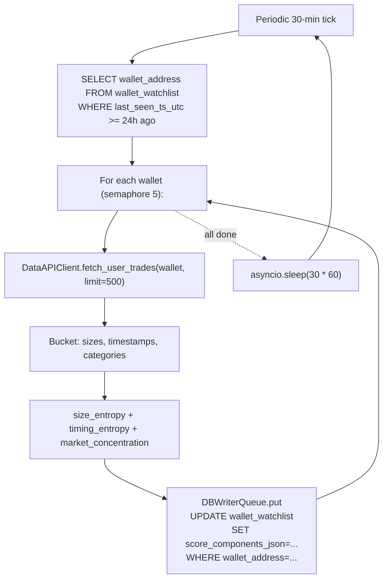

# P4 - T1 - Composer2: Fingerprint Scrubber + Entropy Integration

> **Sprint**: D171 | **Phase**: 4 | **LLM**: Cursor Composer 2 | **Priority**: P0
> **Estimated**: 8 hours | **Blocking**: D170 ship + NQ-1/NQ-3 architect rulings | **Blocks**: P4-T2 final score

---

## 1. Goal

Implement three of the five insider-score dimensions in `panopticon_py/hunting/fingerprint_scrubber.py`:

1. **Size entropy**: per-wallet trade-size distribution (Shannon entropy of histogram). Low entropy = repetitive sizing (suspicious). High entropy = noise.
2. **Timing entropy**: distribution of time-since-last-trade (per wallet). Low entropy = bot/scheduled. Mid entropy = informed (timed near events). High entropy = random.
3. **Market concentration**: fraction of wallet's volume concentrated in single market category (Politics / Crypto / Sports / etc). High concentration on one category = potential domain expert.

Two more dimensions (ROI, fund source) come from P4-T2 (transfer graph) and `four_d_classifier.py` final integration.

---

## 2. Context

`fingerprint_scrubber.py` already exists in `panopticon_py/hunting/`. Read in full first.

`entropy_window.py` (D166-shipped) provides per-token H sample history — **NOT directly applicable** to per-wallet fingerprinting. Fingerprint uses raw trade lists from `clob_trade` table or Data API `/trades` (P2-T3 client).

The mathematical anchor is Shannon entropy:

```
H(X) = -Σ p(x) log₂ p(x)   for x in bucket distribution
```

Normalize to [0, 1] by dividing by `log₂(N_buckets)`.

---

## 3. Step-by-step guide

1. **Read** `panopticon_py/hunting/fingerprint_scrubber.py` in full.
2. **Read** AGENTS.md hunting section (autonomous hunting & shadow mode rules).
3. **Add three pure functions** at module top:
   - `size_entropy(sizes: list[float], n_buckets: int = 10) -> float`
   - `timing_entropy(timestamps_sec: list[int], n_buckets: int = 12) -> float`
   - `market_concentration(market_categories: list[str]) -> float`
4. **Add wallet-level aggregator**:
   - `compute_fingerprint(wallet: str, trades: list[dict]) -> dict` — returns `{size_entropy: float, timing_entropy: float, concentration: float}`.
   - `trades` shape: list of `{size, timestamp_seconds, market_id, category}` (from D169 `DataAPIClient.fetch_user_trades`).
5. **Persist** fingerprint in `wallet_watchlist.score_components_json` (column added by P4-T2 schema migration; if P4-T2 hasn't shipped yet, P4-T1 adds the column itself — coordinate via `_ensure_wallet_watchlist_schema_v2`).
6. **Add periodic recomputation task**:
   - For each wallet in `wallet_watchlist` updated in last 24 h, fetch latest trades (via D169 client), compute fingerprint, persist.
   - Run every 30 min.
   - Bounded fan-out: `asyncio.Semaphore(5)` for concurrent Data API calls.
7. **Unit tests** (`tests/test_d171_fingerprint.py`):
   - `size_entropy([100]*10)` → 0.0 (no diversity).
   - `size_entropy([100, 200, 300, 400, 500, 600, 700, 800, 900, 1000])` → close to 1.0 (full diversity).
   - `timing_entropy` exact tests with known buckets.
   - `market_concentration([("politics",) * 5])` → 1.0 (full concentration).
   - `market_concentration([("politics", "crypto", "sports")])` → low.
8. **Bump version** on `fingerprint_scrubber.py`.
9. **Soak** verification.

---

## 4. Flow + logic chart



---

## 5. API curl example

Verification probes (no new API endpoints introduced; uses existing D169 `DataAPIClient`):

```powershell
# Latest fingerprints
sqlite3 -header -column data\panopticon.db @"
SELECT wallet_address,
       json_extract(score_components_json, '$.size_entropy')   AS size_h,
       json_extract(score_components_json, '$.timing_entropy') AS time_h,
       json_extract(score_components_json, '$.concentration')  AS conc
FROM wallet_watchlist
WHERE score_components_json IS NOT NULL
ORDER BY last_seen_ts_utc DESC
LIMIT 20
"@

# Run unit tests
pytest tests/test_d171_fingerprint.py -q

# Soak: count wallets with fingerprints
sqlite3 data\panopticon.db "SELECT COUNT(*) FROM wallet_watchlist WHERE score_components_json IS NOT NULL;"
```

---

## 6. API standard reply

`wallet_watchlist.score_components_json` shape (after fingerprint computed):

```json
{
  "size_entropy":   0.62,
  "timing_entropy": 0.38,
  "concentration": {
    "politics": 0.78,
    "crypto":   0.15,
    "sports":   0.07,
    "max":      0.78
  },
  "computed_at_utc": "2026-05-05T19:00:00.000Z",
  "n_trades_sampled": 412
}
```

---

## 7. Code skeleton

`panopticon_py/hunting/fingerprint_scrubber.py` — append:

```python
import asyncio
import json
import logging
import math
import os
from collections import Counter
from typing import Iterable

from panopticon_py.db import DBWriterQueue
from panopticon_py.time_utils import utc_now_rfc3339_ms

PROCESS_VERSION = "v1.0.0-D171"

DEFAULT_SIZE_BUCKETS   = 10
DEFAULT_TIMING_BUCKETS = 12
RECOMPUTE_INTERVAL_SEC = 30 * 60
FETCH_CONCURRENCY      = 5
TRADES_PER_WALLET      = 500

logger = logging.getLogger(__name__)


def _normalized_shannon(counts: Iterable[int]) -> float:
    counts = [c for c in counts if c > 0]
    if not counts:
        return 0.0
    total = float(sum(counts))
    if total <= 0 or len(counts) <= 1:
        return 0.0
    h = -sum((c / total) * math.log2(c / total) for c in counts)
    h_max = math.log2(len(counts))
    return h / h_max if h_max > 0 else 0.0


def size_entropy(sizes: list[float], n_buckets: int = DEFAULT_SIZE_BUCKETS) -> float:
    """Shannon entropy of trade-size distribution, normalized to [0, 1]."""
    if not sizes or n_buckets < 2:
        return 0.0
    log_sizes = [math.log10(max(s, 1e-9)) for s in sizes if s > 0]
    if len(log_sizes) < 2:
        return 0.0
    lo, hi = min(log_sizes), max(log_sizes)
    if hi - lo < 1e-9:
        return 0.0
    width = (hi - lo) / n_buckets
    buckets = [0] * n_buckets
    for x in log_sizes:
        idx = min(int((x - lo) / width), n_buckets - 1)
        buckets[idx] += 1
    return _normalized_shannon(buckets)


def timing_entropy(timestamps_sec: list[int], n_buckets: int = DEFAULT_TIMING_BUCKETS) -> float:
    """Entropy of inter-arrival times (log-spaced bins from 1s to 1week)."""
    if len(timestamps_sec) < 2:
        return 0.0
    sorted_ts = sorted(timestamps_sec)
    intervals = [t2 - t1 for t1, t2 in zip(sorted_ts, sorted_ts[1:]) if t2 > t1]
    if len(intervals) < 2:
        return 0.0
    log_intervals = [math.log10(max(i, 1)) for i in intervals]
    lo, hi = math.log10(1), math.log10(60 * 60 * 24 * 7)  # 1s to 1 week
    width = (hi - lo) / n_buckets
    buckets = [0] * n_buckets
    for x in log_intervals:
        idx = max(0, min(int((x - lo) / width), n_buckets - 1))
        buckets[idx] += 1
    return _normalized_shannon(buckets)


def market_concentration(categories: list[str]) -> dict:
    """Per-category share + max share (concentration ratio)."""
    if not categories:
        return {"max": 0.0}
    counts = Counter(categories)
    total = float(sum(counts.values()))
    shares = {cat: cnt / total for cat, cnt in counts.items()}
    shares["max"] = max(shares.values())
    return shares


def compute_fingerprint(wallet: str, trades: list[dict]) -> dict:
    if not trades:
        return {
            "size_entropy":     0.0,
            "timing_entropy":   0.0,
            "concentration":    {"max": 0.0},
            "computed_at_utc":  utc_now_rfc3339_ms(),
            "n_trades_sampled": 0,
        }
    sizes = []
    for t in trades:
        try:
            s = float(t.get("size", 0))
        except (TypeError, ValueError):
            continue
        if s > 0:
            sizes.append(s)
    timestamps = [
        int(t.get("timestamp_seconds") or t.get("timestamp") or 0)
        for t in trades
    ]
    timestamps = [t for t in timestamps if t > 0]
    cats = [str(t.get("category", "unknown")).lower() for t in trades]
    return {
        "size_entropy":     size_entropy(sizes),
        "timing_entropy":   timing_entropy(timestamps),
        "concentration":    market_concentration(cats),
        "computed_at_utc":  utc_now_rfc3339_ms(),
        "n_trades_sampled": len(trades),
    }


async def _recompute_one(client, wallet: str) -> None:
    trades = await client.fetch_user_trades(wallet, limit=TRADES_PER_WALLET)
    fp = compute_fingerprint(wallet, trades)
    DBWriterQueue.put(
        "UPDATE wallet_watchlist SET score_components_json=? WHERE wallet_address=?",
        (json.dumps(fp), wallet),
        table_hint="wallet_watchlist",
    )


async def fingerprint_recompute_loop() -> None:
    from panopticon_py.hunting.data_api_client import DataAPIClient
    import sqlite3
    db_path = os.environ.get("PANOPTICON_DB_PATH", "data/panopticon.db")
    client = DataAPIClient()
    sem = asyncio.Semaphore(FETCH_CONCURRENCY)

    try:
        while True:
            try:
                with sqlite3.connect(db_path, timeout=10) as conn:
                    rows = conn.execute("""
                        SELECT wallet_address FROM wallet_watchlist
                        WHERE last_seen_ts_utc >= datetime('now', '-1 day')
                        LIMIT 200
                    """).fetchall()
            except Exception as exc:
                logger.warning("[FINGERPRINT] db read error: %s", exc)
                rows = []

            async def bounded(w: str) -> None:
                async with sem:
                    try:
                        await _recompute_one(client, w)
                    except Exception as exc:
                        logger.warning("[FINGERPRINT] wallet=%s err=%s", w[:10], exc)

            await asyncio.gather(*[bounded(r[0]) for r in rows])
            logger.info("[FINGERPRINT] recompute pass done wallets=%d", len(rows))
            await asyncio.sleep(RECOMPUTE_INTERVAL_SEC)
    finally:
        await client.close()
```

---

## 8. Error brainstorm + restrictions

| # | Possible error | Trigger | Restriction |
|---|---|---|---|
| E1 | Entropy = 1.0 always reported because all sizes fall in one bucket | Bug in bucketing edge case | Test with single-size list → 0.0 expected. Test with full diversity → close to 1.0. |
| E2 | Negative log error from `math.log2(0)` | Empty bucket | Skeleton filters `c > 0` before log. Verify in test. |
| E3 | `trades` rows missing `category` field | Data API may not provide it | Default `"unknown"`. If only `"unknown"` present, concentration = 1.0 — meaningless. Add note: requires at least 2 distinct categories or the metric degrades. |
| E4 | Wallet with 1 trade → all metrics 0 | Sample too small | Documented behavior: wallets with `< 5` trades skipped. Add filter at top of `compute_fingerprint` if architect requires. |
| E5 | Recompute storm at startup → API rate hit | All wallets need first-time fingerprint | `LIMIT 200` per pass + semaphore 5 → ~40 batches; spaced over 30 min. Acceptable. |
| E6 | `score_components_json` exceeds reasonable size | If categories list grows unbounded | Cap to top 10 categories; document. |
| E7 | Concurrent updates race in `wallet_watchlist.score_components_json` | Update path is via `DBWriterQueue` → serialized | OK; writer thread serializes. |
| E8 | Fingerprint recomputed with stale trades (cache?) | `DataAPIClient` has no cache | Acceptable for D171; D172 may add. |
| E9 | Decision-path contamination — fingerprint outputs read by Graphify | Per AGENTS.md | Fingerprint outputs persist in `wallet_watchlist`, an operational table. They feed `four_d_classifier`, not Graphify. Audit-only path. |
| E10 | Memory: storing 500 trades × 200 wallets in memory at once | ~100k objects | Acceptable. If scaling beyond 500 wallets, switch to per-wallet streaming. |
| E11 | `category` field absent from Polymarket Data API → all wallets concentration=1.0 with `unknown` | Real risk | Memo P2-T3 must verify. If absent, P4-T1 must derive from `market_id` → Polymarket Gamma `/markets?id=...` lookup. Adds ~10 lines. |
| E12 | size_entropy on raw shares (1e8-scale) vs USD notional → different distributions | Plan defaults to USD if `price` known; else shares | Document. Use USD where price available. |

### Restrictions summary

- **NO** decision contamination from Graphify outputs.
- **NO** processing > 200 wallets per pass.
- **NO** parallel fetch > 5 (semaphore).
- **NO** silently dropping wallets with < 5 trades (log, mark `insufficient_data: true` in JSON).
- **MUST** unit tests pass.
- **MUST** version bump.

---

## 9. Verification checklist

- [ ] All three entropy/concentration functions are pure (deterministic on input).
- [ ] Unit tests cover: empty input, single-bucket, full-diversity, mixed.
- [ ] `fingerprint_recompute_loop` running as orchestrator task.
- [ ] At least 50 wallets have `score_components_json` after 1-hour soak.
- [ ] Spot-check: known patterned wallet (e.g. round-number repeat trader) shows low size_entropy.

---

## 10. Exit criteria

ALL of:
1. Three pure functions with unit tests (≥ 6 tests, all green).
2. `fingerprint_recompute_loop` runs continuously without errors.
3. ≥ 50 wallets fingerprinted in 1-hour soak.
4. `score_components_json` JSON-valid for every persisted row.
5. Versions match.

---

## 11. Rollback plan

1. `git revert` fingerprint commits.
2. `UPDATE wallet_watchlist SET score_components_json=NULL;` (one-time SQL).
3. Remove `fingerprint_recompute_loop` task from orchestrator.
4. `restart_all.ps1`.
