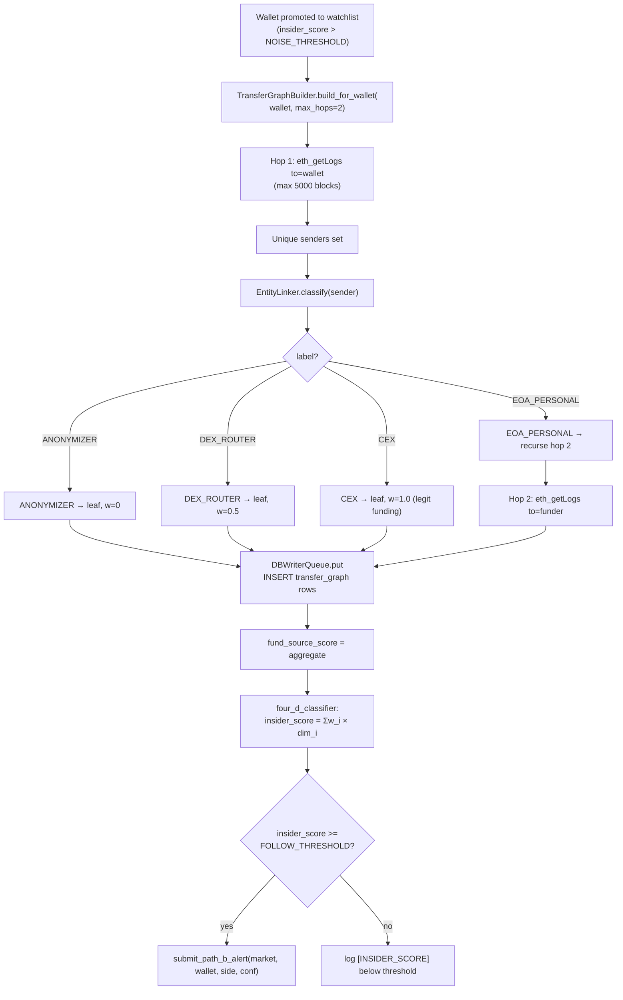

# P4 - T2 - Codex5.3: Transfer Graph + Entity Linker

> **Sprint**: D171 | **Phase**: 4 | **LLM**: Codex 5.3 | **Priority**: P0
> **Estimated**: 10 hours | **Blocking**: D170 ship + IQ-1, IQ-3, NQ-1, NQ-3 architect rulings | **Blocks**: final insider_score ship

---

## 1. Goal

Two deliverables:

1. **Transfer Graph**: build a directed graph of USDC.e fund flows for each watchlisted wallet. Persist in new `transfer_graph` table. Used to compute `fund_source_score` (CEX-funded vs personal-funded vs anonymizer-routed).

2. **Entity Linker**: classify each wallet observed in the graph as `EOA_PERSONAL`, `CEX`, `DEX_ROUTER`, `ANONYMIZER`, or `UNKNOWN`. Source of truth: `config/cex_dex_routers_blacklist.json` (already in repo per AGENTS.md graph-prune rule). Persist label per wallet.

The two fit together because the graph traversal needs to know when to stop (anonymizer hop = stop, weight 0).

Codex 5.3 is chosen because on-chain data parsing precision matters (hex decoding, address normalization).

---

## 2. Context

`AGENTS.md` constraints:
- **Graphify isolation**: this transfer graph must NOT consume `graphify-out/*` outputs. It builds its own graph from `eth_getLogs`.
- **CEX_ANONYMIZED policy**: when a hop hits `config/cex_dex_routers_blacklist.json` entries → mark `CEX_ANONYMIZED`, weight 0, fall back on 4D + shadow PnL.
- **Pagination ceilings**: respect Moralis/Alchemy block-range and row-count limits.

D169 `PolygonListener` already streams Transfers and persists them. P4-T2 reuses that stream for **forward**-direction (incoming USDC) and runs additional bounded queries for **backward**-direction (where did the wallet's funds come from N hops back).

---

## 3. Step-by-step guide

1. **Read** AGENTS.md sections on autonomous hunting + graph pruning.
2. **Read** `config/cex_dex_routers_blacklist.json`. If absent, propose creation with at least these known anonymizers:
   - Tornado Cash (multiple Polygon addresses).
   - Major CEX hot wallets (Binance, Coinbase, OKX, Kraken — Polygon).
   - Common DEX routers (Uniswap V3, QuickSwap, SushiSwap on Polygon).
   The list should be checked into repo (`config/`).
3. **Create new tables** (`panopticon_py/db.py` migration):
   ```sql
   CREATE TABLE IF NOT EXISTS transfer_graph (
     id INTEGER PRIMARY KEY AUTOINCREMENT,
     root_wallet TEXT NOT NULL,
     from_addr   TEXT NOT NULL,
     to_addr     TEXT NOT NULL,
     usdc_amount REAL NOT NULL,
     block       INTEGER NOT NULL,
     hop_depth   INTEGER NOT NULL,           -- 1 = direct funder, 2 = funder's funder, ...
     tx_hash     TEXT NOT NULL,
     created_ts_utc TEXT NOT NULL,
     UNIQUE(root_wallet, tx_hash, hop_depth)
   );
   CREATE INDEX IF NOT EXISTS idx_tg_root ON transfer_graph(root_wallet, hop_depth);
   CREATE INDEX IF NOT EXISTS idx_tg_to   ON transfer_graph(to_addr);

   CREATE TABLE IF NOT EXISTS entity_labels (
     address TEXT PRIMARY KEY,
     label   TEXT NOT NULL,                  -- EOA_PERSONAL | CEX | DEX_ROUTER | ANONYMIZER | UNKNOWN
     source  TEXT NOT NULL,                  -- 'blacklist' | 'heuristic' | 'manual'
     confidence REAL NOT NULL DEFAULT 0.5,
     updated_ts_utc TEXT NOT NULL
   );
   ```
4. **Implement `EntityLinker`** in new `panopticon_py/hunting/entity_linker.py`:
   - Load blacklist at init (memory-resident).
   - `classify(address) -> tuple[label, source, confidence]`.
   - Heuristic fallback for unknown:
     - First-seen activity > 6 months ago + steady inflow → `EOA_PERSONAL`.
     - High in/out ratio + many counterparties → likely `CEX_HOT_WALLET` (heuristic).
     - Default `UNKNOWN`.
5. **Implement `TransferGraphBuilder`** in `panopticon_py/hunting/transfer_graph.py` (new):
   - `async def build_for_wallet(wallet: str, max_hops: int = 2, max_blocks_per_hop: int = 5000) -> dict` — returns graph nodes + edges.
   - For each hop:
     - Query Alchemy `eth_getLogs` for all Transfers to `wallet` in the past `max_blocks_per_hop` blocks (approx 3 hours on Polygon at 2 s/block).
     - For each unique sender, classify via `EntityLinker.classify`.
     - If `CEX` or `ANONYMIZER` → leaf (do not recurse, weight 0).
     - If `EOA_PERSONAL` → record edge, recurse for next hop.
     - If `DEX_ROUTER` → leaf with weight 0.5 (DEX is "intermediate"; the real funder is the swapper).
   - Persist all edges in `transfer_graph`.
6. **Compute `fund_source_score(wallet) -> float`**:
   - 1.0 if all funding traces to `EOA_PERSONAL` or `CEX_HOT_WALLET` (intentional player).
   - 0.5 if mixed.
   - 0.0 if any hop is `ANONYMIZER` or unresolvable.
7. **Wire into `four_d_classifier.py`** (`compute_insider_score`):
   ```python
   score = (
       w1 * roi_score          # NQ-1 weights
     + w2 * timing_score
     + w3 * consistency_score
     + w4 * fund_source_score  # this task
     + w5 * size_entropy_score
   )
   ```
8. **Wire score → PATH-B alert** (`signal_engine.submit_path_b_alert`): when score crosses `FOLLOW_THRESHOLD` (NQ-3) for the first time, emit alert. Track in `wallet_watchlist.alert_emitted_ts` to avoid re-alerts.
9. **Soak verification + CU consumption tracking**.

---

## 4. Flow + logic chart



---

## 5. API curl example

Same `eth_getLogs` curl as P2-T1, but with the wallet as the **`to`** filter (third topic):

```bash
WALLET=0x1234567890abcdef1234567890abcdef12345678
WALLET_TOPIC=$(printf '0x000000000000000000000000%s' "${WALLET#0x}")

curl -X POST https://polygon-mainnet.g.alchemy.com/v2/$ALCHEMY_API_KEY \
  -H "Content-Type: application/json" \
  -d "{
    \"jsonrpc\": \"2.0\",
    \"id\": 1,
    \"method\": \"eth_getLogs\",
    \"params\": [{
      \"fromBlock\": \"0x4d70000\",
      \"toBlock\":   \"0x4d75000\",
      \"address\":   \"0x2791Bca1f2de4661ED88A30C99A7a9449Aa84174\",
      \"topics\":    [
        \"0xddf252ad1be2c89b69c2b068fc378daa952ba7f163c4a11628f55a4df523b3ef\",
        null,
        \"$WALLET_TOPIC\"
      ]
    }]
  }"
```

Note: `topics[2]` filters by recipient. `null` for `topics[1]` means "any sender".

---

## 6. API standard reply

`eth_getLogs` reply: same shape as P2-T1.

`transfer_graph` row:

```json
{
  "id":           42,
  "root_wallet":  "0x1234...",
  "from_addr":    "0xabcdef...",
  "to_addr":      "0x1234...",
  "usdc_amount":  5000.0,
  "block":        81000000,
  "hop_depth":    1,
  "tx_hash":      "0xabc123...",
  "created_ts_utc": "2026-05-05T19:00:00.000Z"
}
```

`entity_labels` row:

```json
{
  "address":         "0xabcdef...",
  "label":           "EOA_PERSONAL",
  "source":          "heuristic",
  "confidence":      0.7,
  "updated_ts_utc":  "2026-05-05T19:00:00.000Z"
}
```

`config/cex_dex_routers_blacklist.json` shape:

```json
{
  "anonymizers": [
    {"address": "0x...", "name": "Tornado Cash 1 ETH (Polygon)", "source": "https://..."}
  ],
  "cex_hot_wallets": [
    {"address": "0xa83e...", "name": "Binance Hot Wallet", "source": "https://..."}
  ],
  "dex_routers": [
    {"address": "0xa5e0...", "name": "Uniswap V3 Router (Polygon)", "source": "https://..."}
  ]
}
```

---

## 7. Code skeleton

`panopticon_py/hunting/entity_linker.py` (new):

```python
import json
import logging
import os
import sqlite3

from panopticon_py.db import DBWriterQueue
from panopticon_py.time_utils import utc_now_rfc3339_ms

PROCESS_VERSION = "v1.0.0-D171"

BLACKLIST_PATH = os.environ.get(
    "PANOPTICON_CEX_BLACKLIST", "config/cex_dex_routers_blacklist.json"
)

logger = logging.getLogger(__name__)


class EntityLinker:
    def __init__(self, blacklist_path: str = BLACKLIST_PATH):
        self._anonymizers: set[str] = set()
        self._cex: set[str] = set()
        self._dex: set[str] = set()
        self._load(blacklist_path)

    def _load(self, path: str) -> None:
        try:
            with open(path, "r", encoding="utf-8") as f:
                data = json.load(f)
        except FileNotFoundError:
            logger.warning("[ENTITY] blacklist not found at %s — running with empty lists", path)
            return
        except json.JSONDecodeError as exc:
            logger.error("[ENTITY] blacklist parse error: %s", exc)
            return
        self._anonymizers = {x["address"].lower() for x in data.get("anonymizers", [])}
        self._cex         = {x["address"].lower() for x in data.get("cex_hot_wallets", [])}
        self._dex         = {x["address"].lower() for x in data.get("dex_routers", [])}
        logger.info(
            "[ENTITY] blacklist loaded anon=%d cex=%d dex=%d",
            len(self._anonymizers), len(self._cex), len(self._dex),
        )

    def classify(self, address: str) -> tuple[str, str, float]:
        addr = address.lower()
        if addr in self._anonymizers:
            return ("ANONYMIZER", "blacklist", 1.0)
        if addr in self._cex:
            return ("CEX", "blacklist", 1.0)
        if addr in self._dex:
            return ("DEX_ROUTER", "blacklist", 1.0)
        return ("UNKNOWN", "default", 0.3)

    def persist_label(self, address: str, label: str, source: str, confidence: float) -> None:
        DBWriterQueue.put(
            """
            INSERT OR REPLACE INTO entity_labels
              (address, label, source, confidence, updated_ts_utc)
            VALUES (?, ?, ?, ?, ?)
            """,
            (address.lower(), label, source, confidence, utc_now_rfc3339_ms()),
            table_hint="entity_labels",
        )
```

`panopticon_py/hunting/transfer_graph.py` (new) — top-level skeleton only (full implementation ~250 lines):

```python
import asyncio
import logging
import os
from typing import Any

import aiohttp

from panopticon_py.db import DBWriterQueue
from panopticon_py.hunting.entity_linker import EntityLinker
from panopticon_py.hunting.pol_monitor import (
    ALCHEMY_HTTP_URL, USDC_E_ADDRESS, TRANSFER_TOPIC, USDC_DECIMALS,
)
from panopticon_py.time_utils import utc_now_rfc3339_ms

PROCESS_VERSION = "v1.0.0-D171"

MAX_HOPS_DEFAULT       = 2
MAX_BLOCKS_PER_HOP     = 5000
ETH_GETLOGS_PAGE_SIZE  = 9
PER_HOP_TIMEOUT_SEC    = 60.0

logger = logging.getLogger(__name__)


def _wallet_to_topic(wallet: str) -> str:
    addr = wallet.lower().removeprefix("0x")
    return "0x" + addr.rjust(64, "0")


class TransferGraphBuilder:
    def __init__(self, api_key: str, linker: EntityLinker):
        self._api_key = api_key
        self._linker  = linker
        self._http: aiohttp.ClientSession | None = None

    async def _ensure_http(self) -> aiohttp.ClientSession:
        if self._http is None or self._http.closed:
            self._http = aiohttp.ClientSession(timeout=aiohttp.ClientTimeout(total=PER_HOP_TIMEOUT_SEC))
        return self._http

    async def _fetch_inbound_transfers(
        self, wallet: str, from_block: int, to_block: int,
    ) -> list[dict]:
        """Paginated eth_getLogs in 9-block chunks for to=wallet."""
        results: list[dict] = []
        url = ALCHEMY_HTTP_URL.format(api_key=self._api_key)
        session = await self._ensure_http()
        cur = from_block
        while cur <= to_block:
            end = min(cur + ETH_GETLOGS_PAGE_SIZE - 1, to_block)
            payload = {
                "jsonrpc": "2.0", "id": 2, "method": "eth_getLogs",
                "params": [{
                    "fromBlock": hex(cur), "toBlock": hex(end),
                    "address":   USDC_E_ADDRESS,
                    "topics": [TRANSFER_TOPIC, None, _wallet_to_topic(wallet)],
                }],
            }
            try:
                async with session.post(url, json=payload) as resp:
                    data = await resp.json()
            except Exception as exc:
                logger.warning("[TG] fetch error blocks=%d-%d %s", cur, end, exc)
                break
            logs = data.get("result")
            if not isinstance(logs, list):
                break
            results.extend(logs)
            cur = end + 1
            await asyncio.sleep(0.2)
        return results

    def _decode(self, log: dict) -> dict | None:
        topics = log.get("topics") or []
        if len(topics) < 3:
            return None
        try:
            from_addr = ("0x" + topics[1][-40:]).lower()
            to_addr   = ("0x" + topics[2][-40:]).lower()
            raw       = int(log.get("data", "0x0"), 16)
            usdc      = raw / (10 ** USDC_DECIMALS)
            block     = int(log["blockNumber"], 16)
            tx_hash   = log.get("transactionHash", "")
        except (ValueError, TypeError, KeyError):
            return None
        return {
            "from": from_addr, "to": to_addr,
            "usdc_amount": usdc, "block": block, "tx_hash": tx_hash,
        }

    async def build_for_wallet(
        self,
        root_wallet: str,
        latest_block: int,
        max_hops: int = MAX_HOPS_DEFAULT,
    ) -> dict:
        edges: list[dict] = []
        visited: set[str] = {root_wallet.lower()}
        frontier: list[tuple[str, int]] = [(root_wallet.lower(), 1)]

        while frontier:
            wallet, hop = frontier.pop()
            if hop > max_hops:
                continue
            from_block = max(0, latest_block - MAX_BLOCKS_PER_HOP)
            logs = await self._fetch_inbound_transfers(wallet, from_block, latest_block)
            for log in logs:
                t = self._decode(log)
                if not t:
                    continue
                edges.append({
                    "root_wallet": root_wallet.lower(),
                    "from_addr":   t["from"],
                    "to_addr":     t["to"],
                    "usdc_amount": t["usdc_amount"],
                    "block":       t["block"],
                    "hop_depth":   hop,
                    "tx_hash":     t["tx_hash"],
                })
                label, _, _ = self._linker.classify(t["from"])
                if label == "EOA_PERSONAL" and t["from"] not in visited and hop < max_hops:
                    visited.add(t["from"])
                    frontier.append((t["from"], hop + 1))
        self._persist_edges(edges)
        return {"root": root_wallet.lower(), "edges": edges, "visited": list(visited)}

    def _persist_edges(self, edges: list[dict]) -> None:
        for e in edges:
            DBWriterQueue.put(
                """
                INSERT OR IGNORE INTO transfer_graph
                  (root_wallet, from_addr, to_addr, usdc_amount, block, hop_depth, tx_hash, created_ts_utc)
                VALUES (?, ?, ?, ?, ?, ?, ?, ?)
                """,
                (e["root_wallet"], e["from_addr"], e["to_addr"],
                 e["usdc_amount"], e["block"], e["hop_depth"],
                 e["tx_hash"], utc_now_rfc3339_ms()),
                table_hint="transfer_graph",
            )

    async def close(self) -> None:
        if self._http and not self._http.closed:
            await self._http.close()


def fund_source_score_from_graph(graph: dict, linker: EntityLinker) -> float:
    """Aggregate fund-source score from a built graph dict."""
    if not graph or not graph.get("edges"):
        return 0.0
    edges = graph["edges"]
    weights = []
    for e in edges:
        label, _, _ = linker.classify(e["from_addr"])
        if label == "ANONYMIZER":
            weights.append(0.0)
        elif label == "DEX_ROUTER":
            weights.append(0.5)
        elif label in ("CEX", "EOA_PERSONAL"):
            weights.append(1.0)
        else:
            weights.append(0.3)
    return sum(weights) / len(weights) if weights else 0.0
```

---

## 8. Error brainstorm + restrictions

| # | Possible error | Trigger | Restriction |
|---|---|---|---|
| E1 | Graph traversal explodes (combinatoric branches) | Many funders per wallet | Hard caps: `max_hops=2`, `max_blocks_per_hop=5000`, `MAX_NODES_PER_GRAPH=200` (add as constant). On exceed → log WARNING and stop traversal. |
| E2 | Alchemy CU exhausted in middle of hop | Free tier 300M/month | Per-wallet build budget: log estimated CU before issuing queries. Per-hop reads ~ 5000/9 × 80 CU = 44,000 CU. Over 200 wallets/hour: 8.8M CU/hour = 6.3B CU/month — **far exceeds free tier**. Architect must rule on rate. Suggested: build graphs only for wallets where preliminary score ≥ NOISE_THRESHOLD (drastically reduces fan-out). |
| E3 | Decision contamination — graph data fed back into Graphify path | Architectural mistake | **HARD BAN per AGENTS.md**. Graph data is consumed by `four_d_classifier` only. No Graphify integration. |
| E4 | Edge persistence floods DBWriterQueue | 200 wallets × 50 edges × queue.maxsize=50k → 10k items, well within budget | Acceptable. If exceeds, batch insert is needed. |
| E5 | Topic encoding wrong (`_wallet_to_topic`) → no matches | Hex padding off | Test with a known wallet that has known transfers; verify `eth_getLogs` returns expected logs. Skeleton uses `rjust(64, "0")` which is correct. |
| E6 | Mixing case (lowercase vs checksum) → cache miss | All comparisons must be lowercase | Skeleton normalizes everywhere. Verify in tests. |
| E7 | `entity_labels` rows duplicated for same address | INSERT OR REPLACE acceptable | Skeleton uses INSERT OR REPLACE; the latest classification wins. OK. |
| E8 | `config/cex_dex_routers_blacklist.json` missing or stale | First-time setup | Plan creates the file with at least Tornado Cash, top 3 CEX hot wallets, top 2 DEX routers. Architect can extend later. |
| E9 | Cycles in graph (A → B → A) | Possible on-chain | `visited` set prevents revisit. Cycles are rare for USDC transfers. |
| E10 | Heuristic mislabel: classifying CEX as EOA → graph traverses through CEX | Heuristic bias | Mitigate by: anything not in blacklist + heavy in-out (> 100 unique counterparties / month) → mark `CEX_HEURISTIC`, treat as CEX leaf with confidence 0.6. Add as enrichment step after blacklist check. |
| E11 | Insider score fires alerts on every minor change | Hysteresis missing | Track `wallet_watchlist.alert_emitted_ts`; only re-alert if score crosses threshold from below AND last alert > 24 h ago. |
| E12 | Score wired to LIVE trading without architect approval | Per AGENTS.md `LIVE_TRADING` gate | **HARD BAN**. PATH-B alert flows to L4Fuser → fire path → paper_trade only. Real trading needs separate ruling. |

### Restrictions summary

- **HARD CAPS**: `max_hops=2`, `max_blocks_per_hop=5000`, `MAX_NODES_PER_GRAPH=200`.
- **NO** Graphify input.
- **NO** auto-promotion to LIVE trading.
- **NO** > 5 concurrent graph builds.
- **NO** scoring CEX-funded wallets as insiders (CEX is leaf with weight 1.0, but the score uses the **destination** wallet's behavior, not the CEX's).
- **MUST** AGENTS.md `cex_dex_routers_blacklist.json` consulted.
- **MUST** CU consumption logged.
- **MUST** version bump.

---

## 9. Verification checklist

- [ ] `config/cex_dex_routers_blacklist.json` exists and parses.
- [ ] `entity_labels` table created.
- [ ] `transfer_graph` table created.
- [ ] `EntityLinker.classify` returns blacklist labels first.
- [ ] `TransferGraphBuilder.build_for_wallet` respects all hard caps.
- [ ] `fund_source_score_from_graph` returns [0, 1].
- [ ] `four_d_classifier` integrates score → `submit_path_b_alert`.
- [ ] Soak: at least 5 graphs built, edges persisted, scores logged.
- [ ] CU consumption tracked in `temp_architect_handoffs/d171_alchemy_cu_report.md`.
- [ ] Decision-path audit: no Graphify input.

---

## 10. Exit criteria

ALL of:
1. ≥ 5 wallets have populated `transfer_graph` rows after 1-hour soak.
2. ≥ 1 wallet's `insider_score >= FOLLOW_THRESHOLD` triggers `submit_path_b_alert`.
3. `[L4_BOOST]` or `[L4_SKIP_OPPOSITE]` log line appears at least once (proves PATH-B → L4 is wired).
4. CU consumption ≤ architect-set budget.
5. No regressions.

---

## 11. Rollback plan

1. `git revert` D171 commits in reverse.
2. `DROP TABLE transfer_graph; DROP TABLE entity_labels;`.
3. Remove fund-source dimension from `four_d_classifier`.
4. PATH-B alerts revert to D170 stub state.
5. `restart_all.ps1`.
