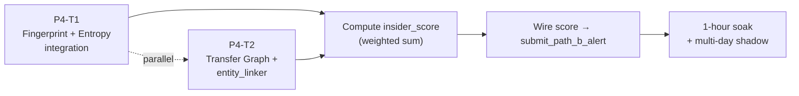

# D171 — Phase 4 Insider Score Precision + Transfer Graph

> **Sprint**: D171 | **Predecessor**: D170 (L4 fusion ready) | **Successor**: TBD (likely D172 backtest / parameter calibration)
> **Duration target**: 5–7 calendar days | **Risk**: HIGH (net-new analytics, value-laden) | **STATUS: BLOCKED ON ARCHITECT (NQ-1, NQ-3, IQ-3)**

---

## ARCHITECT BLOCK — DO NOT START WITHOUT RULING

**This is the highest-architect-leverage sprint. Coding agent should not start until ALL of these are answered:**

| Code | Question | Plan default | Ruling needed |
|---|---|---|---|
| NQ-1 | Insider score weights `w1..w5` (ROI, timing, consistency, fund_source, size_entropy) | `0.30/0.25/0.20/0.15/0.10` | Architect to confirm or replace with backtest-derived values |
| NQ-3 | `FOLLOW_THRESHOLD` cold-start | `0.65` | Architect to confirm |
| NQ-3b | `HIGH_THRESHOLD` (watchlist promotion) | `0.75` | Architect to confirm |
| NQ-3c | `NOISE_THRESHOLD` (ignore below) | `0.40` | Architect to confirm |
| IQ-3 | `moralis_client.py` dual-track or single-track Alchemy? | Single-track Alchemy (cheaper) | Architect to confirm; if dual-track, P4-T2 grows |
| IQ-1 | Alchemy CU sustained for full Transfer graph queries | After D169 measurement, project D171 budget | Architect to set CU budget |

If any answer is "TBD", the corresponding sub-task is deferred to D172.

---

## Sprint goal

Compute `insider_score` per wallet by combining the five dimensions in section 4.2 of the D167 design doc. Wire score → PATH-B alert → L4 fusion → existing paper-trade pipeline.

| # | Task | LLM |
|---|---|---|
| P4-T1 | `fingerprint_scrubber.py` + entropy_window integration: size entropy, timing entropy, market concentration | Composer2 |
| P4-T2 | Transfer Graph (eth_getLogs deep, multi-block, multi-hop) + `entity_linker.py` (CEX vs personal wallet) | Codex5.3 |

**Out of scope for D171** (deferred to D172):
- Backtest harness for weight calibration.
- Multi-week soak validation.
- Live trading gate (LIVE_TRADING=true) — paper only per AGENTS.md.

---

## Critical risks

### CR-1: Decision-path contamination from Graphify

`AGENTS.md` is explicit: `graphify-out/*`, `GRAPH_REPORT.md`, `graph.json` are HUMAN_READ_ONLY. **Transfer Graph in D171 must NOT consume any Graphify output**. It builds its own graph from on-chain `eth_getLogs`. This must be enforced by audit.

### CR-2: Alchemy CU budget tightens with deeper graph queries

D169's plan capped at 100-block backfill on reconnect. D171's transfer graph traversal could pull 1000s of blocks per wallet to build deep funding lineage. **Strict per-wallet block-range cap of 5000 blocks** (about 3 hours on Polygon at ~2s/block). Beyond → escalate to architect.

### CR-3: CEX/Anonymizer detection bias

`config/cex_dex_routers_blacklist.json` (per AGENTS.md) lists known anonymizers. Wallets flagged as `CEX_ANONYMIZED` get **funding-graph weight zero**. Score falls back on 4D + shadow PnL. Coding agent must respect this — do NOT score CEX wallets as insiders just because they have high USDC inflows.

### CR-4: Oracle Meta Risk (UMA Phase 1b)

Per AGENTS.md, addresses correlated with UMA voting activity raise `oracle_meta_risk` flag. This is observational only; does NOT trigger insider score. D171 includes the flag emission but no scoring impact (per AGENTS.md "audit and risk only").

---

## Task ordering

**Order**:
1. P4-T1 and P4-T2 run in parallel (different modules).
2. After both ship, integrate into score computation (small additional task ~2 hours; folded into the larger of P4-T1 / P4-T2 finish).
3. Wire to `submit_path_b_alert` from D170 stub.
4. Soak.

---

## D171 exit criteria

- [ ] `four_d_classifier.py` (existing file) computes insider_score using all 5 dimensions.
- [ ] Score persisted in `wallet_watchlist.insider_score` column (new schema field).
- [ ] At least 1 wallet in soak gets `insider_score >= HIGH_THRESHOLD`; logged but not auto-promoted (manual review per AGENTS.md `LIVE_TRADING` gate).
- [ ] PATH-B alerts flow into `L4Fuser` (D170 stub now live).
- [ ] At least 1 organic PATH-B → L4 fusion event in soak (`[L4_BOOST]` or `[L4_SKIP_OPPOSITE]` log line).
- [ ] CU consumption documented; within architect-set budget.
- [ ] CEX-flagged wallets correctly score 0 on funding dimension (audit trail logged).
- [ ] No regressions in D167–D170 tests.
- [ ] Versions: all touched files MINOR/PATCH bumped; `versions_ref.json` aligned.

---

## Files modified by D171

| File | Tasks | Change scope |
|---|---|---|
| `panopticon_py/hunting/fingerprint_scrubber.py` | P4-T1 | Size entropy, timing entropy, market concentration. |
| `panopticon_py/hunting/entropy_window.py` | P4-T1 (integration only — no behavior change) | Expose H samples for fingerprint use. |
| `panopticon_py/hunting/entity_linker.py` (new file) | P4-T2 | CEX/personal wallet classifier reading `config/cex_dex_routers_blacklist.json`. |
| `panopticon_py/hunting/four_d_classifier.py` | both | Combine 5 dimensions into `insider_score`. |
| `panopticon_py/db.py` | both | Schema additions: `wallet_watchlist.insider_score`, `wallet_watchlist.score_components_json`, `transfer_graph` table. |
| `panopticon_py/signal_engine.py` | wiring | `submit_path_b_alert` is now wired to a real producer. |
| `tests/test_d171_*.py` | both | Unit tests per dimension and integration. |
| `run/versions_ref.json` | all | Sync. |
| `temp_architect_handoffs/d171_alchemy_cu_report.md` | P4-T2 | Soak CU consumption report. |

---

## Architect deferrals

| Code | Question | Default | Action |
|---|---|---|---|
| NQ-1 | Weights | 0.30/0.25/0.20/0.15/0.10 | Confirm or replace |
| NQ-3 | Thresholds (HIGH/FOLLOW/NOISE) | 0.75/0.65/0.40 | Confirm |
| IQ-1 | CU budget | TBD after D169 measurement | Set explicit cap |
| IQ-3 | moralis_client.py | Single-track Alchemy | Confirm |
| AGENTS.md | Decision-path contamination | Audit hooks | Confirm enforcement |

---

## Rollback plan

1. `git revert` D171 commits.
2. Schema rollback: `ALTER TABLE wallet_watchlist DROP COLUMN insider_score; DROP TABLE transfer_graph;` (one-time SQL).
3. PATH-B alert wiring becomes stub again.
4. `restart_all.ps1`.
5. D170 baseline restored.
